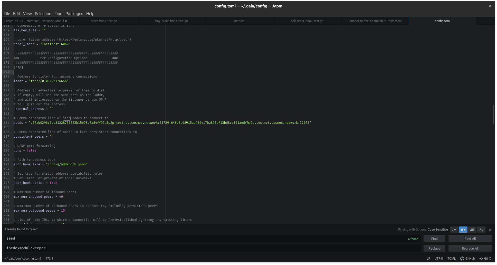
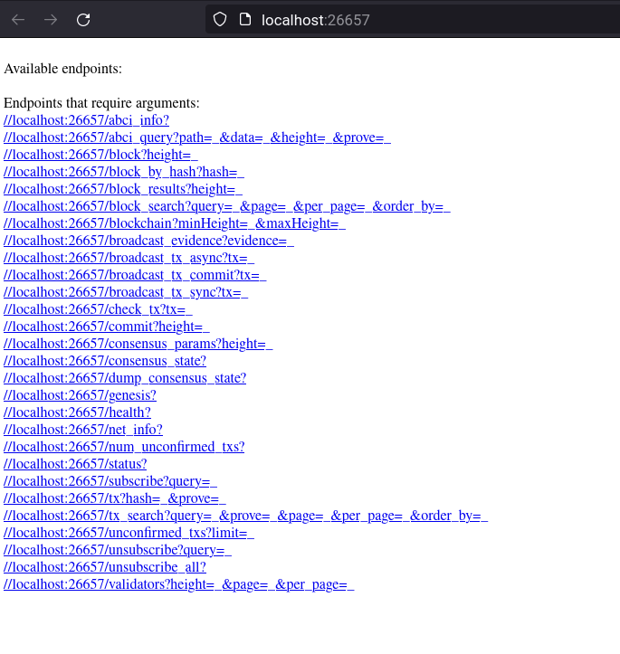
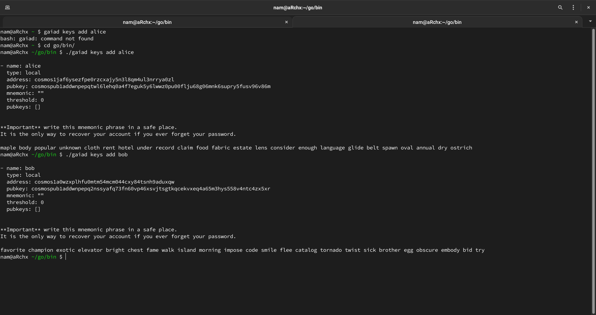
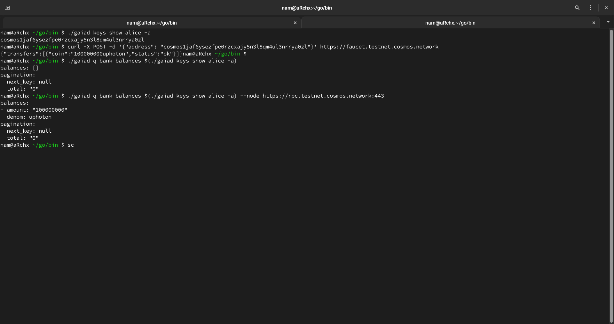
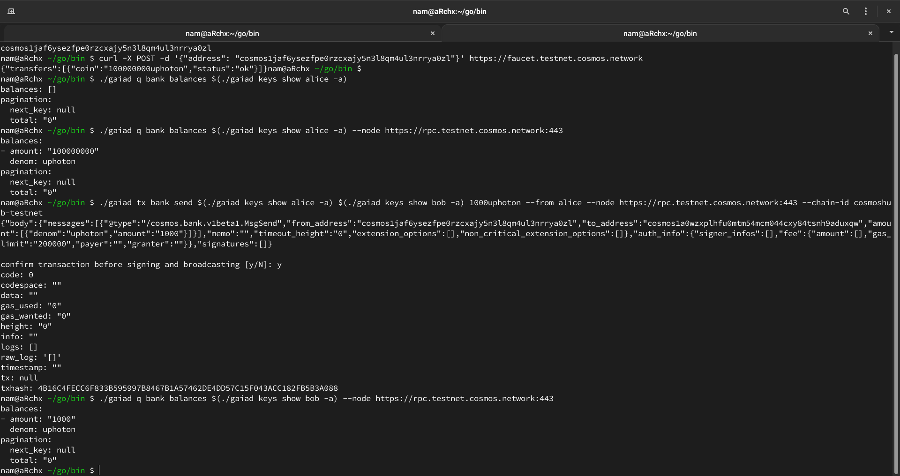

# Connect to the cosmoshub testnet

---

## The Cosmos Hub Testnet

[Hế thống mạng Cosmos](https://cosmos.network/) là 1 hệ sinh thái mở của các blockchain được kết nối với nhau.
Rất nhiều blockchain trong hệ sinh thái này được xây với [Tendermint Core](https://docs.tendermint.com/) và [Cosmos SDk](https://docs.cosmos.network).
Các blockchain này được kết nối bằng phương thức truyền thông nội bổ của các blockchain [(IBC)](https://hub.cosmos.network/main/validators/validator-setup.html)

Trong số các blockchain đó có [Cosmos Hub](https://cosmos.network/features/).
_Mainnet_ của Cosmos Hub đã trực tuyến từ năm 2019.
Bạn có thể học để tham gia vào mạng lưới này như 1 chương trình xác thực (validator),
có thể xem ở [đây](https://hub.cosmos.network/main/validators/validator-setup.html).

### What is a testnet?

_Testnet_ là một mạng lưới mà được khởi chạy cho các nhà phát triển và các chương trình xác thực để thử các tính năng của blockchain trước khi mạng chính được chạy.
Trạng thái của 1 testnet có thể đặt lại bất cứ lúc nào.

---

## About the Testnet Tutorial

Hướng dẫn này sẽ nói đến:
- Tải và cài đặt phần mềm
- Bắt đầu 1 nút
- Sử dụng CLI của Cosmos SDK
- Tương tác với mạng lưới Cosmos Hub testnet

### Requirements

- [git](https://git-scm.com/)
- [curl](https://github.com/curl/curl)
- [go](https://golang.org/)
- [jq](https://github.com/stedolan/jq)
- [make](https://en.wikipedia.org/wiki/Make_(software))

### Public Endpoints

Khi bạn có một ứng dụng cần truy cập đến testnet, có một cơ sở hạn tầng có sẵn để bạn có thể sử dụng

Để truy cập đến hệ thống mạng testnet của Cosmos Hub sử dụng các endpoint sau:

|Dịch vụ|URL|
|-|:-|
|RPC | https://rpc.testnet.cosmos.network:443 |
|API | https://api.testnet.cosmos.network:443 |
|gRPC | https://grpc.testnet.cosmos.network:443 |
|Token faucet | https://faucet.testnet.cosmos.network:443 |

### Seed Nodes

_Seed nodes_ cung cấp 1 danh sách các node dể có thể kết nối đến.
Trước khi chạy node của bạn, bạn phải cung cấp ít nhất 1 kiểu node đê kết nối đến mạng lưới.
Chúng tôi sẽ cung câp _seed nodes_ để giúp bạn kết nối node của bạn đén testnet:

> e6fab0296c0cc31228756822b15e98cfa84ff97b@p2p.testnet.cosmos.network:31729
> 64fefc98915aa430417ba893bf13bd8cc101aedf@p2p.testnet.cosmos.network:32073


### Requesting Tokens from a Faucet

Phần chốt có 1 giao diện web đơn giản ở [đây](https://faucet.testnet.cosmos.network)

Hoặc dùng lệnh dưới để lấy token:

```bash
curl -X POST -d '{"address": "cosmos1kd63kkhtswlh5vcx5nd26fjmr9av74yd4sf8ve"}' https://faucet.testnet.cosmos.network
```

```
{"transfers":[{"coin":"100000000uphoton","status":"ok"}]}
```

---
## Building and Starting a Full Node

Để chạy một node đầy đủ chức năng thì phải xây thành file nhị phân sau đó khởi tạo và chạy node

### Building the Binary

Repo của testnet này là **cosmos/gaia**. Repo này cung cấp các tính năng của:
- mã nguồn **cosmos/gaia** đằng sau Cosmos Hub

    Clone lại repo:

    ```bash
    git clone --branch v5.0.5 https://github.com/cosmos/gaia
    ```

    Bạn có thể bỏ qua phần thông báo này:

    ```bash
    You are in 'detached HEAD' state...
    ```

    Xây phần nhị phân của node

    ```bash
    cd gaia && make install
    ```

### Initializing a Node

Để khơi tạo node:

```bash
gaiad init YOUR_MONIKER
```

```json
{
  "app_message": {
    "auth": {
      "accounts": [],
      "params": {
        "max_memo_characters": "256",
        "sig_verify_cost_ed25519": "590",
        "sig_verify_cost_secp256k1": "1000",
        "tx_sig_limit": "7",
        "tx_size_cost_per_byte": "10"
      }
    },
    "bank": {
      "balances": [],
      "denom_metadata": [],
      "params": {
        "default_send_enabled": true,
        "send_enabled": []
      },
      "supply": []
    },
    "capability": {
      "index": "1",
      "owners": []
    },
    "crisis": {
      "constant_fee": {
        "amount": "1000",
        "denom": "stake"
      }
    },
    "distribution": {
      "delegator_starting_infos": [],
      "delegator_withdraw_infos": [],
      "fee_pool": {
        "community_pool": []
      },
      "outstanding_rewards": [],
      "params": {
        "base_proposer_reward": "0.010000000000000000",
        "bonus_proposer_reward": "0.040000000000000000",
        "community_tax": "0.020000000000000000",
        "withdraw_addr_enabled": true
      },
      "previous_proposer": "",
      "validator_accumulated_commissions": [],
      "validator_current_rewards": [],
      "validator_historical_rewards": [],
      "validator_slash_events": []
    },
    "evidence": {
      "evidence": []
    },
    "genutil": {
      "gen_txs": []
    },
    "gov": {
      "deposit_params": {
        "max_deposit_period": "172800s",
        "min_deposit": [
          {
            "amount": "10000000",
            "denom": "stake"
          }
        ]
      },
      "deposits": [],
      "proposals": [],
      "starting_proposal_id": "1",
      "tally_params": {
        "quorum": "0.334000000000000000",
        "threshold": "0.500000000000000000",
        "veto_threshold": "0.334000000000000000"
      },
      "votes": [],
      "voting_params": {
        "voting_period": "172800s"
      }
    },
    "ibc": {
      "channel_genesis": {
        "ack_sequences": [],
        "acknowledgements": [],
        "channels": [],
        "commitments": [],
        "next_channel_sequence": "0",
        "receipts": [],
        "recv_sequences": [],
        "send_sequences": []
      },
      "client_genesis": {
        "clients": [],
        "clients_consensus": [],
        "clients_metadata": [],
        "create_localhost": false,
        "next_client_sequence": "0",
        "params": {
          "allowed_clients": [
            "06-solomachine",
            "07-tendermint"
          ]
        }
      },
      "connection_genesis": {
        "client_connection_paths": [],
        "connections": [],
        "next_connection_sequence": "0"
      }
    },
    "liquidity": {
      "params": {
        "circuit_breaker_enabled": false,
        "init_pool_coin_mint_amount": "1000000",
        "max_order_amount_ratio": "0.100000000000000000",
        "max_reserve_coin_amount": "0",
        "min_init_deposit_amount": "1000000",
        "pool_creation_fee": [
          {
            "amount": "40000000",
            "denom": "stake"
          }
        ],
        "pool_types": [
          {
            "description": "Standard liquidity pool with pool price function X/Y, ESPM constraint, and two kinds of reserve coins",
            "id": 1,
            "max_reserve_coin_num": 2,
            "min_reserve_coin_num": 2,
            "name": "StandardLiquidityPool"
          }
        ],
        "swap_fee_rate": "0.003000000000000000",
        "unit_batch_height": 1,
        "withdraw_fee_rate": "0.000000000000000000"
      },
      "pool_records": []
    },
    "mint": {
      "minter": {
        "annual_provisions": "0.000000000000000000",
        "inflation": "0.130000000000000000"
      },
      "params": {
        "blocks_per_year": "6311520",
        "goal_bonded": "0.670000000000000000",
        "inflation_max": "0.200000000000000000",
        "inflation_min": "0.070000000000000000",
        "inflation_rate_change": "0.130000000000000000",
        "mint_denom": "stake"
      }
    },
    "params": null,
    "slashing": {
      "missed_blocks": [],
      "params": {
        "downtime_jail_duration": "600s",
        "min_signed_per_window": "0.500000000000000000",
        "signed_blocks_window": "100",
        "slash_fraction_double_sign": "0.050000000000000000",
        "slash_fraction_downtime": "0.010000000000000000"
      },
      "signing_infos": []
    },
    "staking": {
      "delegations": [],
      "exported": false,
      "last_total_power": "0",
      "last_validator_powers": [],
      "params": {
        "bond_denom": "stake",
        "historical_entries": 10000,
        "max_entries": 7,
        "max_validators": 100,
        "unbonding_time": "1814400s"
      },
      "redelegations": [],
      "unbonding_delegations": [],
      "validators": []
    },
    "transfer": {
      "denom_traces": [],
      "params": {
        "receive_enabled": true,
        "send_enabled": true
      },
      "port_id": "transfer"
    },
    "upgrade": {},
    "vesting": {}
  },
  "chain_id": "test-chain-lbfeFV",
  "gentxs_dir": "",
  "moniker": "testnet_test",
  "node_id": "3bf1d6f5774e3db4c83a77c1c4974e9b27654b1f"
}
```

YOUR_MONIKER là một trình giữ chỗ cho 1 chuỗi mà để nhận diện node của bạn.
Chắc chắn rằng thay đổi YOUR_MONIKER với 1 chuỗi mô tả cho node của bạn

### Starting a Node

1. Tải và lưu file genesis trong thư mục dữ liệu của node:
```bash
curl -s https://rpc.testnet.cosmos.network/genesis | jq -r .result.genesis > ~/.gaia/config/genesis.json
```
2. Thêm _seed nodes_ bằng lệnh mà phù hợp với hệ điều hành.
  Với các hệ thống khác macOS:
  ```bash
  sed -i 's/seeds =.*/seeds =   "e6fab0296c0cc31228756822b15e98cfa84ff97b@p2p.testnet.cosmos.network:31729,64fefc98915  aa430417ba893bf13bd8cc101aedf@p2p.testnet.cosmos.network:32073"/g' ~/.gaia/config/  config.toml
  ```

  với MacOS
  ```bash
  sed -i '' 's/seeds =.*/seeds =  "e6fab0296c0cc31228756822b15e98cfa84ff97b@p2p.testnet.cosmos.network:31729,64fefc98915  aa430417ba893bf13bd8cc101aedf@p2p.testnet.cosmos.network:32073"/g' ~/.gaia/config/  config.toml
  ```

  hoặc bằng cách sau:

  

3. Khởi chạy node

  ```bash
  gaiad start
  ```

Node của bạn sẽ đồng bộ hóa và bắt kịp thời gian với mạng lưới. Theo mặc định thì RPC của node sẽ có thể truy cập tại **http://localhost:26657**

1. Để xác thực trạng thái đồng bộ hóa, mở **http://localhost:26657/status** và xem phần **result.sync_info.catching_up**




---

## Using the CLI

Đây là kết quả sau khi hoàn thành phần trước:
- Xây dựng file nhị phân **gaiad** của node
- Khơi tạo node với **gaiad init**
- Chạy node với **gaiad start**

Bây giờ hãy dùng file nhị phân đó để tương tác với testnet bằng cách chạy node đó cục bộ haojcw sử dụng các endpoint mở

### Creating a Key Pair

Tạo một cặp khóa cho user alice và bob

```bash
gaiad keys add alice
```

```bash
gaiad keys add bob
```



### Requesting Tokens from the Faucet

Testnet này sử dụng 2 mệnh giá token: **stake** và **uphoton**

```bash
curl -X POST -d "{ "address": @'<address>' }" https://faucet.testnet.cosmos.network
```

Sau khi nhận được token, bạn có thể xem lại số dư và xác nhận token được gửi.

### Querying Balances

Sử dụng các phương thức sau để xem số dư

Bằng node cục bộ
1. Đảm bảo rằng node đã chạy và hoàn thành việc đồng bộ hóa

2. Chạy lệnh sau:
```bash
gaiad q bank balances $(gaiad keys show alice -a)
```



Query bằng endpoint mở RPC

```bash
gaiad q bank balances $(gaiad keys show alice -a) --node https://rpc.testnet.cosmos.network:443
```

### Sending Tokens

Sử dụng lệnh CLI để gửi token

```bash
gaiad tx bank send $(gaiad keys show alice -a) $(gaiad keys show bob -a) 1000uphoton --from alice --node https://rpc.testnet.cosmos.network:443 --chain-id cosmoshub-testnet
```

Kiểm tra lại số dư

```bash
gaiad q bank balances $(gaiad keys show bob -a) --node https://rpc.testnet.cosmos.network:443
```



```json
{
  "body": {
    "messages": [
      {
        "@type": "/cosmos.bank.v1beta1.MsgSend",
        "from_address": "cosmos1jaf6ysezfpe0rzcxajy5n3l8qm4ul3nrrya0zl",
        "to_address": "cosmos1a0wzxplhfu0mtm54mcm044cxy84tsnh9aduxqw",
        "amount": [
          {
            "denom": "uphoton",
            "amount": "1000"
          }
        ]
      }
    ],
    "memo": "",
    "timeout_height": "0",
    "extension_options": [],
    "non_critical_extension_options": []
  },
  "auth_info": {
    "signer_infos": [],
    "fee": {
      "amount": [],
      "gas_limit": "200000",
      "payer": "",
      "granter": ""
    }
  },
  "signatures": []
}

# confirm transaction before signing and broadcasting [y/N]: y
```

```
code: 0
codespace: ""
data: ""
gas_used: "0"
gas_wanted: "0"
height: "0"
info: ""
logs: []
raw_log: '[]'
timestamp: ""
tx: null
txhash: 4B16C4FECC6F833B595997B8467B1A57462DE4DD57C15F043ACC182FB5B3A088
```

### Using Gravity DEX CLI

Đẻ dùng các lệnh Gravity DEX có thể tìm hiểu tại [đây](https://github.com/tendermint/liquidity/blob/develop/doc/client.md)
