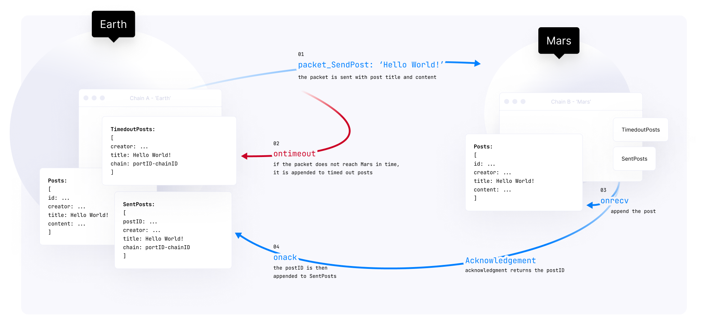

# Create a IBC Hello World module
---
## IBC Hello World

Phương thức truyền thông nội bộ của các Blockchain (IBC) là một phần quan trọng của hệ thống Cosmos - SDK.

Bài hướng dẫn này sẽ giúp xây dựng một cách hiểu về làm thế nào để tạo và gửi các _packet_ giữa blockchain. Nền tảng kiến thức này sẽ giúp bạn điểu hướng giữa các blockchain với Cosmos - SDk

Nội dung của hướng dẫn này là:
- Sử dụng IBC để tạo và gửi các _packet_ giữa các blockchain
- Điều hướng giữa các blockchain bằng cách sử dụng Cosmos SDK và Starport Relayer
- Tạo bài viết blog đơn giản và lưu trên một blockchain khác

### What is Cosmos SDK and IBC?

Cosmos SDK là một framework dùng để tạo ứng dụng blockchain. Cosmos SDK cho phép lập trình viên có thể dễ dàng tạo một blockchain tùy ý mà có tương tác với các blockchain khác.

Mô-đun IBC trong Cosmos SDK là tiêu chuẩn cho sự tương tác giữa 2 blockchain. Mô-đun IBC định nghĩa làm sao để các goi và _messages_ được cấu trúc để được diễn dịch  blockchain gửi và blockchain nhận.

Gói _Cosmos IBC relayer_ giúp kết nối giữa một tập blockchain mà có sử dụng IBC. Bài hướng dẫn này sẽ nó về cách tạo ra 2 blockchain rồi bắt đầu và sử dụng _relayer_ với Starport để kết nối giữa 2 blockchain.

Hướng dẫn sẽ có nhắc tới các phần như các mô-đun, các _IBC packet_ , _relayer_ và vòng đời của các packet  được chuyển giao qua IBC

Sử dụng Starport v0.16.2

```bash
curl https://get.starport.network/starport@v0.16.2! | bash
```

### Create a Blockchain App

Tạo một ứng dụng blockchain với Mô-đun blog để viết các bài viết trên các blockchain khác mà bao gồm _Hello World message_. Với bài hướng dẫn này, bạn có thể viết các bài viết cho vũ trụ Cosmos SDK bao gồm các _message_: Hello Mars, Hello Cosmos, Hello Earth

Tạo một ứng dụng chứa mô-đun blog chứa bài viết giao dịch (post transaction) gồm [title] và [text]

Sau khi định nghĩa logic, chạy 2 ứng dụng blockchain mà gồm mô-đun này

- Các chuỗi có thể chuyển bài viết cho nhau thông qua IBC

- Trên _chuỗi gửi_, lưu thông tin về [trạng thái xác định] và [các bài viết bị quá thời gian chờ]

Sau khi giao dịch được xác định bởi _chuỗi nhận_, thì bài viết sẽ được lưu ở trên các blockchain
- _Chuỗi gửi_ có thêm thông tin về [postID]
- Trên các bài viết được xác định và quá thời gian bao gồm [title] và thông tin [_chuỗi_ nhận bài viết]. [Dấu hiệu nhận biết] có thể nhìn thây được trong tham số của _chuỗi_.

Bảng dưới đây chỉ ra vòng đời của một _packet_ di chuyển qua IBC



### Build your Blockchain App

Sử dụng Starport đẻ dựng lên ứng dụng và Mô-đun blog

#### Build the new blockchain

```bash
starport app github.com/user/planet
```

#### Scaffold the blog module inside your blockchain

Sử dụng Starport để dụng lên mô-đun blog với tính năng IBC, mô-đun blog bao gồm logic để tạo bài viết và hướng chúng truyền qua IBC đến blockchain khác. Với flag ```--ibc``` tạo ra logic đầy đủ cho mô-đun IBC sử dụng cùng.

```bash
starport module create blog --ibc
```


#### Generate CRUD actions for types

Tạo các chức năng CRUD cho các _type_ của mô-đun blog

Sử dụng Starport command để dưng lên code mẫu săng cho các chức năng CRUD

Tạo bài viết

```bash
starport type post title content --module blog --no-message
```

Tạo các [trạng thái xác định] cho những bài viết được gửi

```bash
starport type sentPost postID title chain --module blog --no-message
```

Quản lý các bài viết bị quá thời gian

```bash
starport type timedoutPost title chain --module blog --no-message
```


<!-- 


 -->


Code được dựng lên đã bao gồm cấu trúc dữ liệu, các _message_, xử lý các _message_, _keeper_ để thay đổi trạng thái và các câu lệnh CLI

#### Starport type command overview

```bash
starport type [typeName] [field1] [field2] ... [flags]
```

Câu lệnh ```starport type [typeName]``` xác định tên của _type_ được tạo.

Sau đó có các trường (field) của _type_ đó như: ```[field1], [field2], ... ```

Và tiếp theo là ```[flag]``` : bao gồm một số tùy chỉnh

Ví dụ về post:

```bash
starport type post title content --module blog --no-message
```

typeName: **post**

fields:
- field1: **title**,
- field2: **content**

flag:
- **--module**: định nghĩa mô-đun nào mà transaction _type_ (_type_ giao dịch) sẽ được thêm vào, ở đây là **blog**. Nếu không có thì sẽ lấy thêm vào mô-đun cùng tên với repo
- **--no-message**: khi một _type_ được dựng lên, nếu theo mặc định thì sẽ đồng thời dựng lên các _message_ có thể được gửi bởi dùng cho các hoạt động CRUD. ```flag``` này tắt tính năng đó đi. Chúng ta cung cấp lựa chọn này cho ứng dụng khi chúng ta muốn các bài viết phải tạo ra thông qua cảc giao dịch _IBC packet_ thay vì trưc tiếp bằn các _message_ của người dùng

#### Scaffold a sendable and interpretable IBC

Bây giờ, phải tự động tạo ra gói mã (packet code) mà chứa [title] và [content] của một bài viết

```
starport packet
```
Câu lệnh trên tạo ra phần logic cho _IBC packet_ mà có thể gửi đến blockchain khác.
- Phần [title] identifiervà [content] đươc lưu trữ ở trên _chuỗi nhận_ (target chain)
- [postID] được [xác định] trên _chuỗi gửi_ (sending chain)

Câu lệnh trên cũng đồng thời dừng lên các _câu lệnh CLI_ mà có thể gửi các _IBC packet_

```bash
planetd tx blog send-ibc-post [portID] [channelD] [title] [content]
```

Để dựng lên một _IBC packet_ có thể gửi và diễn dịch được:

```bash
starport packet ibcPost title content --ack postID --module blog
```


Chú ý rằng các trường (fields) trong **ibcPost** trùng với các trường của **post**
- **--ack** định nghĩa điểm nhận diện được trả về cho blockchain gửi
- **--module** xác định là tạo packet tại trong mô-đun IBC xác định

### Modify the Source Code
Sau khi tạo các _type_ và các (giao dịch) _transaction_. Tiếp đến là sẽ thêm phần logic đeẻ có thể cập nhật dữ liệu trong các bẳng. Chỉnh sửa mã nguồn để lưu dữ liệu như đã được xác định từ yêu cầu lúc đầu

#### Add creator to the blog post packet

Bắt đầu với chỉnh sửa file proto mà định nghĩa cấu trúc dữ liệu của _IBC packet_.

Để định nghĩa người tạo ra bài viết trong _blockchain nhận_, thêm trường **creator** trong packet. Trường này không được xác định trực tiếp trong command do nó sẽ tự chuyển hóa thành thàm số trong hàm CLI **SendIbcPost**

```proto
// planet/proto/blog/packet.proto
// this line is used by starport scaffolding # ibc/packet/proto/message
// IbcPostPacketData defines a struct for the packet payload
message IbcPostPacketData {
    string title = 1;
    string content = 2;
    string creator = 3; // < ---
}
```

Để chắc chắn rằng _chuỗi nhận_ có nội dung của người tạo một bài viết blog thì hãy sửa như dưới đây. Nội dung của **sender** được tự động thêm trong **SendIbcPost** _message_. Người gửi được xác nhận như người ký vào _message_ như vậy có thể gán **msg.Sender** cho **package.Creator** trước khi nó được gửi qua cho IBC
điểm nhận
```go
// planet/x/blog/keeper/msg_server_ibc_post.go
// Construct the packet
    var packet types.IbcPostPacketData

    packet.Title = msg.Title
    packet.Content = msg.Content
    packet.Creator = msg.Sender // < ---

    // Transmit the packet
    err := k.TransmitIbcPostPacket(
        ctx,
        packet,
        msg.Port,
        msg.ChannelID,
        clienttypes.ZeroHeight(),
        msg.TimeoutTimestamp,
    )
```

#### Receive the post

Các chức năng logic của chính giao dịch có trong file _planet/x/blog/keeper/**ibc_post.go**_. Dùng các chức năng được định nghĩa đó để quản lý các _IBC packet_:

+ **TransmitIbcPostPacket** được gọi thường xuyên để gửi _packet_ thông qua IBC. Hàm đồng thời định nghĩa logic trước khi _packet_ được gửi qua IBC đến ứng dụng blockchain khác
+ **OnRecvIbcP  ostPacket** _hook_ (móc nối) được gọi tự động khi packet được nhận tại _chuỗi nhận_. Hàm định nghĩa logic để tiếp nhận _packet_
+ **OnAcknowledgementIbcPostPacket** _hook_ đươc gọi khi _packet_ được gửi được [xác định] bởi _chuỗi gửi_. Hàm định nghĩa  logic khi _packet_ đã được nhận
+ **OnTimeoutIbcPostPacket** _hook_ đươc gọi khi _packet_ được gửi bị quá thời gian gửi (timed out). Hàm định nghĩa logic khi _packet_ được gửi không được nhận bởi _chuỗi nhận_

Người dùng sẽ phải chỉnh sửa mã nguồn để có thể thêm phần logic trong nhưng hàm/phương thức trên để có thể dữ liệu bảng có thể chỉnh hợp lý

Khi nhận được một **bài viết (post _message_)**, tạo một bài viết mới ở _chuỗi nhận_ với [title] và [content] được gửi.

Để định nghĩa cho ứng dụng blockchain khi một _message_ có nguồn gốc và người tào ra _message_, sử dụng [dấu hiệu nhận biết] có cấu trúc sau

<postID>-<channelID>-<creatorAddress>

Cuối cùng sử dụng chức năng được tạo từ Starport là **AppendPost** để trả lại ID của post mới được thêm vào. Giá trị này để xác nhận _chuỗi gửi_ qua việc [xác định]

Thêm một trường là PostID vào _packet nhận_:
  + **ctx** là _cấu trúc dữ liệu_ không thay đỏi được mà chứa dữ liệu header của giao dịch.
  + [dấu hiệu nhận biết] được xác định như được định nghĩa ở trên
  + [title] là tiêu đề của bài viết blog
  + [content] là nội dung của bài viết blog

Chỉnh hàm **OnRecvIbcPostPacket** như sau

Lưu ý: thêm thư viện "strconv"

```go
// planet/x/blog/keeper/ibc_post.go
// OnRecvIbcPostPacket processes packet reception
func (k Keeper) OnRecvIbcPostPacket(ctx sdk.Context, packet channeltypes.Packet, data types.IbcPostPacketData) (packetAck types.IbcPostPacketAck, err error) {
    // validate packet data upon receiving
    if err := data.ValidateBasic(); err != nil {
        return packetAck, err
    }

    id := k.AppendPost(
        ctx,
        types.Post{
            Creator: packet.SourcePort+"-"+packet.SourceChannel+"-"+data.Creator,
            Title: data.Title,
            Content: data.Content,
        },
    )
    packetAck.PostID = strconv.FormatUint(id, 10)

    return packetAck, nil
}
```

#### Receive the post acknowledgement

Trên _blockchain gửi_ lưu **sendPost** để biết các post đã nhận được ở _chuỗi nhận_

Lưu giữ [title] và [thông tin chain nhận] để xác định bài viết

Khi một packet được dựng lên, _type_ mặc định cho dữ liệu [xác nhận] đã nhận là môt _type_ mà nhận biết chỉ khi xử lý _packet_ bị lỗi. _Type_ **TheAcknowledgement_Error** chỉ được trả lại nếu hàm **OnRecvIbcPostPacket** trả về lỗi bởi _packet_.

```go
// OnAcknowledgementIbcPostPacket responds to the the success or failure of a packet
// acknowledgement written on the receiving chain.
func (k Keeper) OnAcknowledgementIbcPostPacket(ctx sdk.Context, packet channeltypes.Packet, data types.IbcPostPacketData, ack channeltypes.Acknowledgement) error {
    switch dispatchedAck := ack.Response.(type) {
    case *channeltypes.Acknowledgement_Error:
        // We will not treat acknowledgment error in this tutorial
        return nil
    case *channeltypes.Acknowledgement_Result:
        // Decode the packet acknowledgment
        var packetAck types.IbcPostPacketAck

        if err := types.ModuleCdc.UnmarshalJSON(dispatchedAck.Result, &packetAck); err != nil {
            // The counter-party module doesn't implement the correct acknowledgment format
            return errors.New("cannot unmarshal acknowledgment")
        }

        k.AppendSentPost(
            ctx,
            types.SentPost{
                Creator: data.Creator,
                PostID: packetAck.PostID,
                Title: data.Title,
                Chain: packet.DestinationPort+"-"+packet.DestinationChannel,
            },
        )


        return nil
    default:
        // The counter-party module doesn't implement the correct acknowledgment format
        return errors.New("invalid acknowledgment format")
    }
}
```

#### Store information about the timed-out packet

Lưu giữ các bài viết mà không nhận được bởi _chain nhận_ trong **timedoutPost**.
Phần logic giống như trong **sendPost**

```go
// OnTimeoutIbcPostPacket responds to the case where a packet has not been transmitted because of a timeout
func (k Keeper) OnTimeoutIbcPostPacket(ctx sdk.Context, packet channeltypes.Packet, data types.IbcPostPacketData) error {
    k.AppendTimedoutPost(
        ctx,
        types.TimedoutPost{
            Creator: data.Creator,
            Title: data.Title,
            Chain: packet.DestinationPort+"-"+packet.DestinationChannel,
        },
    )

    return nil
}
```

### Use the IBC Modules

Yêu cầu nhiều terminal để có thể sử dụng hợp lý

#### Test the IBC modules

Khởi động 2 mạng blockchain trên cùng một máy. Cả 2 block chain này cùng dùng một mã nguồn, nhưng chúng sẽ có ID khác nhau

Một blockchain tên là **earth** và cái còn lại tên là **mars**

```yaml
## planet/earth.yml
accounts:
  - name: alice
    coins: ["1000token", "100000000stake"]
  - name: bob
    coins: ["500token", "100000000stake"]
validator:
  name: alice
  staked: "100000000stake"
faucet:
  name: bob
  coins: ["5token", "100000stake"]
genesis:
  chain_id: "earth"
init:
  home: "$HOME/.earth"
```

```yaml
## planet/mars.yml
accounts:
  - name: alice
    coins: ["1000token", "1000000000stake"]
  - name: bob
    coins: ["500token", "100000000stake"]
validator:
  name: alice
  staked: "100000000stake"
faucet:
  host: ":4501"
  name: bob
  coins: ["5token", "100000stake"]
host:
  rpc: ":26659"
  p2p: ":26658"
  prof: ":6061"
  grpc: ":9091"
  api: ":1318"
  frontend: ":8081"
  dev-ui: ":12346"
genesis:
  chain_id: "mars"
init:
  home: "$HOME/.mars"
```

Chạy blockchain **earth**
```bash
starport serve -c earth.yml
```

Chạy blockchain **mars**
```bash
starport serve -c mars.yml
```


#### Configure and start the relayer

Cài đặt lại _relayer_. Sử dụng lệnh Starport **configure** với tùy chọn **--advanced**

```bash
starport relayer configure -a \
--source-rpc "http://0.0.0.0:26657" \
--source-faucet "http://0.0.0.0:4500" \
--source-port "blog" \
--source-version "blog-1" \
--source-gasprice "0.0000025stake" \
--source-prefix "cosmos" \
--target-rpc "http://0.0.0.0:26659" \
--target-faucet "http://0.0.0.0:4501" \
--target-port "blog" \
--target-version "blog-1" \
--target-gasprice "0.0000025stake" \
--target-prefix "cosmos"
```


Khởi động relayer
```bash
starport relayer connect
```


#### Send packets
Gửi _packet_ và kiểm tra các bài viết nhận được

```bash
planetd tx blog send-ibcPost blog channel-0 "Hello" "Hello Mars, I'm Alice from Earth" --from alice --chain-id earth --home ~/.earth
```


Để kiểm tra bài biết đã có trên **mars**
```bash
planetd q blog list-post --node tcp://localhost:26659
```


Để kiểm tra bài viết [được xác định] ở **earth**
```bashsend-ibcPost
planetd q blog list-sentPost
```


Để test gửi quá thời gian (timeout), cài đặt timeout của 1 _packet_ = 1 nanosecond. Xác nhận _packet_ đã bị timeout và kiểm tra danh sách time-out đó

```bash
planetd tx blog send-ibcPost blog channel-0 "Sorry" "Sorry Mars, you will never see this post" --from alice --chain-id earth --home ~/.earth --packet-timeout-timestamp 1
```


```bash
planetd q blog list-timedoutPost
```


Có thể gửi 1 bài viêt tử **mars**

```bash
planetd tx blog send-ibcPost blog channel-0 "Hello" "Hello Earth, I'm Alice from Mars" --from alice --chain-id mars --home ~/.mars --node tcp://localhost:26659
```


Liệt kê danh sách ở **earth**
```bash
planetd q blog list-post
```


Kiểm tra bài viết được gửi từ mars


Cửa sổ relayer


