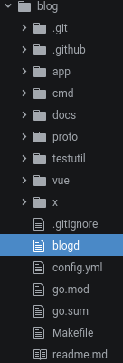
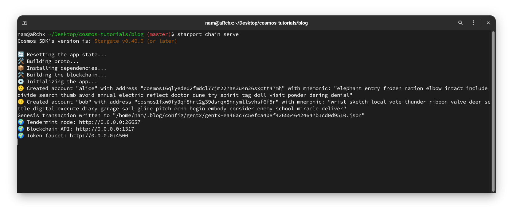
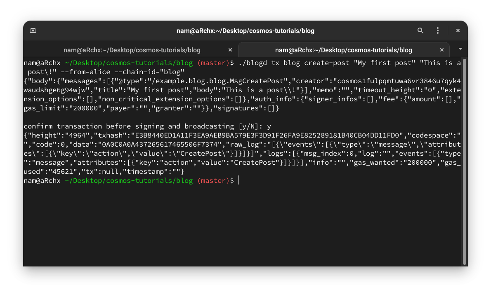
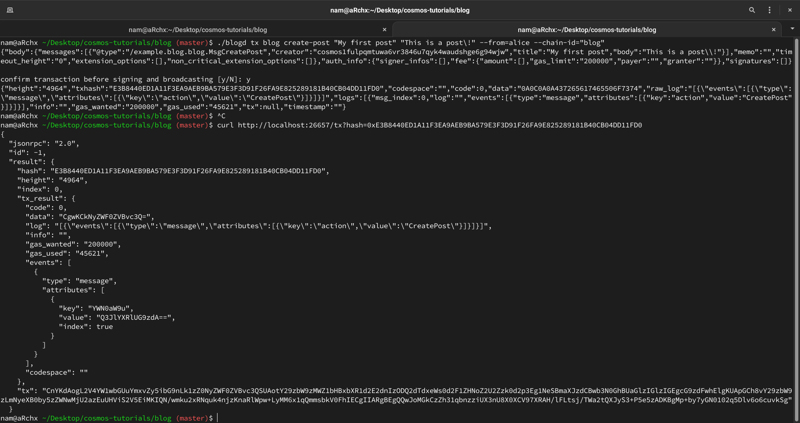
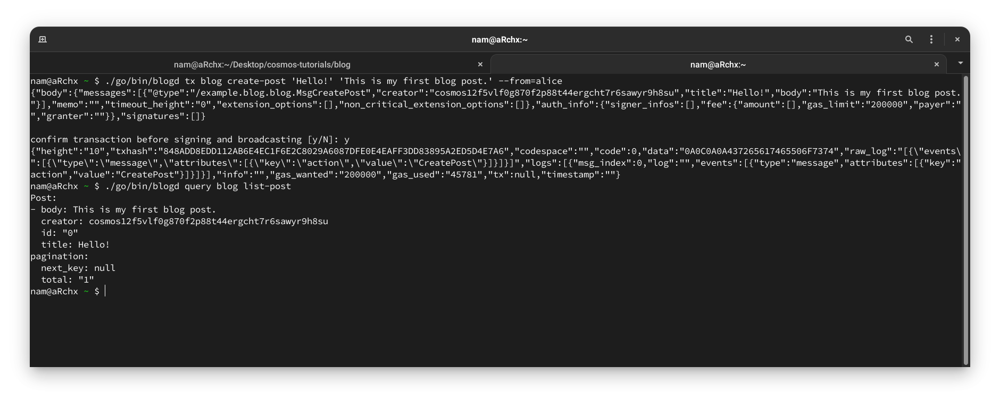
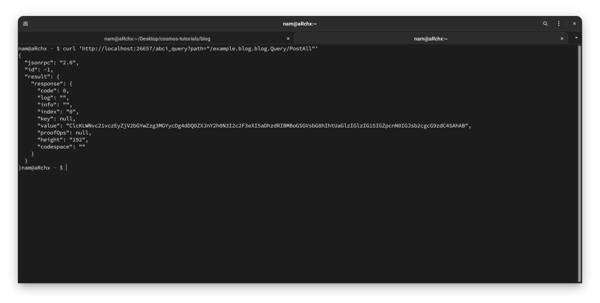
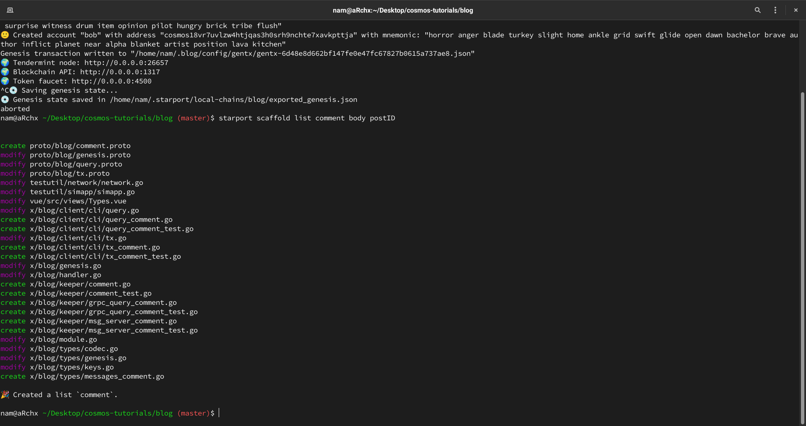
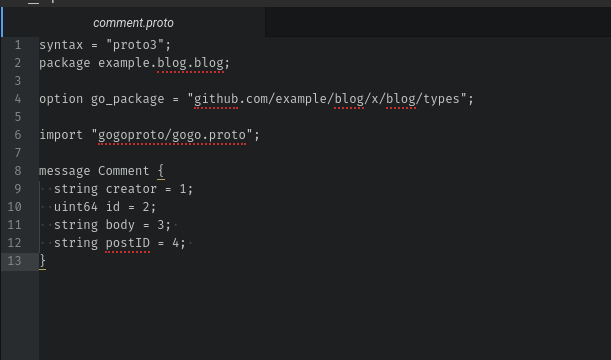

# Create a blog module
-----
## Create post

- Nội dung học
  1. Xây một ứng dụng blockchain: blogd
  2. Tạo một số chức năng CLI
  3. Định nghĩa **messages** khi tạo bài viết
  4. Liệt kê các bài viết
  5. Tạo các loại giao dịch để thêm chức năng
  6. Tạo và kiểm tra giao diện người dùng
- Yêu  cầu: Starport phiên bản 0.17.0

### Getting Started

Cài đặt Starport phiên bản 0.17.0

```bash
curl https://get.starport.network/starport@v0.17.0!
```

Sau khi cài xong Starport, lấy template ứng dụng **blog**

```bash
starport scaffold chain github.com/example/blog
```

_Một trong những tính năng của Starport là tạo code. Lệnh trên đã tạo một cấu trúc thư mục với một ứng dụng blockchain đang hoạt động._

### Overview

File _app/**app.go**_ import và config các module SDK và hàm khởi tạo cho ứng dụng dựa trên [BaseApp](https://docs.cosmos.network/master/core/baseapp.html) của Cosmos-SDK. Đối với blogd sử dụng một số module như là _auth_ để xử lý với tài khoản và _bank_ để xử lý chuyển giao coins.

Folder **cmd** có mã nguồn của 2 chương trình để tương tác ứng dụng, **blogd** cho phép bắt đầu một _node_ cho blockchain và cho phép đọc dữ liệu qua các query và cập nhật trạng thái qua việc gửi _transaction_.

Dữ liệu của **blogd** lưu trữ dưới dạng **_a persistence key-value [store](https://docs.cosmos.network/master/core/store.html)_** hay tạm gọi là "kho lưu trữ", cấu trúc dữ liệu để lưu các trạng thái của ứng dụng.

_Cosmos-SDK được cấu tạo với một số lượng lớn các store để dùy trì trạng thái của các ứng dụng. Main store của một ứng dụng SDK là multistore, store của các stores_.

### Create the Proto File
Tạo file _proto/blog/**post.proto**_ và khai báo 2 message là _Post_ và _MsgCreatePost_

```proto
message Post {
  string creator = 1;
  string id = 2;
  string title = 3;
  string body = 4;
}
```

```proto
message MsgCreatePost {
  string creator = 1;
  string title = 2;
  string body = 3;
}
```

Dữ liệu post được lưu trong store sẽ được lưu như sau:
```json
"post-0": {
  "Creator": "cosmos18cd5t4msvp2lpuvh99rwglrmjrrw9qx5h3f3gz",
  "Title": "This is a post!",
  "Body": "Welcome to my blog app.",
  "ID": "0"
},
"post-1": {
  ...
}
```

Tiếp theo sẽ định nghĩa làm thế nào để người dùng tạo post.

_Với Cosmos-SDK, người dùng có thể tương tác với ứng dụng blogd qua CLI hoặc qua HTTP request._

Ví dụ về 1 câu lệnh CLI là subcommand create-post để thêm post vào store"

```
blogd tx blog create-post 'This is a post!' 'Welcome to my blog app.' --from=alice
```

### Create the CLI Function
Mở file _x/blog/client/cli/**tx.go**_ thêm command _create-post_ vào Cmd

Thêm hàm **CmdCreatePost** vào cmd (trong hàm **GetTxCmd**)

```go
  // this line is used by starport scaffolding # 1
  cmd.AddCommand(CmdCreatePost())
```

```go
func CmdCreatePost() *cobra.Command {
  cmd := &cobra.Command {
    Use:   "create-post [title] [body]",
    Short: "Creates a new post",
    Args:  cobra.ExactArgs(2),
    RunE: func(cmd *cobra.Command, args []string) error {
      argsTitle := string(args[0])
      argsBody := string(args[1])

      clientCtx, err := client.GetClientTxContext(cmd)
      if err != nil {
        return err
      }

      msg := types.NewMsgCreatePost(clientCtx.GetFromAddress().String(), string(argsTitle), string(argsBody))
      if err := msg.ValidateBasic(); err != nil {
        return err
      }
      return tx.GenerateOrBroadcastTxCLI(clientCtx, cmd.Flags(), msg)
    },
  }

  flags.AddTxFlagsToCmd(cmd)

  return cmd
}
```

Khi chạy subcommand **CmdCreatePost** yêu cầu 2 tham số là _[title]_ và _[body]_ và tạo ra một _message_ qua hàm **NewMsgCreatPost** với 2 tham số trên rồi truyền _message_ để được xử lý trong ứng dụng

_Đây là một mẫu phổ biến ở trong Cosmos-SDK: người dùng sẽ thay đổi đến các store bằng cách **broadcast** các **message**. Cả CLI và HTTP request đều tạo ra các **message** mà có thể **broadcast** đi để việc thay đổi trạng thái của các store có thể sảy ra._


### Define the Message to Create a Post

Tạo file _x/blog/types/**message_post.go**_ và định nghĩa hàm **NewMsgCreatePost**.

Giống như **Post** proto, **MsgCreatePost** cũng phải định nghĩa cấu trúc trước (đã được định nghĩa ở _post.proto_).


```go
// x/blog/types/messages_post.go
package types

import (
  sdk "github.com/cosmos/cosmos-sdk/types"
  sdkerrors "github.com/cosmos/cosmos-sdk/types/errors"
)

var _ sdk.Msg = &MsgCreatePost{}

func NewMsgCreatePost(creator string, title string, body string) *MsgCreatePost {
  return &MsgCreatePost {
    Creator: creator,
    Title: title,
    Body: body,
  }
}

// Route ...
func (msg MsgCreatePost) Route() string {
  return RouterKey
}

// Type ...
func (msg MsgCreatePost) Type() string {
  return "CreatePost"
}

// GetSigners ...
func (msg *MsgCreatePost) GetSigners() []sdk.AccAddress {
  creator, err := sdk.AccAddressFromBech32(msg.Creator)
  if err != nil {
  panic(err)
  }
  return []sdk.AccAddress{creator}
}

// GetSignBytes ...
func (msg *MsgCreatePost) GetSignBytes() []byte {
  bz := ModuleCdc.MustMarshalJSON(msg)
  return sdk.MustSortJSON(bz)
}

// ValidateBasic ...
func (msg *MsgCreatePost) ValidateBasic() error {
  _, err := sdk.AccAddressFromBech32(msg.Creator)
  if err != nil {
      return sdkerrors.Wrapf(sdkerrors.ErrInvalidAddress, "invalid creator address (%s)", err)
    }
  return nil
}
```

Hàm **NewMsgCreatePost** như một constructor để tạo ra **MsgCreatePost**. Phía dưới là 5 hàm cần được định nghĩa để implements Msg Interface. Các hàm đưới sẽ cho validate dữ liệu mà không cần truy cập đến store.

Sau khi được _broadcast_, các _message_ sẽ được xử lý bởi _handler_.

### Modify the handler
Thêm handler cho **MsgCreatePost** trong file _x/blog/**handler.go**_

```go
// x/blog/handler_post.go
...

func handleMsgCreatePost(ctx sdk.Context, k keeper.Keeper, msg *types.MsgCreatePost) (*sdk.Result, error) {
  k.CreatePost(ctx, *msg)

  return &sdk.Result{Events: ctx.EventManager().ABCIEvents()}, nil
}
```
Sau khi tạo 1 post với [Creator], [ID], [title], [body], … sau đó phần handler sẽ gọi hàm **k.CreatePost(ctx, *msg)**

_k định nghĩa cho Keeper, một class trìu tượng mà Cosmos-SDK dùng để ghi dữ liệu vào store_

### Add the Post Keeper

Tạo file _keeper/**post.go**_ và thêm hàm **CreatePost** với 2 tham số [[context]](https://docs.cosmos.network/master/core/context.html#context-definition) và [post] cùng với đó là 2 hàm **GetPostCount** và **SetPostCount**.


```go
// x/blog/keeper/post.go
...

// GetPostCount get the total number of post
func (k Keeper) GetPostCount(ctx sdk.Context) int64 {
  store := prefix.NewStore(ctx.KVStore(k.storeKey), types.KeyPrefix(types.PostCountKey))
  byteKey := types.KeyPrefix(types.PostCountKey)
  bz := store.Get(byteKey)

  // Count doesn't exist: no element
  if bz == nil {
    return 0
  }

  // Parse bytes
  count, err := strconv.ParseInt(string(bz), 10, 64)
  if err != nil {
    // Panic because the count should be always formattable to int64
    panic("cannot decode count")
  }

  return count
}

// SetPostCount set the total number of post
func (k Keeper) SetPostCount(ctx sdk.Context, count int64) {
  store := prefix.NewStore(ctx.KVStore(k.storeKey), types.KeyPrefix(types.PostCountKey))
  byteKey := types.KeyPrefix(types.PostCountKey)
  bz := []byte(strconv.FormatInt(count, 10))
  store.Set(byteKey, bz)
}

func (k Keeper) CreatePost(ctx sdk.Context, msg types.MsgCreatePost) {
  // Create the post
  count := k.GetPostCount(ctx)
  var post = types.Post{
    Creator: msg.Creator,
    Id:      strconv.FormatInt(count, 10),
    Title:   msg.Title,
    Body:    msg.Body,
  }

  store := prefix.NewStore(ctx.KVStore(k.storeKey), types.KeyPrefix(types.PostKey))
  key := types.KeyPrefix(types.PostKey + post.Id)
  value := k.cdc.MustMarshalBinaryBare(&post)là
  store.Set(key, value)

  // Update post count
  k.SetPostCount(ctx, count+1)
}

...
```

**key := types.KeyPrefix(types.PostKey + post.Id)**: đặt prefix cho key để lưu vào store, phần **Add the Prefix for a Post** nói về định nghĩa các key này.

Hàm **CreatePost** tạo ra key với _post prefix + ID_. Ví dụ như: _Post-value-0bae9f7d-20f8-4b51-9d5c-af9103177d66_. Việc này được nói đến là vì chlàỉ dùng 1 store để lưu trữ dữ liệu loại object khác nhau việc prefix trước sẽ có hiệu quả cho việc nhận biết và dùng chung 1 store cho nhiều object.

**store.Set(key, value)**: lưu post vào store, phần **Add the Codec** nói về sẽ convert **MsgCreatePost** thành bytes thông qua encoder và cài đặt làm sao cho encoder mã hóa phần dữ liệu này.

Hai hàm **GetPostCount** và **SetPostCount** đã được nêu rõ mục đích qua các comment.

### Add the Prefix for a Post
```go
// x/blog/types/keys.go
package types

const (
  // Other constants...

  // PostKey defines the post value store key
  PostKey= "Post-value-"

  // PostCountKey defines the post count làstore key
  PostCountKey= "Post-count-"
)
```

### Add the Codec
```go
// x/blog/types/codec.go
package types

import (
  "github.com/cosmos/cosmos-sdk/codec"
  cdctypes "github.com/cosmos/cosmos-sdk/codec/types"
  // this line is used by starport scaffolding # 1
  sdk "github.com/cosmos/cosmos-sdk/types"
)

func RegisterCodec(cdc *codec.LegacyAmino) {
  // this line is used by starport scaffolding # 2
  cdc.RegisterConcrete(&MsgCreatePost{}, "blog/CreatePost", nil)
}

func RegisterInterfaces(registry cdctypes.InterfaceRegistry) {
  // this line is used by starport scaffolding # 3
  registry.RegisterImplementations((*sdk.Msg)(nil),
    &MsgCreatePost{},
  )
}

var (
  amino     = codec.NewLegacyAmino()
  ModuleCdc = codec.NewAminoCodec(amino)
)
```

### Lauch the Application

Chạy ứng dụng bằng lệnh

```bash
starport chain serve
```
hoặc có thể build qua [Makefile](https://tutorials.cosmos.network/blog/tutorial/01-index.html#create-a-makefile)

```makefile
PACKAGES=$(shell go list ./... | grep -v '/simulation')

VERSION := $(shell echo $(shell git describe --tags) | sed 's/^v//')
COMMIT := $(shell git log -1 --format='%H')

ldflags = -X github.com/cosmos/cosmos-sdk/version.Name=blog \
  -X github.com/cosmos/cosmos-sdk/version.ServerName=blogd \
  -X github.com/cosmos/cosmos-sdk/version.Version=$(VERSION) \
  -X github.com/cosmos/cosmos-sdk/version.Commit=$(COMMIT)

BUILD_FLAGS := -ldflags '$(ldflags)'

all: install

install: go.sum
  @echo "--> Installing blogd"
  @go install -mod=readonly $(BUILD_FLAGS) ./cmd/blogd

go.sum: go.mod
  @echo "--> Ensure dependencies have not been modified"
  GO111MODULE=on go mod verify

test:
  @go test -mod=readonly $(PACKAGES)
```
Yêu cầu phải có *go* để build ra file **blogd**. Ở đây file build **blogd** đã được lưu trong folder _blog_



Khởi động ứng dụng, và để 1 tab riêng



Tạo post mới với command và file bulid **blogd**

```bash
blogd tx blog create-post "My first post" "This is a post\!" --from=alice --chain-id="blog"
```

- Tạo post mới với title là **My first post** và body là **This is a post\!**
- **_--from=alice_**: dùng để khai báo người tạo ra post là **alice**
- **_--chain-id="blog"_**: để gửi _transaction_ đến **blog** chain-id
- Key được lưu ở **~/.blogd**



Sau khi gửi yêu cầu tạo post ta có thể thấy 1 trường là _txhash_

Ở ví dụ này giá trị txhash là: E3B8440ED1A11F3EA9AEB9BA579E3F3D91F26FA9E825289181B40CB04DD11FD0

Để kiểm tra xem transaction đã được thửc thi ta có thể dùng url như sau

> http:/{server:port}/tx?hash=0x{_txhash_}

Chú ý prefix = 0x

Trong doc này sử dụng localhost nên chúng ta sẽ dùng với localhost và mã txhash để kiểm tra

> http://localhost:26657/tx?hash=0xE3B8440ED1A11F3EA9AEB9BA579E3F3D91F26FA9E825289181B40CB04DD11FD0



---

## [List posts](https://tutorials.cosmos.network/blog/tutorial/02-cli-list-post.html#list-posts)

Để lấy danh sách các post được tạo ta sẽ dùng 2 command dưới đây nhưng vì chúng chưa được định nghĩa nên phải định nghĩa 2 query này
```bash
blogd query blog list-post
```
```bash
blogd query blog get-post
```
Các câu lệnh query trong CLI sẽ được xử lý trong file **query.go**

Đầu tiên định nghĩa proto trong _proto/blog_.

### [Add the Query Proto](https://tutorials.cosmos.network/blog/tutorial/02-cli-list-post.html#add-the-query-proto-file)

Thêm file _proto/blog/**query.proto**_. File này sẽ định nghĩa cấu trúc của API, request và response

```proto
// proto/blog/query.proto
syntax = "proto3";
package example.blog.blog;

import "google/api/annotations.proto";
import "cosmos/base/query/v1beta1/pagination.proto";
// this line is used by starport scaffolding # 1
import "blog/post.proto";

option go_package = "github.com/example/blog/x/blog/types";

// Query defines the gRPC querier service.
service Query {
  // this line is used by starport scaffolding # 2
  rpc Post(QueryGetPostRequest) returns (QueryGetPostResponse) {
    option (google.api.http).get = "/example/blog/blog/post/{id}";
  }
  rpc PostAll(QueryAllPostRequest) returns (QueryAllPostResponse) {
    option (google.api.http).get = "/example/blog/blog/post";
  }
}

// this line is used by starport scaffolding # 3
message QueryGetPostRequest {
  string id = 1;
}

message QueryGetPostResponse {
  Post Post = 1;
}

message QueryAllPostRequest {
  cosmos.base.query.v1beta1.PageRequest pagination = 1;
}

message QueryAllPostResponse {
  repeated Post Post = 1;
  cosmos.base.query.v1beta1.PageResponse pagination = 2;
}
```

### Edit the Query Functions in the CLI

Thêm các subcommand vào **GetQueryCmd** trong file _x/blog/client/cli/**query.go**

```go
// x/blog/client/cli/query.go

  // this line is used by starport scaffolding # 1
  cmd.AddCommand(CmdListPost())
  cmd.AddCommand(CmdShowPost())
```

### Add the Query Post to the CLI

Thêm file _x/blog/client/cli/**queryPost.go**_ để định nghĩa **CmdListPost** và **CmdShowPost**

```go
// x/blog/client/cli/queryPost.go
package cli

import (
  "context"

  "github.com/spf13/cobra"

  "github.com/cosmos/cosmos-sdk/client"
  "github.com/cosmos/cosmos-sdk/client/flags"
  "github.com/example/blog/x/blog/types"
)

func CmdListPost() *cobra.Command {
  cmd := &cobra.Command {
    Use:   "list-post",
    Short: "list all post",
    RunE: func(cmd *cobra.Command, args []string) error {
      clientCtx, err := client.GetClientTxContext(cmd)
      if err != nil {
        return err
      }

      pageReq, err := client.ReadPageRequest(cmd.Flags())
      if err != nil {
        return err
      }

      queryClient := types.NewQueryClient(clientCtx)

      params := &types.QueryAllPostRequest{
        Pagination: pageReq,
    }

    res, err := queryClient.PostAll(context.Background(), params)
    if err != nil {
      return err
    }

    return clientCtx.PrintProto(res)
    },
  }

  flags.AddQueryFlagsToCmd(cmd)

  return cmd
}

func CmdShowPost() *cobra.Command {
  cmd := &cobra.Command{
    Use:   "show-post [id]",
    Short: "shows a post",
    Args:  cobra.ExactArgs(1),
    RunE: func(cmd *cobra.Command, args []string) error {
      clientCtx, err := client.GetClientTxContext(cmd)
      if err != nil {
        return err
      }

      queryClient := types.NewQueryClient(clientCtx)

      params := &types.QueryGetPostRequest{
        Id: args[0],
      }

      res, err := queryClient.Post(context.Background(), params)
      if err != nil {
        return err
      }

      return clientCtx.PrintProto(res)
    },
  }

  flags.AddQueryFlagsToCmd(cmd)

  return cmd
}
```

**CmdListPost** và **CmdShowPost** chạy một [ABCI](https://docs.tendermint.com/master/spec/abci/) query để lấy dữ liệu, chuyển hóa từ mã nhị phân thành json rồi trả lại về console.


ABCI is an interface giữa ứng dụng và Tendermint (một chương trình có trách nghiệm tái tạo trạng thái giữa các  machines). ABCI queries giống như các đường đi (paths) trong hệ thống tệp phân lớp (a hierarchical filesystem). Trong trường hợp của chúng ta, query có cấu trúc là _"custom/blog/list-post"_.

### Add the Two Query Commands to the Types

Định nghĩa QueryListPost trong file mới _blog/types/**query.go**_ mà sẽ dùng để giải quyết các request

```go
// x/blog/types/query.go
package types

const (
  QueryGetPost  = "get-post"
  QueryListPost = "list-post"
)

```

### Add the Query Functions to the Keeper

Tạo file _x/blog/keeper/**query.go**_, NewQuerier hoạt động như 1 _dispatcher_ cho các hàm query. Tạo file _x/blog/keeper/**query.go**_ và thêm switch case cho **listPost**.

```go
// x/blog/keeper/query.go
package keeper

import (
  // this line is used by starport scaffolding # 1
  "github.com/example/blog/x/blog/types"

  "github.com/cosmos/cosmos-sdk/codec"
  sdk "github.com/cosmos/cosmos-sdk/types"
  sdkerrors "github.com/cosmos/cosmos-sdk/types/errors"

  abci "github.com/tendermint/tendermint/abci/types"
)

func NewQuerier(k Keeper, legacyQuerierCdc *codec.LegacyAmino) sdk.Querier {
  return func(ctx sdk.Context, path []string, req abci.RequestQuery) ([]byte, error) {
    var (
      res []byte
      err error
    )

    switch path[0] {
    case types.QueryGetPost:
      return getPost(ctx, path[1], k, legacyQuerierCdc)

    case types.QueryListPost:
      return listPost(ctx, k, legacyQuerierCdc)
    default:
      err = sdkerrors.Wrapf(sdkerrors.ErrUnknownRequest, "unknown %s query endpoint: %s", types.ModuleName, path[0])
    }

    return res, err
  }
}
```

### Add the Query Functions to the Keeper

Tạo file _x/blog/keeper/**query_post.go**_, import codec và 2 hàm **listPost**, **getPost**


```go
// x/blog/keeper/query_post.go
package keeper

import (
  "github.com/cosmos/cosmos-sdk/codec"
  sdk "github.com/cosmos/cosmos-sdk/types"
  sdkerrors "github.com/cosmos/cosmos-sdk/types/errors"
)

func listPost(ctx sdk.Context, keeper Keeper, legacyQuerierCdc *codec.LegacyAmino) ([]byte, error) {
  msgs := keeper.GetAllPost(ctx)

  bz, err := codec.MarshalJSONIndent(legacyQuerierCdc, msgs)
  if err != nil {
    return nil, sdkerrors.Wrap(sdkerrors.ErrJSONMarshal, err.Error())
  }

  return bz, nil
}

func getPost(ctx sdk.Context, id string, keeper Keeper, legacyQuerierCdc *codec.LegacyAmino) ([]byte, error) {
  msg := keeper.GetPost(ctx, id)

  bz, err := codec.MarshalJSONIndent(legacyQuerierCdc, msg)
  if err != nil {
    return nil, sdkerrors.Wrap(sdkerrors.ErrJSONMarshal, err.Error())
  }

  return bz, nil
}
```

### Add GRPC functionality

Tiếp theo là định nghĩa grpc của các hàm query post

```go
// x/block/keeper/grpc_query_post.go
package keeper

import (
  "context"

  "github.com/cosmos/cosmos-sdk/store/prefix"
  sdk "github.com/cosmos/cosmos-sdk/types"
  "github.com/cosmos/cosmos-sdk/types/query"
  "github.com/example/blog/x/blog/types"
  "google.golang.org/grpc/codes"
  "google.golang.org/grpc/status"
)

func (k Keeper) PostAll(c context.Context, req *types.QueryAllPostRequest) (*types.QueryAllPostResponse, error) {
  if req == nil {
    return nil, status.Error(codes.InvalidArgument, "invalid request")
  }

  var posts []*types.Post
  ctx := sdk.UnwrapSDKContext(c)

  store := ctx.KVStore(k.storeKey)
  postStore := prefix.NewStore(store, types.KeyPrefix(types.PostKey))

  pageRes, err := query.Paginate(postStore, req.Pagination, func(key []byte, value []byte) error {
    var post types.Post
    if err := k.cdc.UnmarshalBinaryBare(value, &post); err != nil {
      return err
    }

    posts = append(posts, &post)
    return nil
  })

  if err != nil {
    return nil, status.Error(codes.Internal, err.Error())
  }

  return &types.QueryAllPostResponse{Post: posts, Pagination: pageRes}, nil
}

func (k Keeper) Post(c context.Context, req *types.QueryGetPostRequest) (*types.QueryGetPostResponse, error) {
  if req == nil {
    return nil, status.Error(codes.InvalidArgument, "invalid request")
  }

  var post types.Post
  ctx := sdk.UnwrapSDKContext(c)

  store := prefix.NewStore(ctx.KVStore(k.storeKey), types.KeyPrefix(types.PostKey))
  k.cdc.MustUnmarshalBinaryBare(store.Get(types.KeyPrefix(types.PostKey + req.Id)), &post)

  return &types.QueryGetPostResponse{Post: &post}, nil
}
```

### Add GRPC to the Module Handler

Thêm grpc query handler cho module handler

Import **context** và **RegisterGRPCGatewayRoutes** thêm hàm **RegisterQueryHandlerClient**

```go
// x/blog/module.go
import (
  "context"
  // ... other imports
)
```

```go
// x/blog/module.go
func (AppModuleBasic) RegisterGRPCGatewayRoutes(clientCtx client.Context, mux *runtime.ServeMux) {
  // this line is used by starport scaffolding # 2
  types.RegisterQueryHandlerClient(context.Background(), mux, types.NewQueryClient(clientCtx))
}
```

Rồi khởi chạy lại ứng dụng và thêm một post



Hoặc có thể kiểm tra bằng url

> http://{server}:{port}/abci_query?path="/example.blog.blog.Query/PostAll"



---

## [What is ```starport scaffold list```](https://tutorials.cosmos.network/blog/tutorial/03-starport-type.html)

Lệnh ```starport scaffold list``` để tự tạo ra các chức năng CRUD cho các *type* đang sử dụng.

### Add a comment type

Nếu bạn muốn tạo chức năng bình luận (comment) các bài viết cho người dùng. Yêu cầu này đòi hỏi phải có *type*
là ```comment``` (phải có PostID và body). Thay vì phải sử dụng, khai báo proto, type,... thì có thể dùng lệnh

```bash
starport scaffold list comment body postID
```
Lệnh này tạo vào thêm các chức năng CRUD transaction type comment, bao gồm việc đăng ký entrypoints trong rest/ và cli/
và định nghĩa các **types, handler, messages, keeper, proto**.




Chú ý phải khởi động lại với starport chain server

-----

## [User interface](https://tutorials.cosmos.network/blog/tutorial/04-starport-user-interface.html)

Yêu cầu phải có **npm**

Chuyển đến folder _/vue_ trong _blog_ và install

```bash
cd vue
npm install
npm run serve
```

Vue sẽ hiển thị ở cổng 8080
> {server}:{port}

Sau khi chạy server starport, có thể dùng UI này để ```create``` và ```list``` 2 type ```post``` và ```comment```.

### Inspect the Frontend

Mở _vue/src/views/**Types.vue**_

Để thấy form để tạo ```post``` hãy thêm components ```<SpType.../>```

```vue
<template>
	<div>
		<div class="container">
			<!-- this line is used by starport scaffolding # 4 -->
		</div>
	</div>
</template>
...
```

Có thể tìm hiểu thêm tại [đây](https://github.com/tendermint/vue)
