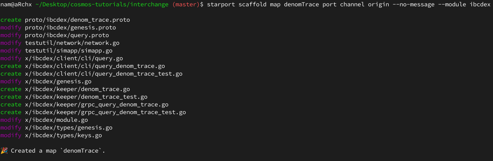

# Create an IBC Interchain Exchange Module

---

## Introduction

_Sàn giao dịch liên chuỗi_ (The Interchain Exchange) là một mô-đun để có thể tạo các lệnh mua và bán giữa các blockchain. Trong hướng dẫn này bạn sẽ học làm sao để tạo một mô-đun Cosmos SDK mà có thể tạo cắc cặp đơn hàng, mua và bán đơn đặt hàng. Bạn sẽ có thể tạo một sổ đơn đặt hàng và mua bán giữa các blockchain mà cho phép chuyển các _token_ từ blockchain này sang blockchain khác.

Nếu bạn muốn xem kết quả, hay thử xem qua phần [này](https://github.com/tendermint/interchange)

Bạn sẽ học được:
- Tạo một blockchain với Starport
- Tạo một mô-đun Cosmos SDK IBC
- Tạo một sổ đặt hàng mà lưu trữ các lệnh mua bán với một mô-đun
- Gửi gói tin IBC (IBC packet)  từ blockchain này đến blockchain khác
- Xử lý việc quá thời gian (timeout) và xác thực của các gói tin IBC

### How the module works

Bạn sẽ được học làm thế nào để xây dựng một sàn giao dịch mà hoạt động với nhiều blockchain. Mô-đun này gọi là _ibcdex_.
Mô-đun này sẽ cho bạn mở một sổ lệnh trao đổi giữa một cặp _token_ từ blockchain này và _token_ ở blockchain khác.
Các blockchain yêu cầu phải có mô-đun ibcdex .
Các _token_ có thể mua hoặc bán với số lượng giới hạn các đơn đặt hàng trên một sổ ghi lệnh đơn gian, sẽ không có khái niệm về _Nhóm thanh toán_ (Liquidity Pool) hoặc AMM

Thị trường một chiều: Không thể mua lại _token_ đã bán ở chuỗi nguồn và _token_ được mua từ chuỗi nhận không thể bán lại bằng cách sử dụng cùng một cặp.
Nếu token từ chuỗi nguồn đã được bán, thì cách duy nhât để lấy mua lại là tạo một cặp mới trong sổ lệnh.
Vấn đề này do bản chất của IBC, tạo một _token_ được chứng thực trên blockchain nhận.
Trong hướng đẫn này, bạn sẽ phân biệt được sự khác nhau giữa _token gốc_ của blockchain và _token được chứng thực_ mà được lưu trên blockchain khác.
Bạn sẽ học làm sao để tạo một cặp sổ lệnh  thứ 2 để có thể nhận _token gốc_ lại.

## App Design

Trong chương này bạn sẽ học làm sao một mô-đun sàn giao dịch liên chuỗi được thiết kế. Mô đun này có nhiều sổ lệnh chứa csac lệnh mua và bán.
Đầu tiên, một sổ lệnh cho một cặp _token_ sẽ đươc tạo.
Sau khi sổ lệnh được tạo, bạn có thể tạo lệnh mua, bán trên cặp _token_ này.

Mô-đun sẽ tận dụng phương thức truyền thông giữa các Blockchain (IBC).
Với IBC, mô-đun có thể tạo các sổ lệnh cho các _token_ để các blockchain có thể tương tác và trao đổi _token_ ở đó.
Bạn sẽ có thể tạo một cặp sổ lệnh với 1 _token_ từ blockchain này và 1 _token_ từ blockchain khác.
Bạn sẽ gọi mô-đun này là ibcdex (trong hướng dẫn này).
Cả 2 blockchain phải có mô-đun **ibcdex**

Khi một người dùng trao đổi _token_ với **ibcdex**, bạn sẽ nhận được 1 _chứng thực_ của _token_ đó ở blockchain khác.
Điều này tương tự với cách mà 1 bộ truyển đổi ibc (ibc-transfer) được cấu tạo.
Khi mà một mô-đun blockchain không có quyên đúc 1 _token_ mới trên 1 blockchain khác thì _token_ trên blockchain nhận đó sẽ bị khóa lại và người mua sẽ nhận được 1 _chứng thực_ của token đó.
Quá trình này có thể đảo ngược nếu _chứng thực_ bị ghi lại để mở khóa _token gốc_. Trong quá trình sẽ mô tả thêm.

### Assumption

Một sổ lệnh có thể tạo để trao đổi bất kỳ token nào giữa các cặp chuỗi.
Yêu cầu là phải có mô-đun **ibcdex**. Chỉ có 1 sổ trao đổi cho 1 cặp _token_ tại một thời điểm.
Một blockchain xác định không thể đúc thêm _token gốc_ của nó.

Mô-đun này đươc lấy cảm hứng từ [mô-đun bộ truyển đổi ibc (ibc-transfer)](https://github.com/cosmos/cosmos-sdk/tree/v0.42.1/x/ibc/applications/transfer) và sẽ có một số điểm tương đồng như việc tạo _chứng từ_.
Nó sẽ trở nên phức tạp hơn nhưng nó sẽ hiển thị làm sao để tạo:
- Một số _type_ của gói tin để chuyên
- Một số _type_ của xác thực để xử lý
- Một số phần logic phức tạp để xử lý gói tin khi nhận hoặc khi bị quá thời gian, ...


### Overview

Giả sử rằng người dùng có 2 blockchains: **Venus** và **Mars**.
_Token  gốc_ của **Venus** gọi là **vcx**.
Khi trao đổi 1 _token_ từ **Mars** đến **Venus**, trên **Venus** sẽ kết thúc bằng việ tạo 1 _token chứng thực IBC_ (IBC voucher token) với 1 _mệnh giá_ (denom, tương tự như key) như ibc/ABC123...XYZ789.
Phần chuỗi dài đằng sau của phần ibc/ là phần _mệnh giá truy vết_ từ việc mã hóa 1 _token_ mà được chuyển đổi qua IBC .
Sử dụng API của ứng dụng blockchain có thể lấy phần _mệnh giá truy vêt_ từ phần mã hóa đó.
Phần _mệnh giá truy vết_ yêu cầu 1 *base_denom* và 1 đường dẫn (path).
Trong ví dụ của chúng ta *base_denom* sẽ là **mcx** và đường dẫn sẽ bao gồm cặp cổng (port) và kênh (channel) mà _token_ đã được chuyển đổi qua.
Đối với đường truyền 1 bên, đường dẫn sẽ giống như: _transfer/channel-0_.
Để tìm hiểu thêm về đường dẫn _token_ trong [này](https://github.com/cosmos/ibc/tree/master/spec/app/ics-020-fungible-token-transfer).
_Token_ **ibc/Venus/mcx** không thể được bán lại thông qua sổ lệnh cũ. Nếu muốn 'đảo ngược' quá trình trao đổi và nhận lại _token_ của **Mars** thì phải 1 sổ lệnh mới là **ibc/Venus/mcx** đến **mcx** phải được tạo ra


### Order books

Như một kiểu trao đổi điển hình , một cặp mới ngụ ý người tạo ra sổ lệnh với yêu cầu để bán **MCX** hoặc mua **VCX**.
Ở đây, người dùng có 2 chuỗi và cấu trúc dữ liệu này phải được chia giữa **Mars** và **Venus**.

Người dùng từ chuỗi **Mars** sẽ bán **MCX** và người dùng từ chuỗi **Venus** sẽ mua **MCX**.
Vì vậy, chúng ta sẽ đại diễn tất cả yêu cầu bán **MCX** trên chuỗi **Mars** và tất cả yêu cầu mua chuỗi **MCX** trên chuỗi **Venus**.

Đây là ví dụ blockchain **Mars** giữ yêu cầu bán và blockchain **Venus** giữ yêu cầu mua.

### Exchanging tokens back

Như 1 bộ chuyển đổi ibc (ibc-transfer) mỗi blockchain giữ 1 dấu vết của _token chứng thực_ mà được tạo trên blockchain khác

Nếu blockchain **Mars** bán **MCX** cho **Venus** và ibc/Venus/mcx được đúc trên **Venus** và nếu ibc/Venus/mcx được bán trên **Mars** thì _token_ sẽ được mở khóa và nhận được sẽ là **MCX**

### Features
Một số đặc điểm để hỗ trợ mô-đun là:
- Tạo một sổ lệnh trao đổi giữa cho 1 cặp _token_ giữa 2 blockchain
- Gửi yêu cầu bán trên chuỗi nguồn
- Gửi yêu cầu mua trên chuỗi nhận
- Hủy yêu cầu mua hoặc bán

---

## Initialize the Blockchain

Trong chương này bạn sẽ học các tạo một mô-đun đơn giản cho ứng dụng _Sàn giao dịch liên chuỗi_.
Bạn dựng lên ứng dụng blockchain, mô-đun, các giao dịch (transaction), các gói tin IBC và các _message_.
Trong chương sau, bạn sẽ tích hợp thêm code để xử lý các giao dịch.

### Install Starport

Sử dụng  Starport v0.16.2

```bash
curl https://get.starport.network/starport@v0.16.2! | bash
```

**Lưu ý, trong hướng dẫn này sẽ sử dụng Starport phiên bản v0.17.0 thay vì v0.16.2 tại vì phiên bản v0.16.2 chưa có flag [--no-module] và lệnh scaffold như yêu cầu.**

### Create the Blockchain

Dựng một ứng dụng blockchain mới tên là **interchain**

```bash
starport scaffold chain github.com/username/interchange --no-module
```

### Create the Module

Dựng mô-đun **ibcdex** bên trong ứng dụng với khả năng IBC. Mô-đun **ibcdex** bao gồm phần logic để tạo và duy trì các sổ lệnh và định tuyến chúng đến blockchain khác

```bash
starport scaffold module ibcdex --ibc --ordering unordered
```


### Create the Transaction Types

Dựng lên 2 _type_ với các chức năng CRUD là: **sellOrderBook** và **buyOderBook**

```bash
starport scaffold map sellOrderBook amountDenom priceDenom --no-message --module ibcdex
starport scaffold map buyOrderBook amountDenom priceDenom --no-message --module ibcdex
```


2 giá trị là
- amountDenom: đại diện _token_ nào sẽ được bán với số lượng bao nhiêu
- priceDenom: giá của _token_

Flag **--module ibcdex** chỉ ra rằng _type_ sẽ được dùng trong mô-đun nào

### Create the IBC Packets

Tạo 3 gói tin cho IBC:
- 1 cặp sổ lệnh **createPair**
- 1 lệnh bán **sellOrder**
- 1 lệnh mua **buyOrder**

```bash
starport scaffold packet createPair sourceDenom targetDenom --module ibcdex
starport scaffold packet sellOrder amountDenom amount:int priceDenom price:int --ack remainingAmount:int,gain:int --module ibcdex
starport scaffold packet buyOrder amountDenom amount:int priceDenom price:int --ack remainingAmount:int,purchase:int --module ibcdex
```


Flag **--ack** định nghĩa trường và kiểu dữ liệu của phần xác thực trả (acknowledgment) về sau khi chuỗi nhận đã nhận được.
Giá trị **--ack** là danh sách tên được phân tách bằng dâu '**,**' với các kiểu dữ liệu tùy chọn sau dấu '**:**'.

### Cancel messages

Việc hủy lệnh được được xử lý trong cục bộ mạng, không có gói tin nào được gửi.
Sử dụng lệnh **message** để tạo _message_ để hủy lệnh bán hoặc mua.

```bash
starport scaffold message cancel-sell-order port channel amountDenom priceDenom orderID:int --desc "Cancel a sell order" --module ibcdex
starport scaffold message cancel-buy-order port channel amountDenom priceDenom orderID:int --desc "Cancel a buy order" --module ibcdex
```


Flag **--desc** sẽ giúp định nghĩa mô tả cho các câu lệnh CLI

### Trace the Denom

Các mệnh giá _token_ phải có những hành vi tương tự khi được mô tả trong **ibc-transfer**:
- 1 _token_ bên ngoài nhận được từ 1 blockchain phải có 1 mệnh giá duy nhất, hay còn được gọi là phần _chứng thực_
- Kho một _token_ được gửi cho 1 blockchain và được gửi và nhận lại, blockchain sẽ giải quyết phần _chức thực_ và chuyển hóa nó lại thành mệnh giá _token gốc_

Các _token chứng thực_ được đại diện dưới dạng _băm_, vì vậy bạn phải lưu những mệnh giá gốc nào có liên quan đến phần _chứng thực_, có thể làm việc này với kiểu dữ liệu _chỉ mục_.

```bash
starport scaffold map denomTrace port channel origin --no-message --module ibcdex
```



Để lưu một _chứng thực_ (voucher): thì phải lưu cổng nguồn (source port ID), kênh nguồn (source channel ID) và mệnh giá gốc (origin denom)

### Create the Configuration

Thêm 2 file cấu hình **mars.yml** và **venus.yml** để thử 2 mạng blockchain với 2 loại _token_ riêng biệt. Thêm vào folder **interchange**. Mệnh giá của **Mars** là **mcx** (marcoin) và của **Venus** là **vcx** (venuscoin)


```yml
# mars.yml
accounts:
  - name: alice
    coins: ["1000token", "100000000stake", "1000mcx"]
  - name: bob
    coins: ["500token", "1000mcx", "100000000stake"]
validator:
  name: alice
  staked: "100000000stake"
faucet:
  name: bob
  coins: ["5token", "100000stake"]
genesis:
  chain_id: "mars"
init:
  home: "$HOME/.mars"
```

```yml
# venus.yml
accounts:
  - name: alice
    coins: ["1000token", "1000000000stake", "1000vcx"]
  - name: bob
    coins: ["500token", "1000vcx", "100000000stake"]
validator:
  name: alice
  staked: "100000000stake"
faucet:
  host: ":4501"
  name: bob
  coins: ["5token", "100000stake"]
host:
  rpc: ":26659"
  p2p: ":26658"
  prof: ":6061"
  grpc: ":9091"
  api: ":1318"
  frontend: ":8081"
  dev-ui: ":12346"
genesis:
  chain_id: "venus"
init:
  home: "$HOME/.venus"
```


---

## Create the Order Book

Trong chương này, bạn sẽ bổ sung phần code cho sổ lệnh cho lệnh mua và bán.

File **order_book.go** với phần bổ sung cho sổ lệnh.
Phần sổ lệnh sẽ cho phép công bố các lệnh mua hoặc bán.
Sổ lệnh cho 1 cặp _token_ sẽ được đăng ký trước.
Sau khi đăng ký sổ lệnh với 1 cặp _token_, người dùng có thể them các lệnh mua/bán.

File **sell_order_book.go** bổ sung cho phần sổ lệnh bán.
Sổ lệnh bán gồm các lệnh bán mà bao gồm phần dữ liệu của mệnh giá của _token_ và giá của 1 _token_ mà người dùng bán.

File **buy_order_book.go** sẽ bổ sung phần sổ lệnh mua.
Sổ lệnh mua bao gồm các lệnh mua mà gồm dữ liệu mệnh giá của _token_ và giá mà người dùng sẽ trả để mua 1 _token_.

Lệnh mua và lệnh bán sẽ tồn tại trên 2 blockchain khác nhau.
Khi lệnh mua mà hợp với lệnh bán, việc trao đổi sẽ diễn ra.

### Add The Order Book

Định nghĩa bộ đệm lót (The protobuffer definition) định nghĩa các dữ liệu mà sổ lệnh có.

Thêm các _message_ cho sổ lệnh và các lệnh trong file **order.proto**

```
// proto/ibcdex/order.proto
syntax = "proto3";
package username.interchange.ibcdex;

option go_package = "github.com/username/interchange/x/ibcdex/types";

message OrderBook {
  int32 idCount = 1;
  repeated Order orders = 2;
}

message Order {
  int32 id = 1;
  string creator = 2;
  int32 amount = 3;
  int32 price = 4;
}
```

Tạo file **order_book.go** trong thư mục _/types_ trong mô-đun **ibcdex** .

Trong file này, sẽ định nghĩa phần logic để tạo 1 sổ lệnh mới.
Đây là logic chung giữa sổ lệnh mua và bán.

```go
// x/ibcdex/types/order_book.go
package types

import (
  "errors"
  "sort"
)

const (
  MaxAmount = int32(100000)
  MaxPrice  = int32(100000)
)

type Ordering int

const (
  Increasing Ordering = iota
  Decreasing
)

var (
  ErrMaxAmount     = errors.New("max amount reached")
  ErrMaxPrice      = errors.New("max price reached")
  ErrZeroAmount    = errors.New("amount is zero")
  ErrZeroPrice     = errors.New("price is zero")
  ErrOrderNotFound = errors.New("order not found")
)

// checkAmountAndPrice checks correct amount or price
func checkAmountAndPrice(amount int32, price int32) error {
  if amount == int32(0) {
    return ErrZeroAmount
  }
  if amount > MaxAmount {
    return ErrMaxAmount
  }
  if price == int32(0) {
    return ErrZeroPrice
  }
  if price > MaxPrice {
    return ErrMaxPrice
  }

  return nil
}

func NewOrderBook() OrderBook {
  return OrderBook{
    IdCount: 0,
  }
}

// GetOrder gets the order from an index
func (book OrderBook) GetOrder(index int) (order Order, err error) {
  if index >= len(book.Orders) {
    return order, ErrOrderNotFound
  }

  return *book.Orders[index], nil
}

// GetNextOrderID gets the ID of the next order to append
func (book OrderBook) GetNextOrderID() int32 {
  return book.IdCount
}

// GetOrderFromID gets an order from the book from its id
func (book OrderBook) GetOrderFromID(id int32) (Order, error) {
  for _, order := range book.Orders {
    if order.Id == id {
      return *order, nil
    }
  }
  return Order{}, ErrOrderNotFound
}

// SetOrder gets the order from an index
func (book *OrderBook) SetOrder(index int, order Order) error {
  if index >= len(book.Orders) {
    return ErrOrderNotFound
  }

  book.Orders[index] = &order

  return nil
}

// IncrementNextOrderID updates the ID count for orders
func (book *OrderBook) IncrementNextOrderID() {
  // Even numbers to have different ID than buy orders
  book.IdCount++
}

// RemoveOrderFromID removes an order from the book and keep it ordered
func (book *OrderBook) RemoveOrderFromID(id int32) error {
  for i, order := range book.Orders {
    if order.Id == id {
      book.Orders = append(book.Orders[:i], book.Orders[i+1:]...)
      return nil
    }
  }
  return ErrOrderNotFound
}

// AppendOrder initializes and appends a new order in a book from order information
func (book *OrderBook) appendOrder(creator string, amount int32, price int32, ordering Ordering) (int32, error) {
  if err := checkAmountAndPrice(amount, price); err != nil {
    return 0, err
  }

  // Initialize the order
  var order Order
  order.Id = book.GetNextOrderID()
  order.Creator = creator
  order.Amount = amount
  order.Price = price

  // Increment ID tracker
  book.IncrementNextOrderID()

  // Insert the order
  book.insertOrder(order, ordering)

  return order.Id, nil
}

// insertOrder inserts the order in the book with the provided order
func (book *OrderBook) insertOrder(order Order, ordering Ordering) {
  if len(book.Orders) > 0 {
    var i int

    // get the index of the new order depending on the provided ordering
    if ordering == Increasing {
      i = sort.Search(len(book.Orders), func(i int) bool { return book.Orders[i].Price > order.Price })
    } else {
      i = sort.Search(len(book.Orders), func(i int) bool { return book.Orders[i].Price < order.Price })
    }

    // insert order
    orders := append(book.Orders, &order)
    copy(orders[i+1:], orders[i:])
    orders[i] = &order
    book.Orders = orders
  } else {
    book.Orders = append(book.Orders, &order)
  }
}
```

### Add The Sellorder

Chỉnh sửa file **sell_order_book.proto** để thêm phần sổ lệnh trong phần sổ lệnh bán.

```proto
// proto/ibcdex/sell_order_book.proto
syntax = "proto3";
package username.interchange.ibcdex;

option go_package = "github.com/username/interchange/x/ibcdex/types";

import "ibcdex/order.proto"; // <--

message SellOrderBook {
  string creator = 1;
  string index = 2;
  string amountDenom = 3;
  string priceDenom = 4;
  OrderBook book = 5; // <--
}
```

Trong thư mục _x/ibcdex/types_ thêm file **sell_order_book.go**

```go
// x/ibcdex/types/sell_order_book.go
package types

// NewSellOrderBook creates a new sell order book
func NewSellOrderBook(AmountDenom string, PriceDenom string) SellOrderBook {
  book := NewOrderBook()
  return SellOrderBook{
    AmountDenom: AmountDenom,
    PriceDenom: PriceDenom,
    Book: &book,
  }
}

// AppendOrder appends an order in sell order book
func (s *SellOrderBook) AppendOrder(creator string, amount int32, price int32) (int32, error) {
  return s.Book.appendOrder(creator, amount, price, Decreasing)
}

// LiquidateFromBuyOrder liquidates the first sell order of the book from the buy order
// if no match is found, return false for match
func (s *SellOrderBook) LiquidateFromBuyOrder(order Order) (
  remainingBuyOrder Order,
  liquidatedSellOrder Order,
  purchase int32,
  match bool,
  filled bool,
) {
  remainingBuyOrder = order

  // No match if no order
  orderCount := len(s.Book.Orders)
  if orderCount == 0 {
    return order, liquidatedSellOrder, purchase, false, false
  }

  // Check if match
  lowestAsk := s.Book.Orders[orderCount-1]
  if order.Price < lowestAsk.Price {
    return order, liquidatedSellOrder, purchase, false, false
  }

  liquidatedSellOrder = *lowestAsk

  // Check if buy order can be entirely filled
  if lowestAsk.Amount >= order.Amount {
    remainingBuyOrder.Amount = 0
    liquidatedSellOrder.Amount = order.Amount
    purchase = order.Amount

    // Remove lowest ask if it has been entirely liquidated
    lowestAsk.Amount -= order.Amount
    if lowestAsk.Amount == 0 {
      s.Book.Orders = s.Book.Orders[:orderCount-1]
    } else {
      s.Book.Orders[orderCount-1] = lowestAsk
    }

    return remainingBuyOrder, liquidatedSellOrder, purchase, true, true
  }

  // Not entirely filled
  purchase = lowestAsk.Amount
  s.Book.Orders = s.Book.Orders[:orderCount-1]
  remainingBuyOrder.Amount -= lowestAsk.Amount

  return remainingBuyOrder, liquidatedSellOrder, purchase, true, false
}

// FillBuyOrder try to fill the buy order with the order book and returns all the side effects
func (s *SellOrderBook) FillBuyOrder(order Order) (
  remainingBuyOrder Order,
  liquidated []Order,
  purchase int32,
  filled bool,
) {
  var liquidatedList []Order
  totalPurchase := int32(0)
  remainingBuyOrder = order

  // Liquidate as long as there is match
  for {
    var match bool
    var liquidation Order
    remainingBuyOrder, liquidation, purchase, match, filled = s.LiquidateFromBuyOrder(
      remainingBuyOrder,
    )
    if !match {
      break
    }

    // Update gains
    totalPurchase += purchase

    // Update liquidated
    liquidatedList = append(liquidatedList, liquidation)

    if filled {
      break
    }
  }

  return remainingBuyOrder, liquidatedList, totalPurchase, filled
}
```

### Add The Buyorder

Chỉnh sửa file **buy_order_book.proto** để thêm phần sổ lệnh trong phần sổ lệnh mua.

```proto
// proto/ibcdex/buy_order_book.proto
syntax = "proto3";
package username.interchange.ibcdex;

option go_package = "github.com/username/interchange/x/ibcdex/types";

import "ibcdex/order.proto"; // <--

message BuyOrderBook {
  string creator = 1;
  string index = 2;
  string amountDenom = 3;
  string priceDenom = 4;
  OrderBook book = 5; // <--
}
```

Trong thư mục _x/ibcdex/types_ thêm file **buy_order_book.go**

```go
// x/ibcdex/types/buy_order_book.go
package types

// NewBuyOrderBook creates a new buy order book
func NewBuyOrderBook(AmountDenom string, PriceDenom string) BuyOrderBook {
 book := NewOrderBook()
 return BuyOrderBook{
       AmountDenom: AmountDenom,
       PriceDenom: PriceDenom,
       Book: &book,
   }
}

// AppendOrder appends an order in buy order book
func (b *BuyOrderBook) AppendOrder(creator string, amount int32, price int32) (int32, error) {
  return b.Book.appendOrder(creator, amount, price, Increasing)
}

// LiquidateFromSellOrder liquidates the first buy order of the book from the sell order
// if no match is found, return false for match
func (b *BuyOrderBook) LiquidateFromSellOrder(order Order) (
  remainingSellOrder Order,
  liquidatedBuyOrder Order,
  gain int32,
  match bool,
  filled bool,
) {
  remainingSellOrder = order

  // No match if no order
  orderCSpaceount := len(b.Book.Orders)
  if orderCount == 0 {
    return order, liquidatedBuyOrder, gain, false, false
  }

  // Check if match
  highestBid := b.Book.Orders[orderCount-1]
  if order.Price > highestBid.Price {
    return order, liquidatedBuyOrder, gain, false, false
  }

  liquidatedBuyOrder = *highestBid

  // Check if sell order can be entirely filled
  if highestBid.Amount >= order.Amount {
    remainingSellOrder.Amount = 0
    liquidatedBuyOrder.Amount = order.Amount
    gain = order.Amount * highestBid.Price

    // Remove highest bid if it has been entirely liquidated
    highestBid.Amount -= order.Amount
    if highestBid.Amount == 0 {
      b.Book.Orders = b.Book.Orders[:orderCount-1]
    } else {
      b.Book.Orders[orderCount-1] = highestBid
    }
    return remainingSellOrder, liquidatedBuyOrder, gain, true, true
  }

  // Not entirely filled
  gain = highestBid.Amount * highestBid.Price
  b.Book.Orders = b.Book.Orders[:orderCount-1]
  remainingSellOrder.Amount -= highestBid.Amount

  return remainingSellOrder, liquidatedBuyOrder, gain, true, false
}


// FillSellOrder try to fill the sell order with the order book and returns all the side effects
func (b *BuyOrderBook) FillSellOrder(order Order) (
 remainingSellOrder Order,
 liquidated []Order,
 gain int32,
 filled bool,
) {
 var liquidatedList []Order
 totalGain := int32(0)
 remainingSellOrder = order

 // Liquidate as long as there is match
 for {
   var match bool
   var liquidation Order
   remainingSellOrder, liquidation, gain, match, filled = b.LiquidateFromSellOrder(
     remainingSellOrder,
   )
   if !match {
     break
   }

   // Update gains
   totalGain += gain

   // Update liquidated
   liquidatedList = append(liquidatedList, liquidation)

   if filled {
     break
   }
 }

 return remainingSellOrder, liquidatedList, totalGain, filled
}
```
---
## Create Order Pairs

Trong chương này sẽ hướng đến xây dựng phần mềm để có thể làm sổ lệnh có khả năng truyền tin giũa các blockchain.
Việc này sẽ yêu cầu tạo chỉ mục cho một sổ lệnh, với các _message_ theo khi nhận và khi xác thực gói tin IBC.

### Define the Order Book Indexes

Định nghĩa các sổ lệnh như dạng số chỉ mục trong _store_ nhưng phải xác định làm sao index này được định nghĩa:

```go
// x/ibcdex/types/keys.go
import "fmt"

//...

func OrderBookIndex(
  portID string,
  channelID string,
  sourceDenom string,
  targetDenom string,
) string {
  return fmt.Sprintf("%s-%s-%s-%s",
    portID,
    channelID,
    sourceDenom,
    targetDenom,
  )
}
```

### Check for Existing Pairs

1 cặp token sẽ luôn có một sổ lệnh mà mọi người có thể truy cập từ ứng dụng.
Khi tồn tại 1 sổ lệnh thì sẽ ném ra lỗi.

```go
// x/ibcdex/keeper/msg_server_create_pair.go
import "errors"

//...

func (k msgServer) SendCreatePair(goCtx context.Context, msg *types.MsgSendCreatePair) (*types.MsgSendCreatePairResponse, error) {
  ctx := sdk.UnwrapSDKContext(goCtx)

  // Cannot create the pair if it already exists
  pairIndex := types.OrderBookIndex(msg.Port, msg.ChannelID, msg.SourceDenom, msg.TargetDenom)
  _, found := k.GetSellOrderBook(ctx, pairIndex)
  if found {
    return &types.MsgSendCreatePairResponse{}, errors.New("the pair already exist")
  }

  // ...
}
```

### Create the OnRecv Function

Khi 1 gói tin với 1 sổ lệnh được nhận, việc thẩm định của giao dịch sẽ được kiểm tra với hàm **ValidateBasic()**.
Nếu 1 cặp không tồn tại, thì nó sẽ thêm vào _keeper_:

```go
// x/ibcdex/keeper/create_pair.go
func (k Keeper) OnRecvCreatePairPacket(ctx sdk.Context, packet channeltypes.Packet, data types.CreatePairPacketData) (packetAck types.CreatePairPacketAck, err error) {
  // validate packet data upon receiving
  if err := data.ValidateBasic(); err != nil {
    return packetAck, err
  }

  // Check if the buy order book exists
  pairIndex := types.OrderBookIndex(packet.SourcePort, packet.SourceChannel, data.SourceDenom, data.TargetDenom)
  _, found := k.GetBuyOrderBook(ctx, pairIndex)
  if found {
    return packetAck, errors.New("the pair already exist")
  }

  // Set the buy order book
  book := types.NewBuyOrderBook(data.SourceDenom, data.TargetDenom)
  book.Index = pairIndex
  k.SetBuyOrderBook(ctx, book)

  return packetAck, nil
}
```

### Create the OnAcknowledgement Function

Khi 1 gói tin được gửi với IBC đã được thẩm định và nhận, nó phải được xác thực.
Sau khi việc xác thực thành công, thêm sổ lệnh mua vào cơ sở dữ liệu.

```go
// x/ibcdex/keeper/create_pair.go
func (k Keeper) OnAcknowledgementCreatePairPacket(ctx sdk.Context, packet channeltypes.Packet, data types.CreatePairPacketData, ack channeltypes.Acknowledgement) error {
  switch dispatchedAck := ack.Response.(type) {
  case *channeltypes.Acknowledgement_Error:
    return nil
  case *channeltypes.Acknowledgement_Result:
    // Decode the packet acknowledgment
    var packetAck types.CreatePairPacketAck

    if err := types.ModuleCdc.UnmarshalJSON(dispatchedAck.Result, &packetAck); err != nil {
      // The counter-party module doesn't implement the correct acknowledgment format
      return errors.New("cannot unmarshal acknowledgment")
    }

    // Set the sell order book
    pairIndex := types.OrderBookIndex(packet.SourcePort, packet.SourceChannel, data.SourceDenom, data.TargetDenom)
    book := types.NewSellOrderBook(data.SourceDenom, data.TargetDenom)
    book.Index = pairIndex
    k.SetSellOrderBook(ctx, book)

    return nil
  default:
    // The counter-party module doesn't implement the correct acknowledgment format
    return errors.New("invalid acknowledgment format")
  }
}
```

### No Consequences OnTimeout

Trong kịch bản sẽ không có trường hợp bị vượt quá thời gian (timeout).
Sổ lệnh sẽ không được xác thực

---

## Initialize the Orders

Chương này, sẽ hướng tới việc khởi tạo _bank keeper_ vào mô-đun **ibcdex** và sẽ cập nhật mô-đun ở **app.go**.
Việc này sẽ đảm bảo rằng không có 1 _token gốc_ nào có thể đúc tại ứng dụng blockchain, điều này sẽ bảo vệ mô-đun từ các hành vi trái đạo đức.

### Add the bank keeper to the module

Thêm tham chiếu _bank keeper_ trong mô-đun **ibcdex**

```go
// x/ibcdex/types/expected_keeper.go
package types

import sdk "github.com/cosmos/cosmos-sdk/types"

// BankKeeper defines the expected bank keeper
type BankKeeper interface {
  SendCoins(ctx sdk.Context, fromAddr sdk.AccAddress, toAddr sdk.AccAddress, amt sdk.Coins) error
  MintCoins(ctx sdk.Context, moduleName string, amt sdk.Coins) error
  BurnCoins(ctx sdk.Context, moduleName string, amt sdk.Coins) error
  SendCoinsFromModuleToAccount(ctx sdk.Context, senderModule string, recipientAddr sdk.AccAddress, amt sdk.Coins) error
  SendCoinsFromAccountToModule(ctx sdk.Context, senderAddr sdk.AccAddress, recipientModule string, amt sdk.Coins) error
}
```

Trong file _x/ibcdex/keeper/**keeper.go**_ xác định _bank_ để có thể truy cập từ mô-đun **ibcdex**

```go
// x/ibcdex/keeper/keeper.go
type (
  Keeper struct {
    cdc           codec.Marshaler
    storeKey      sdk.StoreKey
    memKey        sdk.StoreKey
    channelKeeper types.ChannelKeeper
    portKeeper    types.PortKeeper
    scopedKeeper  types.ScopedKeeper
    bankKeeper    types.BankKeeper  // <--
  }
)

func NewKeeper(
  cdc codec.Marshaler,
  storeKey,
  memKey sdk.StoreKey,
  channelKeeper types.ChannelKeeper,
  portKeeper types.PortKeeper,
  scopedKeeper types.ScopedKeeper,
  bankKeeper types.BankKeeper,  // <--
) *Keeper {
  return &Keeper{
    cdc:           cdc,
    storeKey:      storeKey,
    memKey:        memKey,
    channelKeeper: channelKeeper,
    portKeeper:    portKeeper,
    scopedKeeper:  scopedKeeper,
    bankKeeper:    bankKeeper,  // <--
  }
}
```

Cuối cùng trong file **app.go** (định nghĩa các mô-đun được sử dụng trong ứng dụng blockchain) thêm phần _bank keeper_ vào **ibcdexKeeper**

```go
// app/app.go
...


app.IbcdexKeeper = *ibcdexmodulekeeper.NewKeeper(
  appCodec,
  keys[ibcdexmoduletypes.StoreKey],
  keys[ibcdexmoduletypes.MemStoreKey],
  app.IBCKeeper.ChannelKeeper,
  &app.IBCKeeper.PortKeeper,
  scopedIbcdexKeeper,
  app.BankKeeper,  // <--
)
```

Ứng dụng sẽ đúc và sử dụng token đó bằng tài khoản bank.
Việc sử dụng tính năng này yêu cầu mô-đun phải có một tài khoản mô-đun.
Để cho phép tài khoản mô-đun hoạt động phải khai báo quyền này trong cấu trúc quyền tài khoản mô-đun của mô-đun xác thực

```go
// app/app.go
maccPerms = map[string][]string{
    authtypes.FeeCollectorName:     nil,
    distrtypes.ModuleName:          nil,
    minttypes.ModuleName:           {authtypes.Minter},
    stakingtypes.BondedPoolName:    {authtypes.Burner, authtypes.Staking},
    stakingtypes.NotBondedPoolName: {authtypes.Burner, authtypes.Staking},
    govtypes.ModuleName:            {authtypes.Burner},
    ibctransfertypes.ModuleName:    {authtypes.Minter, authtypes.Burner},
    ibcdexmoduletypes.ModuleName:         {authtypes.Minter, authtypes.Burner}, // <--
}
```

### Ensure no native token is minted

Đảm bảo rằng không _token gốc_ nào được đúc trong trường hợp mô-đun đã kết nối đến một đối tác độc hại hoặc gặp phải lỗi.
Đổi tên chức năng này thành chức năng khóa tạm thời và mở khỏa và sử dụng lại các hàm từ mô-đun **ibc-transfer** với địa chỉ ký quỹ (escrow address) để đảm bảo không có _token_ nào được tạo mới.

Với các _token_ khác, sử dụng mô-đun chức năng của tài khoản.

Để tóm tắt quá trình quyết định xem 1 _token_ phải bị khóa hoặc bị đốt cháy, hãy tạo các hàm **SafeBurn** và **SafeMint**.
Các hàm đó sẽ kiểm tra xem mệnh giá có gốc trong chuỗi hay một chứng từ hay không.

Hãy xem xét tất cả mệnh giá nào bắt đầu với *_ibc/* là một chứng từ

Định nghĩa các hàm sử dụng

```go
// x/ibcdex/keeper/mint.go
package keeper

import (
  "fmt"
  sdk "github.com/cosmos/cosmos-sdk/types"
  ibctransfertypes "github.com/cosmos/cosmos-sdk/x/ibc/applications/transfer/types"
  "github.com/username/interchange/x/ibcdex/types"
  "strings"
)

// isIBCToken checks if the token came from the IBC module
func isIBCToken(denom string) bool {
  return strings.HasPrefix(denom, "ibc/")
}

func (k Keeper) SafeBurn(
  ctx sdk.Context,
  port string,
  channel string,
  sender sdk.AccAddress,
  denom string,
  amount int32,
) error {
  if isIBCToken(denom) {
    // Burn the tokens
    if err := k.BurnTokens(
      ctx, sender,
      sdk.NewCoin(denom, sdk.NewInt(int64(amount))),
    ); err != nil {
      return err
    }
  } else {
    // Lock the token to send
    if err := k.LockTokens(
      ctx,
      port,
      channel,
      sender,
      sdk.NewCoin(denom, sdk.NewInt(int64(amount))),
    ); err != nil {
      return err
    }
  }
  return nil
}

func (k Keeper) SafeMint(
  ctx sdk.Context,
  port string,
  channel string,
  receiver sdk.AccAddress,
  denom string,
  amount int32,
) error {
  if isIBCToken(denom) {
    // Mint IBC tokens
    if err := k.MintTokens(
      ctx,
      receiver,
      sdk.NewCoin(denom, sdk.NewInt(int64(amount))),
    ); err != nil {
      return err
    }
  } else {
    // Unlock native tokens
    if err := k.UnlockTokens(
      ctx,
      port,
      channel,
      receiver,
      sdk.NewCoin(denom, sdk.NewInt(int64(amount))),
    ); err != nil {
      return err
    }
  }
  return nil
}

func (k Keeper) BurnTokens(
  ctx sdk.Context,
  sender sdk.AccAddress,
  tokens sdk.Coin,
) error {
  // transfer the coins to the module account and burn them
  if err := k.bankKeeper.SendCoinsFromAccountToModule(
    ctx, sender, types.ModuleName, sdk.NewCoins(tokens),
  ); err != nil {
    return err
  }

  if err := k.bankKeeper.BurnCoins(
    ctx, types.ModuleName, sdk.NewCoins(tokens),
  ); err != nil {
    // NOTE: should not happen as the module account was
    // retrieved on the step above and it has enough balace
    // to burn.
    panic(fmt.Sprintf("cannot burn coins after a successful send to a module account: %v", err))
  }

  return nil
}

func (k Keeper) MintTokens(
  ctx sdk.Context,
  receiver sdk.AccAddress,
  tokens sdk.Coin,
) error {
  // mint new tokens if the source of the transfer is the same chain
  if err := k.bankKeeper.MintCoins(
    ctx, types.ModuleName, sdk.NewCoins(tokens),
  ); err != nil {
    return err
  }

  // send to receiver
  if err := k.bankKeeper.SendCoinsFromModuleToAccount(
    ctx, types.ModuleName, receiver, sdk.NewCoins(tokens),
  ); err != nil {
    panic(fmt.Sprintf("unable to send coins from module to account despite previously minting coins to module account: %v", err))
  }

  return nil
}

func (k Keeper) LockTokens(
  ctx sdk.Context,
  sourcePort string,
  sourceChannel string,
  sender sdk.AccAddress,
  tokens sdk.Coin,
) error {
  // create the escrow address for the tokens
  escrowAddress := ibctransfertypes.GetEscrowAddress(sourcePort, sourceChannel)

  // escrow source tokens. It fails if balance insufficient
  if err := k.bankKeeper.SendCoins(
    ctx, sender, escrowAddress, sdk.NewCoins(tokens),
  ); err != nil {
    return err
  }

  return nil
}

func (k Keeper) UnlockTokens(
  ctx sdk.Context,
  sourcePort string,
  sourceChannel string,
  receiver sdk.AccAddress,
  tokens sdk.Coin,
) error {
  // create the escrow address for the tokens
  escrowAddress := ibctransfertypes.GetEscrowAddress(sourcePort, sourceChannel)

  // escrow source tokens. It fails if balance insufficient
  if err := k.bankKeeper.SendCoins(
    ctx, escrowAddress, receiver, sdk.NewCoins(tokens),
  ); err != nil {
    return err
  }

  return nil
}
```

### Declare the denom

Như đã được định nghĩa ở phần **App Design**, _token_ được gửi với IBC sẽ tạo ra 1 _token chứng thực_.

Các quy tắc sau được sử dụng:
-  1 _token ngoại lai_ được nhận từ blockchain khác có mệnh giá duy nhất, tham chiếu đến _chứng từ_.
- Khi mà 1 _token_ được gửi đến từ 1 blockchain khác được nhận lại, blockchain nhận sẽ giải quyết _chứng từ_ và chuyển hóa nó thành _token gốc_ (có mệnh giá gốc).

Các _chứng từ_ được băm ra, vì thế phải lưu mệnh giá nào có liên quan đến _chứng từ_, làm việc này bằng cách sử dụng giao dịch _type_ chỉ mục.

_Chứng từ_ (Voucher) lưu giữ thông tin sau:
- ID Cổng nguồn (source port)
- ID Kênh nguồn (channel port)
- Mệnh giá gốc

Định nghĩa các phương thức:
- Xác định _chứng từ_ từ 1 cổng, kênh, mệnh giá
- Lưu tất cả các _chứng từ_ để giải quyết thành các mệnh giá gốc
- Giải quyết các _chứng từ_

```go
// x/ibcdex/keeper/denom.go
package keeper

import (
  sdk "github.com/cosmos/cosmos-sdk/types"
  ibctransfertypes "github.com/cosmos/cosmos-sdk/x/ibc/applications/transfer/types"
  "github.com/username/interchange/x/ibcdex/types"
)

// VoucherDenom returns the voucher of the denom from the port ID and channel ID
// and saves the origin in the store
func VoucherDenom(port string, channel string, denom string) string {
  // since SendPacket did not prefix the denomination, we must prefix denomination here
  sourcePrefix := ibctransfertypes.GetDenomPrefix(port, channel)

  // NOTE: sourcePrefix contains the trailing "/"
  prefixedDenom := sourcePrefix + denom

  // construct the denomination trace from the full raw denomination
  denomTrace := ibctransfertypes.ParseDenomTrace(prefixedDenom)

  voucher := denomTrace.IBCDenom()

  return voucher[:16]
}

// SaveVoucherDenom saves the voucher denom to be able to convert it back later
func (k Keeper) SaveVoucherDenom(ctx sdk.Context, port string, channel string, denom string) {
  voucher := VoucherDenom(port, channel, denom)

  // Store the origin denom
  _, saved := k.GetDenomTrace(ctx, voucher)
  if !saved {
    k.SetDenomTrace(ctx, types.DenomTrace{
      Index:   voucher,
      Port:    port,
      Channel: channel,
      Origin:  denom,
    })
  }
}

// OriginalDenom returns back the original denom of the voucher
// False is returned if the port ID and channel ID provided are not the origins of the voucher
func (k Keeper) OriginalDenom(ctx sdk.Context, port string, channel string, voucher string) (string, bool) {
  trace, exist := k.GetDenomTrace(ctx, voucher)
  if exist {
    // Check if original port and channel
    if trace.Port == port && trace.Channel == channel {
      return trace.Origin, true
    }
  }

  // Not the original chain
  return "", false
}
```

In the next chapter, you will learn how to create the IBC packets for buy and sell orders. How to use packets that are received, acknowledged or timed out.

Ở chương tiếp theo, hướng dẫn làm sao để tao gói tin IBC cho lệnh mua và lệnh bán.
Làm sao để biết gói tin đã nhận, đã xác thực và bị quá thời gian.

---

## Create the Sell Order IBC packet

Trong chương này, chúng ta sẽ chỉnh sửa phần logic của IBC để tạo yêu cầu bán trên sàn giao dịch IBC.
Một yêu cầu bán phải được nộp vào một sổ lệnh đã tồn tại.
Khi xử lý với phần _token gốc_, những _token_ đó sẽ bị khóa lại đến khi các gói IBC bị đảo ngược.
Khi bạn xử lý với _IBC token_, những _token_ đó sẽ bị phá hủy và _token_ gốc sẽ được trả lại.

### Modify the Proto Definition

```proto
// proto/ibcdex/packet.proto
message SellOrderPacketData {
  string amountDenom = 1;
  int32 amount = 2;
  string priceDenom = 3;
  int32 price = 4;
  string seller = 5;  // <--
}
```

### About the IBC Packet

Các gói tin IBC phải có 4 trạng thái mà cần quyết định:
- Trước khi gửi gói tin
- Khi gói tin được nhận
- Khi xác thực lại gói tin
- Khi gói tin bị quá thời gian

#### Pre-transmit

Trước khi 1 lệnh bán được nhận, đảm bảo nó bao gồm phần logic sau:
- Kiểm tra xem 1 cặp đã tồn tại trong sổ lệnh
- Nếu _token_ là 1 _IBC token_, phá hủy _token_
- Nếu _token_ là 1 _token nguyên thủy_, khóa _token_
- Lưu phần _chứng từ_ nhận được ở blockchain nhận từ đó nó có thể khả dụng cho việc giải quyết mệnh giá

```go
// x/ibcdex/keeper/msg_server_sell_order.go
import "errors"

func (k msgServer) SendSellOrder(goCtx context.Context, msg *types.MsgSendSellOrder) (*types.MsgSendSellOrderResponse, error) {
  ctx := sdk.UnwrapSDKContext(goCtx)

  // Cannot send a order if the order book pair doesn't exist
  pairIndex := types.OrderBookIndex(msg.Port, msg.ChannelID, msg.AmountDenom, msg.PriceDenom)
  _, found := k.GetSellOrderBook(ctx, pairIndex)
  if !found {
    return &types.MsgSendSellOrderResponse{}, errors.New("the pair doesn't exist")
  }

  sender, err := sdk.AccAddressFromBech32(msg.Sender)
  if err != nil {
    return &types.MsgSendSellOrderResponse{}, err
  }

  // Use SafeBurn to ensure no new native tokens are minted
  if err := k.SafeBurn(
    ctx,
    msg.Port,
    msg.ChannelID,
    sender,
    msg.AmountDenom,
    msg.Amount,
  ); err != nil {
    return &types.MsgSendSellOrderResponse{}, err
  }

  // Save the voucher received on the other chain, to have the ability to resolve it into the original denom
  k.SaveVoucherDenom(ctx, msg.Port, msg.ChannelID, msg.AmountDenom)

  // Construct the packet
  var packet types.SellOrderPacketData

  packet.Seller = msg.Sender  // <- Manually specify the seller here
  packet.AmountDenom = msg.AmountDenom
  packet.Amount = msg.Amount
  packet.PriceDenom = msg.PriceDenom
  packet.Price = msg.Price

  // Transmit the packet
  err = k.TransmitSellOrderPacket(
    ctx,
    packet,
    msg.Port,
    msg.ChannelID,
    clienttypes.ZeroHeight(),
    msg.TimeoutTimestamp,
  )
  if err != nil {
    return nil, err
  }

  return &types.MsgSendSellOrderResponse{}, nil
}
```

### Create the OnRecv Function
- Cập nhật sổ lệnh mua
- Phân phối _token_ (đã bán) đến người mua
- Gửi lệnh mua đến blockchain mua sau khi đáp ứng các nhu cầu

```go
// x/ibcdex/keeper/sell_order.go
// OnRecvSellOrderPacket processes packet reception
func (k Keeper) OnRecvSellOrderPacket(ctx sdk.Context, packet channeltypes.Packet, data types.SellOrderPacketData) (packetAck types.SellOrderPacketAck, err error) {
  // validate packet data upon receiving
  if err := data.ValidateBasic(); err != nil {
    return packetAck, err
  }

  // Check if the buy order book exists
  pairIndex := types.OrderBookIndex(packet.SourcePort, packet.SourceChannel, data.AmountDenom, data.PriceDenom)
  book, found := k.GetBuyOrderBook(ctx, pairIndex)
  if !found {
    return packetAck, errors.New("the pair doesn't exist")
  }

  // Fill sell order
  remaining, liquidated, gain, _ := book.FillSellOrder(types.Order{
    Amount: data.Amount,
    Price:  data.Price,
  })

  // Return remaining amount and gains
  packetAck.RemainingAmount = remaining.Amount
  packetAck.Gain = gain

  // Before distributing sales, we resolve the denom
  // First we check if the denom received comes from this chain originally
  finalAmountDenom, saved := k.OriginalDenom(ctx, packet.DestinationPort, packet.DestinationChannel, data.AmountDenom)
  if !saved {
    // If it was not from this chain we use voucher as denom
    finalAmountDenom = VoucherDenom(packet.SourcePort, packet.SourceChannel, data.AmountDenom)
  }

  // Dispatch liquidated buy orders
  for _, liquidation := range liquidated {
    liquidation := liquidation

    addr, err := sdk.AccAddressFromBech32(liquidation.Creator)
    if err != nil {
      return packetAck, err
    }

    if err := k.SafeMint(
      ctx,
      packet.DestinationPort,
      packet.DestinationChannel,
      addr,
      finalAmountDenom,
      liquidation.Amount,
    ); err != nil {
      return packetAck, err
    }
  }

  // Save the new order book
  k.SetBuyOrderBook(ctx, book)

  return packetAck, nil
}
```

### Create the OnAcknowledgement Function
- Blockchain **Mars** sẽ lưu các lệnh bán còn lại trong sổ lệnh bán và sẽ phân phối các **MCX** được bán đến với người mua và sẽ phân phối đến người bán số lượng bán.
- Khi gặp lỗi chúng ta sẽ đúc lại những _token_ phá hủy.

```go
// x/ibcdex/keeper/sell_order.go
func (k Keeper) OnAcknowledgementSellOrderPacket(ctx sdk.Context, packet channeltypes.Packet, data types.SellOrderPacketData, ack channeltypes.Acknowledgement) error {
  switch dispatchedAck := ack.Response.(type) {
  case *channeltypes.Acknowledgement_Error:
    // In case of error we mint back the native token
    receiver, err := sdk.AccAddressFromBech32(data.Seller)
    if err != nil {
      return err
    }

    if err := k.SafeMint(
      ctx,
      packet.SourcePort,
      packet.SourceChannel,
      receiver,
      data.AmountDenom,
      data.Amount,
    ); err != nil {
      return err
    }

    return nil
  case *channeltypes.Acknowledgement_Result:
    // Decode the packet acknowledgment
    var packetAck types.SellOrderPacketAck

    if err := types.ModuleCdc.UnmarshalJSON(dispatchedAck.Result, &packetAck); err != nil {
      // The counter-party module doesn't implement the correct acknowledgment format
      return errors.New("cannot unmarshal acknowledgment")The IBC packet has four different stages you need to consider:

    Before transmitting the packet
    On Receipt of a packet
    On Acknowledgment of a packet
    On Timeout of a packet
    }

    // Get the sell order book
    pairIndex := types.OrderBookIndex(packet.SourcePort, packet.SourceChannel, data.AmountDenom, data.PriceDenom)
    book, found := k.GetSellOrderBook(ctx, pairIndex)
    if !found {
      panic("sell order book must exist")
    }

    // Append the remaining amount of the order
    if packetAck.RemainingAmount > 0 {
      _, err := book.AppendOrder(
        data.Seller,
        packetAck.RemainingAmount,
        data.Price,
      )
      if err != nil {
        return err
      }

      // Save the new order book
      k.SetSellOrderBook(ctx, book)
    }


    // Mint the gains
    if packetAck.Gain > 0 {
      receiver, err := sdk.AccAddressFromBech32(data.Seller)
      if err != nil {
        return err
      }

      finalPriceDenom, saved := k.OriginalDenom(ctx, packet.SourcePort, packet.SourceChannel, data.PriceDenom)
      if !saved {
        // If it was not from this chain we use voucher as denom
        finalPriceDenom = VoucherDenom(packet.DestinationPort, packet.DestinationChannel, data.PriceDenom)
      }
      if err := k.SafeMint(
        ctx,
        packet.SourcePort,
        packet.SourceChannel,
        receiver,
        finalPriceDenom,
        packetAck.Gain,
      ); err != nil {
        return err
      }The IBC packet has four different stages you need to consider:

    Before transmitting the packet
    On Receipt of a packet
    On Acknowledgment of a packet
    On Timeout of a packet
    }

    return nil
  default:
    // The counter-party module doesn't implement the correct acknowledgment format
    return errors.New("invalid acknowledgment format")
  }
}
```

### Create the OnTimeout Function

- Khi có vấn đề về việc quá thời gian gửi thì sẽ đúc lại _token bị lỗi_

```go
// x/ibcdex/keeper/sell_order.go
func (k Keeper) OnTimeoutSellOrderPacket(ctx sdk.Context, packet channeltypes.Packet, data types.SellOrderPacketData) error {
  // In case of error we mint back the native token
  receiver, err := sdk.AccAddressFromBech32(data.Seller)
  if err != nil {
    return err
  }

  if err := k.SafeMint(
    ctx,
    packet.SourcePort,
    packet.SourceChannel,
    receiver,
    data.AmountDenom,
    data.Amount,
  ); err != nil {
    return err
  }

  return nil
}
```

---

## Create the Buy Order IBC packet

Chương này sẽ giúp chỉnh lại phần logic của IBC để taih một yêu cầu mua trong sàn giao dịch IBC.
Phần logic này khá giống so với phần yêu cầu bán ở chưởng trước.

### Modify the Proto Definition

```proto
// proto/ibcdex/packet.proto
message BuyOrderPacketData {
  string amountDenom = 1;
  int32 amount = 2;
  string priceDenom = 3;
  int32 price = 4;
  string buyer = 5; // <--
}
```
### About the IBC Packet

Các gói tin IBC phải có 4 trạng thái mà cần quyết định:
- Trước khi gửi gói tin
- Khi gói tin được nhận
- Khi xác thực lại gói tin
- Khi gói tin bị quá thời gian


#### Pre-transmit

Trước khi lệnh mua được nộp, thì có một số logic cần phải chú ý:
- Kiểm tra xem 1 cặp đã tồn tại trong sổ lệnh
- Nếu _token_ là 1 _IBC token_, phá hủy _token_
- Nếu _token_ là 1 _token nguyên thủy_, khóa _token_
- Lưu phần _chứng từ_ nhận được ở blockchain nhận từ đó nó có thể khả dụng cho việc giải quyết mệnh giá


```go
// x/ibcdex/keeper/msg_server_buy_order.go
import "errors"

func (k msgServer) SendBuyOrder(goCtx context.Context, msg *types.MsgSendBuyOrder) (*types.MsgSendBuyOrderResponse, error) {
  ctx := sdk.UnwrapSDKContext(goCtx)

  // Cannot send a order if the pair doesn't exist
  pairIndex := types.OrderBookIndex(msg.Port, msg.ChannelID, msg.AmountDenom, msg.PriceDenom)
  _, found := k.GetBuyOrderBook(ctx, pairIndex)
  if !found {
    return &types.MsgSendBuyOrderResponse{}, errors.New("the pair doesn't exist")
  }

  // Lock the token to send
  sender, err := sdk.AccAddressFromBech32(msg.Sender)
  if err != nil {
    return &types.MsgSendBuyOrderResponse{}, err
  }

    // Use SafeBurn to ensure no new native tokens are minted
  if err := k.SafeBurn(
    ctx,
    msg.Port,
    msg.ChannelID,
    sender,
    msg.PriceDenom,
    msg.Amount*msg.Price,
  ); err != nil {
    return &types.MsgSendBuyOrderResponse{}, err
  }

  // Save the voucher received on the other chain, to have the ability to resolve it into the original denom
  k.SaveVoucherDenom(ctx, msg.Port, msg.ChannelID, msg.PriceDenom)

  // Construct the packet
  var packet types.BuyOrderPacketData

  packet.Buyer = msg.Sender // <- Manually specify the buyer here
  packet.AmountDenom = msg.AmountDenom
  packet.Amount = msg.Amount
  packet.PriceDenom = msg.PriceDenom
  packet.Price = msg.Price

  // Transmit the packet
  err = k.TransmitBuyOrderPacket(
    ctx,
    packet,
    msg.Port,
    msg.ChannelID,
    clienttypes.ZeroHeight(),
    msg.TimeoutTimestamp,
  )
  if err != nil {
    return nil, err
  }

  return &types.MsgSendBuyOrderResponse{}, nil
}
```

### Create the OnRecv Function
- Cập nhật sổ lệnh mua
- Gửi lợi nhuận cho người bán
- Gửi lệnh mua đến blockchain bán sau khi đáp ứng đủ nhu cầu


```go
// x/ibcdex/keeper/buy_order.go
func (k Keeper) OnRecvBuyOrderPacket(ctx sdk.Context, packet channeltypes.Packet, data types.BuyOrderPacketData) (packetAck types.BuyOrderPacketAck, err error) {
  // validate packet data upon receiving
  if err := data.ValidateBasic(); err != nil {
    return packetAck, err
  }

  // Check if the sell order book exists
  pairIndex := types.OrderBookIndex(packet.SourcePort, packet.SourceChannel, data.AmountDenom, data.PriceDenom)
  book, found := k.GetSellOrderBook(ctx, pairIndex)
  if !found {
    return packetAck, errors.New("the pair doesn't exist")
  }

  // Fill buy order
  remaining, liquidated, purchase, _ := book.FillBuyOrder(types.Order{
    Amount: data.Amount,
    Price: data.Price,
  })

  // Return remaining amount and gains
  packetAck.RemainingAmount = remaining.Amount
  packetAck.Purchase = purchase

  // Before distributing gains, we resolve the denom
  // First we check if the denom received comes from this chain originally
  finalPriceDenom, saved := k.OriginalDenom(ctx, packet.DestinationPort, packet.DestinationChannel, data.PriceDenom)
  if !saved {
    // If it was not from this chain we use voucher as denom
    finalPriceDenom = VoucherDenom(packet.SourcePort, packet.SourceChannel, data.PriceDenom)
  }

  // Dispatch liquidated buy order
  for _, liquidation := range liquidated {
    liquidation := liquidation

    addr, err := sdk.AccAddressFromBech32(liquidation.Creator)
    if err != nil {
      return packetAck, err
    }

    if err := k.SafeMint(
      ctx,
      packet.DestinationPort,
      packet.DestinationChannel,
      addr,
      finalPriceDenom,
      liquidation.Amount*liquidation.Price,
    ); err != nil {
      return packetAck, err
    }
  }

  // Save the new order book
  k.SetSellOrderBook(ctx, book)

  return packetAck, nil
}
```

### Create the OnAcknowledgement Function

```go
// x/ibcdex/keeper/buy_order.go
func (k Keeper) OnAcknowledgementBuyOrderPacket(ctx sdk.Context, packet channeltypes.Packet, data types.BuyOrderPacketData, ack channeltypes.Acknowledgement) error {
  switch dispatchedAck := ack.Response.(type) {
  case *channeltypes.Acknowledgement_Error:
    // In case of error we mint back the native token
    receiver, err := sdk.AccAddressFromBech32(data.Buyer)
    if err != nil {
      return err
    }

    if err := k.SafeMint(
      ctx,
      packet.SourcePort,
      packet.SourceChannel,
      receiver,
      data.PriceDenom,
      data.Amount*data.Price,
    ); err != nil {
      return err
    }

    return nil
  case *channeltypes.Acknowledgement_Result:
    // Decode the packet acknowledgment
    var packetAck types.BuyOrderPacketAck

    if err := types.ModuleCdc.UnmarshalJSON(dispatchedAck.Result, &packetAck); err != nil {
      // The counter-party module doesn't implement the correct acknowledgment format
      return errors.New("cannot unmarshal acknowledgment")
    }

    // Get the sell order book
    pairIndex := types.OrderBookIndex(packet.SourcePort, packet.SourceChannel, data.AmountDenom, data.PriceDenom)
    book, found := k.GetBuyOrderBook(ctx, pairIndex)
    if !found {
      panic("buy order book must exist")
    }

    // Append the remaining amount of the order
    if packetAck.RemainingAmount > 0 {
      _, err := book.AppendOrder(
        data.Buyer,
        packetAck.RemainingAmount,
        data.Price,
      )
      if err != nil {
        return err
      }

      // Save the new order book
      k.SetBuyOrderBook(ctx, book)
    }

    // Mint the purchase
    if packetAck.Purchase > 0 {
      receiver, err := sdk.AccAddressFromBech32(data.Buyer)
      if err != nil {
        return err
      }

      finalAmountDenom, saved := k.OriginalDenom(ctx, packet.SourcePort, packet.SourceChannel, data.AmountDenom)
      if !saved {
        // If it was not from this chain we use voucher as denom
        finalAmountDenom = VoucherDenom(packet.DestinationPort, packet.DestinationChannel, data.AmountDenom)
      }
      if err := k.SafeMint(
        ctx,
        packet.SourcePort,
        packet.SourceChannel,
        receiver,
        finalAmountDenom,
        packetAck.Purchase,
      ); err != nil {
        return err
      }
    }

    return nil
  default:
    // The counter-party module doesn't implement the correct acknowledgment format
    return errors.New("invalid acknowledgment format")
  }
}
```

### Create the OnTimeout Function

```go
// x/ibcdex/keeper/buy_order.go
func (k Keeper) OnTimeoutBuyOrderPacket(ctx sdk.Context, packet channeltypes.Packet, data types.BuyOrderPacketData) error {
  // In case of error we mint back the native token
  receiver, err := sdk.AccAddressFromBech32(data.Buyer)
  if err != nil {
    return err
  }

  if err := k.SafeMint(
    ctx,
    packet.SourcePort,
    packet.SourceChannel,
    receiver,
    data.PriceDenom,
    data.Amount*data.Price,
  ); err != nil {
    return err
  }

  return nil
}
```

---

### Cancel orders

Trong chương này sẽ bật cơ chế hủy lệnh bán và mua.

Hàm **RemoveOrderFromID** sẽ sử dụng để xóa lệnh bán hoặc lệnh mua có trong sổ lệnh.

### Cancel the Sell Order

Để hủy một lệnh bán, phần logic sẽ là lấy ID lệnh mua sau đó dùng hàm **RemoveOrderFromID** để xóa lệnh mua đấy khỏi sổ lệnh và cập nhập _keeper_

```go
// x/ibcdex/keeper/msg_server_cancel_sell_order.go
import "errors"

func (k msgServer) CancelSellOrder(goCtx context.Context, msg *types.MsgCancelSellOrder) (*types.MsgCancelSellOrderResponse, error) {
  ctx := sdk.UnwrapSDKContext(goCtx)

  // Retrieve the book
  pairIndex := types.OrderBookIndex(msg.Port, msg.Channel, msg.AmountDenom, msg.PriceDenom)
  s, found := k.GetSellOrderBook(ctx, pairIndex)
  if !found {
    return &types.MsgCancelSellOrderResponse{}, errors.New("the pair doesn't exist")
  }

  // Check order creator
  order, err := s.Book.GetOrderFromID(msg.OrderID)
  if err != nil {
    return &types.MsgCancelSellOrderResponse{}, err
  }
  if order.Creator != msg.Creator {
    return &types.MsgCancelSellOrderResponse{}, errors.New("canceller must be creator")
  }

  // Remove order
  if err := s.Book.RemoveOrderFromID(msg.OrderID); err != nil {
    return &types.MsgCancelSellOrderResponse{}, err
  }
  k.SetSellOrderBook(ctx, s)

    // Refund seller with remaining amount
  seller, err := sdk.AccAddressFromBech32(order.Creator)
  if err != nil {
    return &types.MsgCancelSellOrderResponse{}, err
  }
  if err := k.SafeMint(
    ctx,
    msg.Port,
    msg.Channel,
    seller,
    msg.AmountDenom,
    order.Amount,
  ); err != nil {
    return &types.MsgCancelSellOrderResponse{}, err
  }

  return &types.MsgCancelSellOrderResponse{}, nil
}
```

### Cancel the Buy Order

Để hủy một lệnh mua, phần logic sẽ là lấy ID lệnh bán sau đó dùng hàm **RemoveOrderFromID** để xóa lệnh mua đấy khỏi sổ lệnh và cập nhập _keeper_

```go
// x/ibcdex/keeper/msg_server_cancel_buy_order.go
import "errors"

func (k msgServer) CancelBuyOrder(goCtx context.Context, msg *types.MsgCancelBuyOrder) (*types.MsgCancelBuyOrderResponse, error) {
  ctx := sdk.UnwrapSDKContext(goCtx)

  // Retrieve the book
  pairIndex := types.OrderBookIndex(msg.Port, msg.Channel, msg.AmountDenom, msg.PriceDenom)
  b, found := k.GetBuyOrderBook(ctx, pairIndex)
  if !found {
    return &types.MsgCancelBuyOrderResponse{}, errors.New("the pair doesn't exist")
  }

  // Check order creator
  order, err := b.Book.GetOrderFromID(msg.OrderID)
  if err != nil {
    return &types.MsgCancelBuyOrderResponse{}, err
  }
  if order.Creator != msg.Creator {
    return &types.MsgCancelBuyOrderResponse{}, errors.New("canceller must be creator")
  }

  // Remove order
  if err := b.Book.RemoveOrderFromID(msg.OrderID); err != nil {
    return &types.MsgCancelBuyOrderResponse{}, err
  }
  k.SetBuyOrderBook(ctx, b)

  // Refund buyer with remaining price amount
  buyer, err := sdk.AccAddressFromBech32(order.Creator)
  if err != nil {
    return &types.MsgCancelBuyOrderResponse{}, err
  }
  if err := k.SafeMint(
    ctx,
    msg.Port,
    msg.Channel,
    buyer,
    msg.PriceDenom,
    order.Amount*order.Price,
  ); err != nil {
    return &types.MsgCancelBuyOrderResponse{}, err
  }

  return &types.MsgCancelBuyOrderResponse{}, nil
}
```

Đấy là tất cả các chức năng cần thiết cho mô-đun **ibcdex**.
Trong chương sau sẽ chỉ ra cách sử dụng và tương tác với mô-đun **ibcdex**.
Người dùng sẽ sử dụng các câu lệnh để tạo các sổ lệnh, các lệnh mua và bán giữa 2 blockchain **Mars** và **Venus**.

---

## Walkthrough

Nếu mà đã test với relayer thì phải xóa phần dữ liệu cũ đi bằng cách:

```bash
rm ~/.starport/relayer/config.yml
```

### Start the Blockchains

Khỏi động 2 blockchain **Mars** và **Venus** ở 2 terminal khác nhau

```bash
starport chain serve -c mars.yml -r
```

```bash
starport chain serve -c venus.yml -r

```


### Configure the relayer

Khởi động _relayer_, **Mars** sẽ được coi là blockchain nguồn và **Venus** được coi là blockchain nhận.
Sử dụng các công mặc định của **Mars**.
Còn với Venus, thông tin về các cổng được cài đặt ở file **venus.yml**


```bash
# relayer configuration
starport relayer configure -a \
--source-rpc "http://0.0.0.0:26657" \
--source-faucet "http://0.0.0.0:4500" \
--source-port "ibcdex" \
--source-version "ibcdex-1" \
--source-gasprice "0.0000025stake" \
--source-prefix "cosmos" \
--target-rpc "http://0.0.0.0:26659" \
--target-faucet "http://0.0.0.0:4501" \
--target-port "ibcdex" \
--target-version "ibcdex-1" \
--target-gasprice "0.0000025stake" \
--target-prefix "cosmos"
```


### Connect the relayer

Sau khi cài đặt _relayer_ với 2 blockchain, bắt đầu chạy _relayer_ và kết nối 2 blockchain.

```bash
# relayer connection
starport relayer connect
```


### Commands Overview

Một số câu lệnh sẽ sử dụng

```bash
# To get account balances during the tutorial:
# For mars
interchanged q bank balances [address]

# For venus
interchanged q bank balances [address] --node tcp://localhost:26659

# To show the order book
# For mars
interchanged q ibcdex list-sell-order-book

# For venus
interchanged q ibcdex list-buy-order-book --node tcp://localhost:26659
```

###  Create an Order Book

Tạo một sổ lệnh cho 1 cặp _token_ ở sàn giao dịch.
**Mars** là blockchain nguồn.
**Venus** là blockchain nhận.

Một sổ lệnh để bán _token_ **mcx** và mua _token_ **vcx**

```bash
interchanged tx ibcdex send-create-pair ibcdex channel-0 mcx vcx --from alice --chain-id mars --home ~/.mars
```

```json
{
   "body":{
      "messages":[
         {
            "@type":"/username.interchange.ibcdex.MsgSendCreatePair",
            "sender":"cosmos1vhalh9yseu6k2243k2w6gqrpl7yqvw9l4n08w0",
            "port":"ibcdex",
            "channelID":"channel-0",
            "timeoutTimestamp":"1633276432254660435",
            "sourceDenom":"mcx",
            "targetDenom":"vcx"
         }
      ],
      "memo":"",
      "timeout_height":"0",
      "extension_options":[

      ],
      "non_critical_extension_options":[

      ]
   },
   "auth_info":{
      "signer_infos":[

      ],
      "fee":{
         "amount":[

         ],
         "gas_limit":"200000",
         "payer":"",
         "granter":""
      }
   },
   "signatures":[

   ]
}

# confirm transaction before signing and broadcasting [y/N]: y

{
   "height":"324",
   "txhash":"3EA08B789C456D2E1DEF671C44587FF5603C0F2930756CE108DE4FB9EEFA4D8A",
   "codespace":"",
   "code":0,
   "data":"0A100A0E53656E6443726561746550616972",
   "raw_log":"[{\"events\":[{\"type\":\"message\",\"attributes\":[{\"key\":\"action\",\"value\":\"SendCreatePair\"},{\"key\":\"module\",\"value\":\"ibc_channel\"}]},{\"type\":\"send_packet\",\"attributes\":[{\"key\":\"packet_data\",\"value\":\"\\u0012\\n\\n\\u0003mcx\\u0012\\u0003vcx\"},{\"key\":\"packet_timeout_height\",\"value\":\"0-0\"},{\"key\":\"packet_timeout_timestamp\",\"value\":\"1633276432254660435\"},{\"key\":\"packet_sequence\",\"value\":\"1\"},{\"key\":\"packet_src_port\",\"value\":\"ibcdex\"},{\"key\":\"packet_src_channel\",\"value\":\"channel-0\"},{\"key\":\"packet_dst_port\",\"value\":\"ibcdex\"},{\"key\":\"packet_dst_channel\",\"value\":\"channel-0\"},{\"key\":\"packet_channel_ordering\",\"value\":\"ORDER_UNORDERED\"},{\"key\":\"packet_connection\",\"value\":\"connection-0\"}]}]}]",
   "logs":[
      {
         "msg_index":0,
         "log":"",
         "events":[
            {
               "type":"message",
               "attributes":[
                  {
                     "key":"action",
                     "value":"SendCreatePair"
                  },
                  {
                     "key":"module",
                     "value":"ibc_channel"
                  }
               ]
            },
            {
               "type":"send_packet",
               "attributes":[
                  {
                     "key":"packet_data",
                     "value":"\u0012\n\n\u0003mcx\u0012\u0003vcx"
                  },
                  {
                     "key":"packet_timeout_height",
                     "value":"0-0"
                  },
                  {
                     "key":"packet_timeout_timestamp",
                     "value":"1633276432254660435"
                  },
                  {
                     "key":"packet_sequence",
                     "value":"1"
                  },
                  {
                     "key":"packet_src_port",
                     "value":"ibcdex"
                  },
                  {
                     "key":"packet_src_channel",
                     "value":"channel-0"
                  },
                  {
                     "key":"packet_dst_port",
                     "value":"ibcdex"
                  },
                  {
                     "key":"packet_dst_channel",
                     "value":"channel-0"
                  },
                  {
                     "key":"packet_channel_ordering",
                     "value":"ORDER_UNORDERED"
                  },
                  {
                     "key":"packet_connection",
                     "value":"connection-0"
                  }
               ]
            }
         ]
      }
   ],
   "info":"",
   "gas_wanted":"200000",
   "gas_used":"55198",
   "tx":null,
   "timestamp":""
}
```

Có thể xem các sổ lệnh bằng các lệnh sau:

```bash
# show the orderbooks
interchanged q ibcdex list-sell-order-book
```

```
SellOrderBook:
- amountDenom: mcx
  book:
    idCount: 0
    orders: []
  creator: ""
  index: ibcdex-channel-0-mcx-vcx
  priceDenom: vcx
pagination:
  next_key: null
  total: "0"
```

```bash
interchanged q ibcdex list-buy-order-book --node tcp://localhost:26659
```

```
BuyOrderBook:
- amountDenom: mcx
  book:
    idCount: 0
    orders: []
  creator: ""
  index: ibcdex-channel-0-mcx-vcx
  priceDenom: vcx
pagination:
  next_key: null
  total: "0"
```

### Create a sell order

Lệnh để tạo 1 gói tin với 1 lệnh bán:

```bash
interchanged tx ibcdex send-sell-order [src-port] [src-channel] [amount-denom] [amount] [priceDenom] [price]
```

Lệnh bán này muốn bán 10 **mcx** để đổi lấy 15 **vcx**.

```bash
# Create and send the sell order
interchanged tx ibcdex send-sell-order ibcdex channel-0 mcx 10 vcx 15 --from alice --chain-id mars --home ~/.mars
```

```json
{
   "body":{
      "messages":[
         {
            "@type":"/username.interchange.ibcdex.MsgSendSellOrder",
            "sender":"cosmos1vhalh9yseu6k2243k2w6gqrpl7yqvw9l4n08w0",
            "port":"ibcdex",
            "channelID":"channel-0",
            "timeoutTimestamp":"1633276673649634254",
            "amountDenom":"mcx",
            "amount":10,
            "priceDenom":"vcx",
            "price":15
         }
      ],
      "memo":"",
      "timeout_height":"0",
      "extension_options":[

      ],
      "non_critical_extension_options":[

      ]
   },
   "auth_info":{
      "signer_infos":[

      ],
      "fee":{
         "amount":[

         ],
         "gas_limit":"200000",
         "payer":"",
         "granter":""
      }
   },
   "signatures":[

   ]
}
# confirm transaction before signing and broadcasting [y/N]: y

{
  "height": "530",
  "txhash": "60F0E947F1B47644C421B005036B3B819B7E241A72485ACC0AF1E0A65E716093",
  "codespace": "",
  "code": 0,
  "data": "0A0F0A0D53656E6453656C6C4F72646572",
  "raw_log": "[{\"events\":[{\"type\":\"message\",\"attributes\":[{\"key\":\"action\",\"value\":\"SendSellOrder\"},{\"key\":\"sender\",\"value\":\"cosmos1vhalh9yseu6k2243k2w6gqrpl7yqvw9l4n08w0\"},{\"key\":\"module\",\"value\":\"ibc_channel\"}]},{\"type\":\"send_packet\",\"attributes\":[{\"key\":\"packet_data\",\"value\":\"\\u001a=\\n\\u0003mcx\\u0010\\n\\u001a\\u0003vcx \\u000f*-cosmos1vhalh9yseu6k2243k2w6gqrpl7yqvw9l4n08w0\"},{\"key\":\"packet_timeout_height\",\"value\":\"0-0\"},{\"key\":\"packet_timeout_timestamp\",\"value\":\"1633276673649634254\"},{\"key\":\"packet_sequence\",\"value\":\"2\"},{\"key\":\"packet_src_port\",\"value\":\"ibcdex\"},{\"key\":\"packet_src_channel\",\"value\":\"channel-0\"},{\"key\":\"packet_dst_port\",\"value\":\"ibcdex\"},{\"key\":\"packet_dst_channel\",\"value\":\"channel-0\"},{\"key\":\"packet_channel_ordering\",\"value\":\"ORDER_UNORDERED\"},{\"key\":\"packet_connection\",\"value\":\"connection-0\"}]},{\"type\":\"transfer\",\"attributes\":[{\"key\":\"recipient\",\"value\":\"cosmos17nfwlwpcz348ddln38qkqknpm8vhgmw07vz82s\"},{\"key\":\"sender\",\"value\":\"cosmos1vhalh9yseu6k2243k2w6gqrpl7yqvw9l4n08w0\"},{\"key\":\"amount\",\"value\":\"10mcx\"}]}]}]",
  "logs": [
    {
      "msg_index": 0,
      "log": "",
      "events": [
        {
          "type": "message",
          "attributes": [
            {
              "key": "action",
              "value": "SendSellOrder"
            },
            {
              "key": "sender",
              "value": "cosmos1vhalh9yseu6k2243k2w6gqrpl7yqvw9l4n08w0"
            },
            {
              "key": "module",
              "value": "ibc_channel"
            }
          ]
        },
        {
          "type": "send_packet",
          "attributes": [
            {
              "key": "packet_data",
              "value": "\u001a=\n\u0003mcx\u0010\n\u001a\u0003vcx \u000f*-cosmos1vhalh9yseu6k2243k2w6gqrpl7yqvw9l4n08w0"
            },
            {
              "key": "packet_timeout_height",
              "value": "0-0"
            },
            {
              "key": "packet_timeout_timestamp",
              "value": "1633276673649634254"
            },
            {
              "key": "packet_sequence",
              "value": "2"
            },
            {
              "key": "packet_src_port",
              "value": "ibcdex"
            },
            {
              "key": "packet_src_channel",
              "value": "channel-0"
            },
            {
              "key": "packet_dst_port",
              "value": "ibcdex"
            },
            {
              "key": "packet_dst_channel",
              "value": "channel-0"
            },
            {
              "key": "packet_channel_ordering",
              "value": "ORDER_UNORDERED"
            },
            {
              "key": "packet_connection",
              "value": "connection-0"
            }
          ]
        },
        {
          "type": "transfer",
          "attributes": [
            {
              "key": "recipient",
              "value": "cosmos17nfwlwpcz348ddln38qkqknpm8vhgmw07vz82s"
            },
            {
              "key": "sender",
              "value": "cosmos1vhalh9yseu6k2243k2w6gqrpl7yqvw9l4n08w0"
            },
            {
              "key": "amount",
              "value": "10mcx"
            }
          ]
        }
      ]
    }
  ],
  "info": "",
  "gas_wanted": "200000",
  "gas_used": "76295",
  "tx": null,
  "timestamp": ""
}
```

### Create a buy order

Lệnh để tạo 1 gói tin với 1 lệnh mua:

```bash
interchanged tx ibcdex send-buy-order [src-port] [src-channel] [amount-denom] [amount] [price-denom] [price]
```

Lệnh mua này yêu cầu 10 **mcx** để đổi lấy 5 **vcx**

```bash
# Create and send the buy order
interchanged tx ibcdex send-buy-order ibcdex channel-0 mcx 10 vcx 5 --from alice --chain-id venus --home ~/.venus --node tcp://localhost:26659
```

```json
{
  "body": {
    "messages": [
      {
        "@type": "/username.interchange.ibcdex.MsgSendBuyOrder",
        "sender": "cosmos1lp4vr99mpe9ffesla7wenrs6yv32lgh47nphac",
        "port": "ibcdex",
        "channelID": "channel-0",
        "timeoutTimestamp": "1633276922870210032",
        "amountDenom": "mcx",
        "amount": 10,
        "priceDenom": "vcx",
        "price": 5
      }
    ],
    "memo": "",
    "timeout_height": "0",
    "extension_options": [],
    "non_critical_extension_options": []
  },
  "auth_info": {
    "signer_infos": [],
    "fee": {
      "amount": [],
      "gas_limit": "200000",
      "payer": "",
      "granter": ""
    }
  },
  "signatures": []
}
## confirm transaction before signing and broadcasting [y/N]: y

{
  "height": "1046",
  "txhash": "9F0E39818D8FC2F136D6C1BFABA45FF3FD6E62CBA1AFD2CC677158EB39D5CB55",
  "codespace": "",
  "code": 0,
  "data": "0A0E0A0C53656E644275794F72646572",
  "raw_log": "[{\"events\":[{\"type\":\"message\",\"attributes\":[{\"key\":\"action\",\"value\":\"SendBuyOrder\"},{\"key\":\"sender\",\"value\":\"cosmos1lp4vr99mpe9ffesla7wenrs6yv32lgh47nphac\"},{\"key\":\"module\",\"value\":\"ibc_channel\"}]},{\"type\":\"send_packet\",\"attributes\":[{\"key\":\"packet_data\",\"value\":\"\\\"=\\n\\u0003mcx\\u0010\\n\\u001a\\u0003vcx \\u0005*-cosmos1lp4vr99mpe9ffesla7wenrs6yv32lgh47nphac\"},{\"key\":\"packet_timeout_height\",\"value\":\"0-0\"},{\"key\":\"packet_timeout_timestamp\",\"value\":\"1633276922870210032\"},{\"key\":\"packet_sequence\",\"value\":\"1\"},{\"key\":\"packet_src_port\",\"value\":\"ibcdex\"},{\"key\":\"packet_src_channel\",\"value\":\"channel-0\"},{\"key\":\"packet_dst_port\",\"value\":\"ibcdex\"},{\"key\":\"packet_dst_channel\",\"value\":\"channel-0\"},{\"key\":\"packet_channel_ordering\",\"value\":\"ORDER_UNORDERED\"},{\"key\":\"packet_connection\",\"value\":\"connection-0\"}]},{\"type\":\"transfer\",\"attributes\":[{\"key\":\"recipient\",\"value\":\"cosmos17nfwlwpcz348ddln38qkqknpm8vhgmw07vz82s\"},{\"key\":\"sender\",\"value\":\"cosmos1lp4vr99mpe9ffesla7wenrs6yv32lgh47nphac\"},{\"key\":\"amount\",\"value\":\"50vcx\"}]}]}]",
  "logs": [
    {
      "msg_index": 0,
      "log": "",
      "events": [
        {
          "type": "message",
          "attributes": [
            {
              "key": "action",
              "value": "SendBuyOrder"
            },
            {
              "key": "sender",
              "value": "cosmos1lp4vr99mpe9ffesla7wenrs6yv32lgh47nphac"
            },
            {
              "key": "module",
              "value": "ibc_channel"
            }
          ]
        },
        {
          "type": "send_packet",
          "attributes": [
            {
              "key": "packet_data",
              "value": "\"=\n\u0003mcx\u0010\n\u001a\u0003vcx \u0005*-cosmos1lp4vr99mpe9ffesla7wenrs6yv32lgh47nphac"
            },
            {
              "key": "packet_timeout_height",
              "value": "0-0"
            },
            {
              "key": "packet_timeout_timestamp",
              "value": "1633276922870210032"
            },
            {
              "key": "packet_sequence",
              "value": "1"
            },
            {
              "key": "packet_src_port",
              "value": "ibcdex"
            },
            {
              "key": "packet_src_channel",
              "value": "channel-0"
            },
            {
              "key": "packet_dst_port",
              "value": "ibcdex"
            },
            {
              "key": "packet_dst_channel",
              "value": "channel-0"
            },
            {
              "key": "packet_channel_ordering",
              "value": "ORDER_UNORDERED"
            },
            {
              "key": "packet_connection",
              "value": "connection-0"
            }
          ]
        },
        {
          "type": "transfer",
          "attributes": [
            {
              "key": "recipient",
              "value": "cosmos17nfwlwpcz348ddln38qkqknpm8vhgmw07vz82s"
            },
            {
              "key": "sender",
              "value": "cosmos1lp4vr99mpe9ffesla7wenrs6yv32lgh47nphac"
            },
            {
              "key": "amount",
              "value": "50vcx"
            }
          ]
        }
      ]
    }
  ],
  "info": "",
  "gas_wanted": "200000",
  "gas_used": "76282",
  "tx": null,
  "timestamp": ""
}
```
### Cancel Buy or Sell Order

Lệnh để tạo 1 gói tin để hủy lệnh mua và bán:

```bash
interchanged tx ibcdex cancel-sell-order [port] [channel] [amount-denom] [price-denom] [order-id]

interchanged tx ibcdex cancel-buy-order [port] [channel] [amount-denom] [price-denom] [order-id]
```

```bash
# Sell order
interchanged tx ibcdex cancel-sell-order ibcdex channel-0 mcx vcx 0 --from alice --chain-id mars --home ~/.mars
```
```json
{
  "body": {
    "messages": [
      {
        "@type": "/username.interchange.ibcdex.MsgCancelSellOrder",
        "creator": "cosmos1vhalh9yseu6k2243k2w6gqrpl7yqvw9l4n08w0",
        "port": "ibcdex",
        "channel": "channel-0",
        "amountDenom": "mcx",
        "priceDenom": "vcx",
        "orderID": 0
      }
    ],
    "memo": "",
    "timeout_height": "0",
    "extension_options": [],
    "non_critical_extension_options": []
  },
  "auth_info": {
    "signer_infos": [],
    "fee": {
      "amount": [],
      "gas_limit": "200000",
      "payer": "",
      "granter": ""
    }
  },
  "signatures": []
}

# confirm transaction before signing and broadcasting [y/N]: y

{
  "height": "762",
  "txhash": "277C8597524A3719324D99DA313EBAE673B91692DC74D8D48D7E515AEAC32CFB",
  "codespace": "",
  "code": 0,
  "data": "0A110A0F43616E63656C53656C6C4F72646572",
  "raw_log": "[{\"events\":[{\"type\":\"message\",\"attributes\":[{\"key\":\"action\",\"value\":\"CancelSellOrder\"},{\"key\":\"sender\",\"value\":\"cosmos17nfwlwpcz348ddln38qkqknpm8vhgmw07vz82s\"}]},{\"type\":\"transfer\",\"attributes\":[{\"key\":\"recipient\",\"value\":\"cosmos1vhalh9yseu6k2243k2w6gqrpl7yqvw9l4n08w0\"},{\"key\":\"sender\",\"value\":\"cosmos17nfwlwpcz348ddln38qkqknpm8vhgmw07vz82s\"},{\"key\":\"amount\",\"value\":\"10mcx\"}]}]}]",
  "logs": [
    {
      "msg_index": 0,
      "log": "",
      "events": [
        {
          "type": "message",
          "attributes": [
            {
              "key": "action",
              "value": "CancelSellOrder"
            },
            {
              "key": "sender",
              "value": "cosmos17nfwlwpcz348ddln38qkqknpm8vhgmw07vz82s"
            }
          ]
        },
        {
          "type": "transfer",
          "attributes": [
            {
              "key": "recipient",
              "value": "cosmos1vhalh9yseu6k2243k2w6gqrpl7yqvw9l4n08w0"
            },
            {
              "key": "sender",
              "value": "cosmos17nfwlwpcz348ddln38qkqknpm8vhgmw07vz82s"
            },
            {
              "key": "amount",
              "value": "10mcx"
            }
          ]
        }
      ]
    }
  ],
  "info": "",
  "gas_wanted": "200000",
  "gas_used": "52053",
  "tx": null,
  "timestamp": ""
}
```

```bash
# Buy order
interchanged tx ibcdex cancel-buy-order ibcdex channel-0 mcx vcx 0 --from alice --chain-id venus --home ~/.venus --node tcp://localhost:26659
```

```json
{
  "body": {
    "messages": [
      {
        "@type": "/username.interchange.ibcdex.MsgCancelBuyOrder",
        "creator": "cosmos1lp4vr99mpe9ffesla7wenrs6yv32lgh47nphac",
        "port": "ibcdex",
        "channel": "channel-0",
        "amountDenom": "mcx",
        "priceDenom": "vcx",
        "orderID": 0
      }
    ],
    "memo": "",
    "timeout_height": "0",
    "extension_options": [],
    "non_critical_extension_options": []
  },
  "auth_info": {
    "signer_infos": [],
    "fee": {
      "amount": [],
      "gas_limit": "200000",
      "payer": "",
      "granter": ""
    }
  },
  "signatures": []
}
# confirm transaction before signing and broadcasting [y/N]: y

{
  "height": "1154",
  "txhash": "604627005AC07BCFDC0C71A31B6D75F803FF253BD27E38D192C8C66A047405C9",
  "codespace": "",
  "code": 0,
  "data": "0A100A0E43616E63656C4275794F72646572",
  "raw_log": "[{\"events\":[{\"type\":\"message\",\"attributes\":[{\"key\":\"action\",\"value\":\"CancelBuyOrder\"},{\"key\":\"sender\",\"value\":\"cosmos17nfwlwpcz348ddln38qkqknpm8vhgmw07vz82s\"}]},{\"type\":\"transfer\",\"attributes\":[{\"key\":\"recipient\",\"value\":\"cosmos1lp4vr99mpe9ffesla7wenrs6yv32lgh47nphac\"},{\"key\":\"sender\",\"value\":\"cosmos17nfwlwpcz348ddln38qkqknpm8vhgmw07vz82s\"},{\"key\":\"amount\",\"value\":\"50vcx\"}]}]}]",
  "logs": [
    {
      "msg_index": 0,
      "log": "",
      "events": [
        {
          "type": "message",
          "attributes": [
            {
              "key": "action",
              "value": "CancelBuyOrder"
            },
            {
              "key": "sender",
              "value": "cosmos17nfwlwpcz348ddln38qkqknpm8vhgmw07vz82s"
            }
          ]
        },
        {
          "type": "transfer",
          "attributes": [
            {
              "key": "recipient",
              "value": "cosmos1lp4vr99mpe9ffesla7wenrs6yv32lgh47nphac"
            },
            {
              "key": "sender",
              "value": "cosmos17nfwlwpcz348ddln38qkqknpm8vhgmw07vz82s"
            },
            {
              "key": "amount",
              "value": "50vcx"
            }
          ]
        }
      ]
    }
  ],
  "info": "",
  "gas_wanted": "200000",
  "gas_used": "52043",
  "tx": null,
  "timestamp": ""
}
```

### Exchange Tokens

Gửi 1 lệnh bán 10 **mcx** với giá 15 **vcx**.

```bash
# Sell order
interchanged tx ibcdex send-sell-order ibcdex channel-0 mcx 10 vcx 15 --from alice --chain-id mars --home ~/.mars
```

```json
{
  "body": {
    "messages": [
      {
        "@type": "/username.interchange.ibcdex.MsgSendSellOrder",
        "sender": "cosmos1vhalh9yseu6k2243k2w6gqrpl7yqvw9l4n08w0",
        "port": "ibcdex",
        "channelID": "channel-0",
        "timeoutTimestamp": "1633277147495442536",
        "amountDenom": "mcx",
        "amount": 10,
        "priceDenom": "vcx",
        "price": 15
      }
    ],
    "memo": "",
    "timeout_height": "0",
    "extension_options": [],
    "non_critical_extension_options": []
  },
  "auth_info": {
    "signer_infos": [],
    "fee": {
      "amount": [],
      "gas_limit": "200000",
      "payer": "",
      "granter": ""
    }
  },
  "signatures": []
}
### confirm transaction before signing and broadcasting [y/N]: y

{
  "height": "873",
  "txhash": "B82D1D12871557EE3B490EC52D549CD351A8AD55D2D64879C2699FC5462E4DD5",
  "codespace": "",
  "code": 0,
  "data": "0A0F0A0D53656E6453656C6C4F72646572",
  "raw_log": "[{\"events\":[{\"type\":\"message\",\"attributes\":[{\"key\":\"action\",\"value\":\"SendSellOrder\"},{\"key\":\"sender\",\"value\":\"cosmos1vhalh9yseu6k2243k2w6gqrpl7yqvw9l4n08w0\"},{\"key\":\"module\",\"value\":\"ibc_channel\"}]},{\"type\":\"send_packet\",\"attributes\":[{\"key\":\"packet_data\",\"value\":\"\\u001a=\\n\\u0003mcx\\u0010\\n\\u001a\\u0003vcx \\u000f*-cosmos1vhalh9yseu6k2243k2w6gqrpl7yqvw9l4n08w0\"},{\"key\":\"packet_timeout_height\",\"value\":\"0-0\"},{\"key\":\"packet_timeout_timestamp\",\"value\":\"1633277147495442536\"},{\"key\":\"packet_sequence\",\"value\":\"3\"},{\"key\":\"packet_src_port\",\"value\":\"ibcdex\"},{\"key\":\"packet_src_channel\",\"value\":\"channel-0\"},{\"key\":\"packet_dst_port\",\"value\":\"ibcdex\"},{\"key\":\"packet_dst_channel\",\"value\":\"channel-0\"},{\"key\":\"packet_channel_ordering\",\"value\":\"ORDER_UNORDERED\"},{\"key\":\"packet_connection\",\"value\":\"connection-0\"}]},{\"type\":\"transfer\",\"attributes\":[{\"key\":\"recipient\",\"value\":\"cosmos17nfwlwpcz348ddln38qkqknpm8vhgmw07vz82s\"},{\"key\":\"sender\",\"value\":\"cosmos1vhalh9yseu6k2243k2w6gqrpl7yqvw9l4n08w0\"},{\"key\":\"amount\",\"value\":\"10mcx\"}]}]}]",
  "logs": [
    {
      "msg_index": 0,
      "log": "",
      "events": [
        {
          "type": "message",
          "attributes": [
            {
              "key": "action",
              "value": "SendSellOrder"
            },
            {
              "key": "sender",
              "value": "cosmos1vhalh9yseu6k2243k2w6gqrpl7yqvw9l4n08w0"
            },
            {
              "key": "module",
              "value": "ibc_channel"
            }
          ]
        },
        {
          "type": "send_packet",
          "attributes": [
            {
              "key": "packet_data",
              "value": "\u001a=\n\u0003mcx\u0010\n\u001a\u0003vcx \u000f*-cosmos1vhalh9yseu6k2243k2w6gqrpl7yqvw9l4n08w0"
            },
            {
              "key": "packet_timeout_height",
              "value": "0-0"
            },
            {
              "key": "packet_timeout_timestamp",
              "value": "1633277147495442536"
            },
            {
              "key": "packet_sequence",
              "value": "3"
            },
            {
              "key": "packet_src_port",
              "value": "ibcdex"
            },
            {
              "key": "packet_src_channel",
              "value": "channel-0"
            },
            {
              "key": "packet_dst_port",
              "value": "ibcdex"
            },
            {
              "key": "packet_dst_channel",
              "value": "channel-0"
            },
            {
              "key": "packet_channel_ordering",
              "value": "ORDER_UNORDERED"
            },
            {
              "key": "packet_connection",
              "value": "connection-0"
            }
          ]
        },
        {
          "type": "transfer",
          "attributes": [
            {
              "key": "recipient",
              "value": "cosmos17nfwlwpcz348ddln38qkqknpm8vhgmw07vz82s"
            },
            {
              "key": "sender",
              "value": "cosmos1vhalh9yseu6k2243k2w6gqrpl7yqvw9l4n08w0"
            },
            {
              "key": "amount",
              "value": "10mcx"
            }
          ]
        }
      ]
    }
  ],
  "info": "",
  "gas_wanted": "200000",
  "gas_used": "65830",
  "tx": null,
  "timestamp": ""
}
```

Kiểm tra sổ lệnh bán:

```bash
# Sell order book
interchanged q ibcdex list-sell-order-book
```

```
SellOrderBook:
- amountDenom: mcx
  book:
    idCount: 2
    orders:
    - amount: 10
      creator: cosmos1vhalh9yseu6k2243k2w6gqrpl7yqvw9l4n08w0
      id: 1
      price: 15
  creator: ""
  index: ibcdex-channel-0-mcx-vcx
  priceDenom: vcx
pagination:
  next_key: null
  total: "0"
```

Gửi 1 lệnh mua yêu cầu 10 **mcx** với giá 5 **vcx**

```
BuyOrderBook:
- amountDenom: mcx
  book:
    idCount: 1
    orders: []
  creator: ""
  index: ibcdex-channel-0-mcx-vcx
  priceDenom: vcx
pagination:
  next_key: null
  total: "0"
```

```bash
# Buy order
interchanged tx ibcdex send-buy-order ibcdex channel-0 mcx 10 vcx 5 --from alice --chain-id venus --home ~/.venus --node tcp://localhost:26659
```

```json
{
  "body": {
    "messages": [
      {
        "@type": "/username.interchange.ibcdex.MsgSendBuyOrder",
        "sender": "cosmos1lp4vr99mpe9ffesla7wenrs6yv32lgh47nphac",
        "port": "ibcdex",
        "channelID": "channel-0",
        "timeoutTimestamp": "1633277347671040602",
        "amountDenom": "mcx",
        "amount": 10,
        "priceDenom": "vcx",
        "price": 5
      }
    ],
    "memo": "",
    "timeout_height": "0",
    "extension_options": [],
    "non_critical_extension_options": []
  },
  "auth_info": {
    "signer_infos": [],
    "fee": {
      "amount": [],
      "gas_limit": "200000",
      "payer": "",
      "granter": ""
    }
  },
  "signatures": []
}

# confirm transaction before signing and broadcasting [y/N]: y

{
  "height": "1405",
  "txhash": "A932C8F52EC1B972B18C2DC3CA2039BDBFC5039877A271BB405B53635927409C",
  "codespace": "",
  "code": 0,
  "data": "0A0E0A0C53656E644275794F72646572",
  "raw_log": "[{\"events\":[{\"type\":\"message\",\"attributes\":[{\"key\":\"action\",\"value\":\"SendBuyOrder\"},{\"key\":\"sender\",\"value\":\"cosmos1lp4vr99mpe9ffesla7wenrs6yv32lgh47nphac\"},{\"key\":\"module\",\"value\":\"ibc_channel\"}]},{\"type\":\"send_packet\",\"attributes\":[{\"key\":\"packet_data\",\"value\":\"\\\"=\\n\\u0003mcx\\u0010\\n\\u001a\\u0003vcx \\u0005*-cosmos1lp4vr99mpe9ffesla7wenrs6yv32lgh47nphac\"},{\"key\":\"packet_timeout_height\",\"value\":\"0-0\"},{\"key\":\"packet_timeout_timestamp\",\"value\":\"1633277347671040602\"},{\"key\":\"packet_sequence\",\"value\":\"2\"},{\"key\":\"packet_src_port\",\"value\":\"ibcdex\"},{\"key\":\"packet_src_channel\",\"value\":\"channel-0\"},{\"key\":\"packet_dst_port\",\"value\":\"ibcdex\"},{\"key\":\"packet_dst_channel\",\"value\":\"channel-0\"},{\"key\":\"packet_channel_ordering\",\"value\":\"ORDER_UNORDERED\"},{\"key\":\"packet_connection\",\"value\":\"connection-0\"}]},{\"type\":\"transfer\",\"attributes\":[{\"key\":\"recipient\",\"value\":\"cosmos17nfwlwpcz348ddln38qkqknpm8vhgmw07vz82s\"},{\"key\":\"sender\",\"value\":\"cosmos1lp4vr99mpe9ffesla7wenrs6yv32lgh47nphac\"},{\"key\":\"amount\",\"value\":\"50vcx\"}]}]}]",
  "logs": [
    {
      "msg_index": 0,
      "log": "",
      "events": [
        {
          "type": "message",
          "attributes": [
            {
              "key": "action",
              "value": "SendBuyOrder"
            },
            {
              "key": "sender",
              "value": "cosmos1lp4vr99mpe9ffesla7wenrs6yv32lgh47nphac"
            },
            {
              "key": "module",
              "value": "ibc_channel"
            }
          ]
        },
        {
          "type": "send_packet",
          "attributes": [
            {
              "key": "packet_data",
              "value": "\"=\n\u0003mcx\u0010\n\u001a\u0003vcx \u0005*-cosmos1lp4vr99mpe9ffesla7wenrs6yv32lgh47nphac"
            },
            {
              "key": "packet_timeout_height",
              "value": "0-0"
            },
            {
              "key": "packet_timeout_timestamp",
              "value": "1633277347671040602"
            },
            {
              "key": "packet_sequence",
              "value": "2"
            },
            {
              "key": "packet_src_port",
              "value": "ibcdex"
            },
            {
              "key": "packet_src_channel",
              "value": "channel-0"
            },
            {
              "key": "packet_dst_port",
              "value": "ibcdex"
            },
            {
              "key": "packet_dst_channel",
              "value": "channel-0"
            },
            {
              "key": "packet_channel_ordering",
              "value": "ORDER_UNORDERED"
            },
            {
              "key": "packet_connection",
              "value": "connection-0"
            }
          ]
        },
        {
          "type": "transfer",
          "attributes": [
            {
              "key": "recipient",
              "value": "cosmos17nfwlwpcz348ddln38qkqknpm8vhgmw07vz82s"
            },
            {
              "key": "sender",
              "value": "cosmos1lp4vr99mpe9ffesla7wenrs6yv32lgh47nphac"
            },
            {
              "key": "amount",
              "value": "50vcx"
            }
          ]
        }
      ]
    }
  ],
  "info": "",
  "gas_wanted": "200000",
  "gas_used": "65817",
  "tx": null,
  "timestamp": ""
}
```

Kiểm tra sổ lệnh mua:

```bash
# Buy order book
interchanged q ibcdex list-buy-order-book --node tcp://localhost:26659
```

```
BuyOrderBook:
- amountDenom: mcx
  book:
    idCount: 2
    orders:
    - amount: 10
      creator: cosmos1lp4vr99mpe9ffesla7wenrs6yv32lgh47nphac
      id: 1
      price: 5
  creator: ""
  index: ibcdex-channel-0-mcx-vcx
  priceDenom: vcx
pagination:
  next_key: null
  total: "0"
```

### Complete Exchange with a Sell Order

Bây giờ gửi gói tin 1 lệnh bán mà trùng khớp với lệnh mua 10 **mcx** giá 5 **vcx**

```bash
# Perform a sell order that get completely filled
interchanged tx ibcdex send-sell-order ibcdex channel-0 mcx 5 vcx 3 --from alice --chain-id mars --home ~/.mars
```

```json
{
  "body": {
    "messages": [
      {
        "@type": "/username.interchange.ibcdex.MsgSendSellOrder",
        "sender": "cosmos1vhalh9yseu6k2243k2w6gqrpl7yqvw9l4n08w0",
        "port": "ibcdex",
        "channelID": "channel-0",
        "timeoutTimestamp": "1633277593650569222",
        "amountDenom": "mcx",
        "amount": 5,
        "priceDenom": "vcx",
        "price": 3
      }
    ],
    "memo": "",
    "timeout_height": "0",
    "extension_options": [],
    "non_critical_extension_options": []
  },
  "auth_info": {
    "signer_infos": [],
    "fee": {
      "amount": [],
      "gas_limit": "200000",
      "payer": "",
      "granter": ""
    }
  },
  "signatures": []
}
## confirm transaction before signing and broadcasting [y/N]: y

{
  "height": "1207",
  "txhash": "70D14C1BBBAA4DB0897DBB2AC378509805A815BC327CF6B28F353018141FDC42",
  "codespace": "",
  "code": 0,
  "data": "0A0F0A0D53656E6453656C6C4F72646572",
  "raw_log": "[{\"events\":[{\"type\":\"message\",\"attributes\":[{\"key\":\"action\",\"value\":\"SendSellOrder\"},{\"key\":\"sender\",\"value\":\"cosmos1vhalh9yseu6k2243k2w6gqrpl7yqvw9l4n08w0\"},{\"key\":\"module\",\"value\":\"ibc_channel\"}]},{\"type\":\"send_packet\",\"attributes\":[{\"key\":\"packet_data\",\"value\":\"\\u001a=\\n\\u0003mcx\\u0010\\u0005\\u001a\\u0003vcx \\u0003*-cosmos1vhalh9yseu6k2243k2w6gqrpl7yqvw9l4n08w0\"},{\"key\":\"packet_timeout_height\",\"value\":\"0-0\"},{\"key\":\"packet_timeout_timestamp\",\"value\":\"1633277593650569222\"},{\"key\":\"packet_sequence\",\"value\":\"4\"},{\"key\":\"packet_src_port\",\"value\":\"ibcdex\"},{\"key\":\"packet_src_channel\",\"value\":\"channel-0\"},{\"key\":\"packet_dst_port\",\"value\":\"ibcdex\"},{\"key\":\"packet_dst_channel\",\"value\":\"channel-0\"},{\"key\":\"packet_channel_ordering\",\"value\":\"ORDER_UNORDERED\"},{\"key\":\"packet_connection\",\"value\":\"connection-0\"}]},{\"type\":\"transfer\",\"attributes\":[{\"key\":\"recipient\",\"value\":\"cosmos17nfwlwpcz348ddln38qkqknpm8vhgmw07vz82s\"},{\"key\":\"sender\",\"value\":\"cosmos1vhalh9yseu6k2243k2w6gqrpl7yqvw9l4n08w0\"},{\"key\":\"amount\",\"value\":\"5mcx\"}]}]}]",
  "logs": [
    {
      "msg_index": 0,
      "log": "",
      "events": [
        {
          "type": "message",
          "attributes": [
            {
              "key": "action",
              "value": "SendSellOrder"
            },
            {
              "key": "sender",
              "value": "cosmos1vhalh9yseu6k2243k2w6gqrpl7yqvw9l4n08w0"
            },
            {
              "key": "module",
              "value": "ibc_channel"
            }
          ]
        },
        {
          "type": "send_packet",
          "attributes": [
            {
              "key": "packet_data",
              "value": "\u001a=\n\u0003mcx\u0010\u0005\u001a\u0003vcx \u0003*-cosmos1vhalh9yseu6k2243k2w6gqrpl7yqvw9l4n08w0"
            },
            {
              "key": "packet_timeout_height",
              "value": "0-0"
            },
            {
              "key": "packet_timeout_timestamp",
              "value": "1633277593650569222"
            },
            {
              "key": "packet_sequence",
              "value": "4"
            },
            {
              "key": "packet_src_port",
              "value": "ibcdex"
            },
            {
              "key": "packet_src_channel",
              "value": "channel-0"
            },
            {
              "key": "packet_dst_port",
              "value": "ibcdex"
            },
            {
              "key": "packet_dst_channel",
              "value": "channel-0"
            },
            {
              "key": "packet_channel_ordering",
              "value": "ORDER_UNORDERED"
            },
            {
              "key": "packet_connection",
              "value": "connection-0"
            }
          ]
        },
        {
          "type": "transfer",
          "attributes": [
            {
              "key": "recipient",
              "value": "cosmos17nfwlwpcz348ddln38qkqknpm8vhgmw07vz82s"
            },
            {
              "key": "sender",
              "value": "cosmos1vhalh9yseu6k2243k2w6gqrpl7yqvw9l4n08w0"
            },
            {
              "key": "amount",
              "value": "5mcx"
            }
          ]
        }
      ]
    }
  ],
  "info": "",
  "gas_wanted": "200000",
  "gas_used": "65995",
  "tx": null,
  "timestamp": ""
}
```

### Compare Balances

Sau khi kiểm tra cuộc giao địch đã được thực hiện, kiểm 2 ví của 2 bên và xem _token chứng từ IBC_ trong ví

```bash
# Get balance
interchanged q bank balances < cosmos1vhalh9yseu6k2243k2w6gqrpl7yqvw9l4n08w0 >
```

```
balances:
- amount: "25"
  denom: ibc/50D70B7748FB
- amount: "985"
  denom: mcx
- amount: "0"
  denom: stake
- amount: "1000"
  denom: token
pagination:
  next_key: null
  total: "0"
```

### Complete Exchange with a Buy Order

```bash
# Filled buy order
interchanged tx ibcdex send-buy-order ibcdex channel-0 mcx 5 vcx 15 --from alice --chain-id venus --home ~/.venus --node tcp://localhost:26659
```

### Compare Balances

```bash
interchanged q bank balances < cosmos1vhalh9yseu6k2243k2w6gqrpl7yqvw9l4n08w0 >
```

```
balances:
- amount: "100"
  denom: ibc/50D70B7748FB
- amount: "985"
  denom: mcx
- amount: "0"
  denom: stake
- amount: "1000"
  denom: token
pagination:
  next_key: null
  total: "0"
```

```bash
interchanged q bank balances < cosmos1lp4vr99mpe9ffesla7wenrs6yv32lgh47nphac > --node tcp://localhost:26659
```

```
balances:
- amount: "10"
  denom: ibc/99678A10AF68
- amount: "900000000"
  denom: stake
- amount: "1000"
  denom: token
- amount: "875"
  denom: vcx
pagination:
  next_key: null
  total: "0"
```

### Complete Exchange with a Partially Filled Sell Order

```bash
# Sell order that gets partially filled
interchanged tx ibcdex send-sell-order ibcdex channel-0 mcx 10 vcx 3 --from alice --chain-id mars --home ~/.mars
```

### Compare Balances

```bash
interchanged q bank balances < cosmos1lp4vr99mpe9ffesla7wenrs6yv32lgh47nphac > --node tcp://localhost:26659
```

```
balances:
- amount: "15"
  denom: ibc/99678A10AF68
- amount: "900000000"
  denom: stake
- amount: "1000"
  denom: token
- amount: "875"
  denom: vcx
pagination:
  next_key: null
  total: "0"
```

### Complete Exchange with a Partially Filled Buy Order

```bash
# Buy order that gets partially filled
interchanged tx ibcdex send-buy-order ibcdex channel-0 mcx 10 vcx 5 --from alice --chain-id venus --home ~/.venus --node tcp://localhost:26659
```

### Compare Balances

```bash
interchanged q bank balances cosmos1lp4vr99mpe9ffesla7wenrs6yv32lgh47nphac --node tcp://localhost:26659
```

```
balances:
- amount: "15"
  denom: ibc/99678A10AF68
- amount: "900000000"
  denom: stake
- amount: "1000"
  denom: token
- amount: "825"
  denom: vcx
pagination:
  next_key: null
  total: "0"
```

### Cancel a Sell Order
```
SellOrderBook:
- amountDenom: mcx
  book:
    idCount: 3
    orders:
    - amount: 5
      creator: cosmos1vhalh9yseu6k2243k2w6gqrpl7yqvw9l4n08w0
      id: 1
      price: 15
  creator: ""
  index: ibcdex-channel-0-mcx-vcx
  priceDenom: vcx
pagination:
  next_key: null
  total: "0"
```

```bash
# Cancel a sell order
interchanged tx ibcdex cancel-sell-order ibcdex channel-0 mcx vcx <1> --from alice --chain-id mars --home ~/.mars
```

```
SellOrderBook:
- amountDenom: mcx
  book:
    idCount: 3
    orders: []
  creator: ""
  index: ibcdex-channel-0-mcx-vcx
  priceDenom: vcx
pagination:
  next_key: null
  total: "0"
```

### Exchange a Token and Return to Original Token

Sau khi giao dịch _token_ từ blockchain **Mars** đến blockchain **Venus**, người dùng sẽ kết thúc bằng việc có _token chứng từ_ trên blockchain **Venus**.
_Token chứng từ_ này đã được đúc thành 1 token trên blockchain **Venus** khi được khóa lại trên blockchain **Mars**. Khi quá trình này đảo ngược, _token chứng từ_ ở trên **Venus** sẽ bị phái hủy và _token gốc trên sao hỏa_ có thể được mở khóa.

Có thể thực hiện bằng cách sau:

Đầu tiên tạo một cặp lệnh:

```bash
interchanged tx ibcdex send-create-pair ibcdex channel-0 mcx vcx --from alice --chain-id mars --home ~/.mars
```

```json
{
  "body": {
    "messages": [
      {
        "@type": "/username.interchange.ibcdex.MsgSendCreatePair",
        "sender": "cosmos1vhalh9yseu6k2243k2w6gqrpl7yqvw9l4n08w0",
        "port": "ibcdex",
        "channelID": "channel-0",
        "timeoutTimestamp": "1633278313035743477",
        "sourceDenom": "mcx",
        "targetDenom": "vcx"
      }
    ],
    "memo": "",
    "timeout_height": "0",
    "extension_options": [],
    "non_critical_extension_options": []
  },
  "auth_info": {
    "signer_infos": [],
    "fee": {
      "amount": [],
      "gas_limit": "200000",
      "payer": "",
      "granter": ""
    }
  },
  "signatures": []
}
# confirm transaction before signing and broadcasting [y/N]: y

{
  "height": "1774",
  "txhash": "2719998591C9E0927A9B9998C51B3B615BE7BEEADDC5D85B29AD8BA9EE5B7E98",
  "codespace": "undefined",
  "code": 1,
  "data": "",
  "raw_log": "internal",
  "logs": [],
  "info": "",
  "gas_wanted": "200000",
  "gas_used": "39441",
  "tx": null,
  "timestamp": ""
}
```

Lệnh bán
```bash
interchanged tx ibcdex send-sell-order ibcdex channel-0 mcx 10 vcx 15 --from alice --chain-id mars --home ~/.mars
```

```json
{
  "body": {
    "messages": [
      {
        "@type": "/username.interchange.ibcdex.MsgSendSellOrder",
        "sender": "cosmos1vhalh9yseu6k2243k2w6gqrpl7yqvw9l4n08w0",
        "port": "ibcdex",
        "channelID": "channel-0",
        "timeoutTimestamp": "1633278313035743477",
        "amountDenom": "mcx",
        "amount": 10,
        "priceDenom": "vcx",
        "price": 15
      }
    ],
    "memo": "",
    "timeout_height": "0",
    "extension_options": [],
    "non_critical_extension_options": []
  },
  "auth_info": {
    "signer_infos": [],
    "fee": {
      "amount": [],
      "gas_limit": "200000",
      "payer": "",
      "granter": ""
    }
  },
  "signatures": []
}
# confirm transaction before signing and broadcasting [y/N]: y

{
  "height": "1853",
  "txhash": "700F7D81DC6181B4D9DC01BA8B08143D8FDA2F0E02B1CAA0865717C81FA79B6D",
  "codespace": "",
  "code": 0,
  "data": "0A0F0A0D53656E6453656C6C4F72646572",
  "raw_log": "[{\"events\":[{\"type\":\"message\",\"attributes\":[{\"key\":\"action\",\"value\":\"SendSellOrder\"},{\"key\":\"sender\",\"value\":\"cosmos1vhalh9yseu6k2243k2w6gqrpl7yqvw9l4n08w0\"},{\"key\":\"module\",\"value\":\"ibc_channel\"}]},{\"type\":\"send_packet\",\"attributes\":[{\"key\":\"packet_data\",\"value\":\"\\u001a=\\n\\u0003mcx\\u0010\\n\\u001a\\u0003vcx \\u000f*-cosmos1vhalh9yseu6k2243k2w6gqrpl7yqvw9l4n08w0\"},{\"key\":\"packet_timeout_height\",\"value\":\"0-0\"},{\"key\":\"packet_timeout_timestamp\",\"value\":\"1633278313035743477\"},{\"key\":\"packet_sequence\",\"value\":\"6\"},{\"key\":\"packet_src_port\",\"value\":\"ibcdex\"},{\"key\":\"packet_src_channel\",\"value\":\"channel-0\"},{\"key\":\"packet_dst_port\",\"value\":\"ibcdex\"},{\"key\":\"packet_dst_channel\",\"value\":\"channel-0\"},{\"key\":\"packet_channel_ordering\",\"value\":\"ORDER_UNORDERED\"},{\"key\":\"packet_connection\",\"value\":\"connection-0\"}]},{\"type\":\"transfer\",\"attributes\":[{\"key\":\"recipient\",\"value\":\"cosmos17nfwlwpcz348ddln38qkqknpm8vhgmw07vz82s\"},{\"key\":\"sender\",\"value\":\"cosmos1vhalh9yseu6k2243k2w6gqrpl7yqvw9l4n08w0\"},{\"key\":\"amount\",\"value\":\"10mcx\"}]}]}]",
  "logs": [
    {
      "msg_index": 0,
      "log": "",
      "events": [
        {
          "type": "message",
          "attributes": [
            {
              "key": "action",
              "value": "SendSellOrder"
            },
            {
              "key": "sender",
              "value": "cosmos1vhalh9yseu6k2243k2w6gqrpl7yqvw9l4n08w0"
            },
            {
              "key": "module",
              "value": "ibc_channel"
            }
          ]
        },
        {
          "type": "send_packet",
          "attributes": [
            {
              "key": "packet_data",
              "value": "\u001a=\n\u0003mcx\u0010\n\u001a\u0003vcx \u000f*-cosmos1vhalh9yseu6k2243k2w6gqrpl7yqvw9l4n08w0"
            },
            {
              "key": "packet_timeout_height",
              "value": "0-0"
            },
            {
              "key": "packet_timeout_timestamp",
              "value": "1633278313035743477"
            },
            {
              "key": "packet_sequence",
              "value": "6"
            },
            {
              "key": "packet_src_port",
              "value": "ibcdex"
            },
            {
              "key": "packet_src_channel",
              "value": "channel-0"
            },
            {
              "key": "packet_dst_port",
              "value": "ibcdex"
            },
            {
              "key": "packet_dst_channel",
              "value": "channel-0"
            },
            {
              "key": "packet_channel_ordering",
              "value": "ORDER_UNORDERED"
            },
            {
              "key": "packet_connection",
              "value": "connection-0"
            }
          ]
        },
        {
          "type": "transfer",
          "attributes": [
            {
              "key": "recipient",
              "value": "cosmos17nfwlwpcz348ddln38qkqknpm8vhgmw07vz82s"
            },
            {
              "key": "sender",
              "value": "cosmos1vhalh9yseu6k2243k2w6gqrpl7yqvw9l4n08w0"
            },
            {
              "key": "amount",
              "value": "10mcx"
            }
          ]
        }
      ]
    }
  ],
  "info": "",
  "gas_wanted": "200000",
  "gas_used": "65827",
  "tx": null,
  "timestamp": ""
}
```

Lệnh mua

```bash
interchanged tx ibcdex send-buy-order ibcdex channel-0 mcx 10 vcx 15 --from alice --chain-id venus --home ~/.venus --node tcp://localhost:26659
```

```json
{
  "body": {
    "messages": [
      {
        "@type": "/username.interchange.ibcdex.MsgSendBuyOrder",
        "sender": "cosmos1lp4vr99mpe9ffesla7wenrs6yv32lgh47nphac",
        "port": "ibcdex",
        "channelID": "channel-0",
        "timeoutTimestamp": "1633278555089557075",
        "amountDenom": "mcx",
        "amount": 10,
        "priceDenom": "vcx",
        "price": 15
      }
    ],
    "memo": "",
    "timeout_height": "0",
    "extension_options": [],
    "non_critical_extension_options": []
  },
  "auth_info": {
    "signer_infos": [],
    "fee": {
      "amount": [],
      "gas_limit": "200000",
      "payer": "",
      "granter": ""
    }
  },
  "signatures": []
}

## confirm transaction before signing and broadcasting [y/N]: y


{
  "height": "2202",
  "txhash": "0EBB33D43A4CEDFBF50D8B77C70378BFFB16809A4C2B610DCB9F6236E07EEC93",
  "codespace": "",
  "code": 0,
  "data": "0A0E0A0C53656E644275794F72646572",
  "raw_log": "[{\"events\":[{\"type\":\"message\",\"attributes\":[{\"key\":\"action\",\"value\":\"SendBuyOrder\"},{\"key\":\"sender\",\"value\":\"cosmos1lp4vr99mpe9ffesla7wenrs6yv32lgh47nphac\"},{\"key\":\"module\",\"value\":\"ibc_channel\"}]},{\"type\":\"send_packet\",\"attributes\":[{\"key\":\"packet_data\",\"value\":\"\\\"=\\n\\u0003mcx\\u0010\\n\\u001a\\u0003vcx \\u000f*-cosmos1lp4vr99mpe9ffesla7wenrs6yv32lgh47nphac\"},{\"key\":\"packet_timeout_height\",\"value\":\"0-0\"},{\"key\":\"packet_timeout_timestamp\",\"value\":\"1633278555089557075\"},{\"key\":\"packet_sequence\",\"value\":\"5\"},{\"key\":\"packet_src_port\",\"value\":\"ibcdex\"},{\"key\":\"packet_src_channel\",\"value\":\"channel-0\"},{\"key\":\"packet_dst_port\",\"value\":\"ibcdex\"},{\"key\":\"packet_dst_channel\",\"value\":\"channel-0\"},{\"key\":\"packet_channel_ordering\",\"value\":\"ORDER_UNORDERED\"},{\"key\":\"packet_connection\",\"value\":\"connection-0\"}]},{\"type\":\"transfer\",\"attributes\":[{\"key\":\"recipient\",\"value\":\"cosmos17nfwlwpcz348ddln38qkqknpm8vhgmw07vz82s\"},{\"key\":\"sender\",\"value\":\"cosmos1lp4vr99mpe9ffesla7wenrs6yv32lgh47nphac\"},{\"key\":\"amount\",\"value\":\"150vcx\"}]}]}]",
  "logs": [
    {
      "msg_index": 0,
      "log": "",
      "events": [
        {
          "type": "message",
          "attributes": [
            {
              "key": "action",
              "value": "SendBuyOrder"
            },
            {
              "key": "sender",
              "value": "cosmos1lp4vr99mpe9ffesla7wenrs6yv32lgh47nphac"
            },
            {
              "key": "module",
              "value": "ibc_channel"
            }
          ]
        },
        {
          "type": "send_packet",
          "attributes": [
            {
              "key": "packet_data",
              "value": "\"=\n\u0003mcx\u0010\n\u001a\u0003vcx \u000f*-cosmos1lp4vr99mpe9ffesla7wenrs6yv32lgh47nphac"
            },
            {
              "key": "packet_timeout_height",
              "value": "0-0"
            },
            {
              "key": "packet_timeout_timestamp",
              "value": "1633278555089557075"
            },
            {
              "key": "packet_sequence",
              "value": "5"
            },
            {
              "key": "packet_src_port",
              "value": "ibcdex"
            },
            {
              "key": "packet_src_channel",
              "value": "channel-0"
            },
            {
              "key": "packet_dst_port",
              "value": "ibcdex"
            },
            {
              "key": "packet_dst_channel",
              "value": "channel-0"
            },
            {
              "key": "packet_channel_ordering",
              "value": "ORDER_UNORDERED"
            },
            {
              "key": "packet_connection",
              "value": "connection-0"
            }
          ]
        },
        {
          "type": "transfer",
          "attributes": [
            {
              "key": "recipient",
              "value": "cosmos17nfwlwpcz348ddln38qkqknpm8vhgmw07vz82s"
            },
            {
              "key": "sender",
              "value": "cosmos1lp4vr99mpe9ffesla7wenrs6yv32lgh47nphac"
            },
            {
              "key": "amount",
              "value": "150vcx"
            }
          ]
        }
      ]
    }
  ],
  "info": "",
  "gas_wanted": "200000",
  "gas_used": "66012",
  "tx": null,
  "timestamp": ""
}
```

Lấy ví/số dư

```bash
interchanged q bank balances < cosmos1vhalh9yseu6k2243k2w6gqrpl7yqvw9l4n08w0 >
```

```
balances:
- amount: "150"
  denom: ibc/50D70B7748FB
- amount: "990"
  denom: mcx
- amount: "0"
  denom: stake
- amount: "1000"
  denom: token

```

Kiểm tra số dư của **Venus**

```bash
interchanged q bank balances < cosmos1lp4vr99mpe9ffesla7wenrs6yv32lgh47nphac > --node tcp://localhost:26659
```

```
balances:
- amount: "10"
  denom: ibc/99678A10AF68
- amount: "900000000"
  denom: stake
- amount: "1000"
  denom: token
- amount: "850"
  denom: vcx

```

Kiểm tra mệnh giá truy vêt và đường dẫn của _token_ ở **Mars**

```bash
interchanged q ibcdex list-denom-trace
```

```
DenomTrace:
- channel: channel-0
  creator: ""
  index: ibc/99678A10AF68
  origin: mcx
  port: ibcdex
pagination:
  next_key: null
  total: "0"
```

Kiểm tra đường đẫn của _token chứng từ_ nhận được trên **Venus**

```bash
interchanged q ibcdex list-denom-trace --node tcp://localhost:26659
```

```
DenomTrace:
- channel: channel-0
  creator: ""
  index: ibc/50D70B7748FB
  origin: vcx
  port: ibcdex
pagination:
  next_key: null
  total: "0"
```

Như đã được giải thích ở trên, quá trình không thể đảo người với cùng sổ lệnh.

Để tạo 1 giao dịch đảo ngược, tạo cặp sổ lệnh mới:

```bash
# Create a pair in the opposite way
interchanged tx ibcdex send-create-pair ibcdex channel-0 ibc/50D70B7748FB ibc/99678A10AF68 --from alice --chain-id mars --home ~/.mars
```

Sổ lệnh mới đã được tạo ở trên cả 2 blockchain.
Kiểm tra **SellOrderBook** ở **Mars** và **BuyOrderBook** ở **Venus**.

Giao dịch _token_ mà được chứng từ thành _token_ có giá trị nguyên bản với các lệnh sau:

Tạo lệnh bán ở **Mars**:

```bash
# Exchange tokens back
interchanged tx ibcdex send-sell-order ibcdex channel-0 ibc/50D70B7748FB 10 ibc/99678A10AF68 1 --from alice --chain-id mars --home ~/.mars
```

Tạo lệnh mua ở **Venus**:

```bash
interchanged tx ibcdex send-buy-order ibcdex channel-0 ibc/50D70B7748FB 5 ibc/99678A10AF68 1 --from alice --chain-id venus --home ~/.venus --node tcp://localhost:26659
```

Xem số dư của **Mars**:

```bash
interchanged q bank balances cosmos1vhalh9yseu6k2243k2w6gqrpl7yqvw9l4n08w0 >
```

```
balances:
- amount: "140"
  denom: ibc/50D70B7748FB
- amount: "995"
  denom: mcx
- amount: "0"
  denom: stake
- amount: "1000"
  denom: token
```

Xem số dư của **Venus**:

```bash
interchanged q bank balances < cosmos1lp4vr99mpe9ffesla7wenrs6yv32lgh47nphac >  --node tcp://localhost:26659
```

```
balances:
- amount: "5"
  denom: ibc/99678A10AF68
- amount: "900000000"
  denom: stake
- amount: "1000"
  denom: token
- amount: "855"
  denom: vcx
```


---

## Write tests

Để test ứng dụng, thêm phần code sau:

Sau khi bạn thêm các file test bên dưới, chuyển đến thư mục _interchain_ và chạy

### Create Tests for the Order Book

```go
// types/order_book_test.go
package types_test

import (
  "math/rand"
  "testing"

  "github.com/cosmos/cosmos-sdk/crypto/keys/ed25519"
  sdk "github.com/cosmos/cosmos-sdk/types"
  "github.com/stretchr/testify/require"
  "github.com/tendermint/interchange/x/ibcdex/types"
)

func GenString(n int) string {
  alpha := []rune("abcdefghijklmnopqrstuvwxyzABCDEFGHIJKLMNOPQRSTUVWXYZ")

  buf := make([]rune, n)
  for i := range buf {
    buf[i] = alpha[rand.Intn(len(alpha))]
  }
  return string(buf)
}

func GenAddress() string {
  pk := ed25519.GenPrivKey().PubKey()
  addr := pk.Address()
  return sdk.AccAddress(addr).String()
}

func GenAmount() int32 {
  return int32(rand.Intn(int(types.MaxAmount)) + 1)
}

func GenPrice() int32 {
  return int32(rand.Intn(int(types.MaxPrice)) + 1)
}

func GenPair() (string, string) {
  return GenString(10), GenString(10)
}

func GenOrder() (string, int32, int32) {
  return GenLocalAccount(), GenAmount(), GenPrice()
}

func GenLocalAccount() string {
  return GenAddress()
}

func MockAccount(str string) string {
  return str
}

func OrderListToOrderBook(list []types.Order) types.OrderBook {
  listCopy := make([]*types.Order, len(list))
  for i, order := range list {
    order := order
    listCopy[i] = &order
  }

  return types.OrderBook{
    IdCount: 0,
    Orders:  listCopy,
  }
}

func TestRemoveOrderFromID(t *testing.T) {
  inputList := []types.Order{
    {Id: 3, Creator: MockAccount("3"), Amount: 2, Price: 10},
    {Id: 2, Creator: MockAccount("2"), Amount: 30, Price: 15},
    {Id: 1, Creator: MockAccount("1"), Amount: 200, Price: 20},
    {Id: 0, Creator: MockAccount("0"), Amount: 50, Price: 25},
  }

  book := OrderListToOrderBook(inputList)
  expectedList := []types.Order{
    {Id: 3, Creator: MockAccount("3"), Amount: 2, Price: 10},
    {Id: 1, Creator: MockAccount("1"), Amount: 200, Price: 20},
    {Id: 0, Creator: MockAccount("0"), Amount: 50, Price: 25},
  }
  expectedBook := OrderListToOrderBook(expectedList)
  err := book.RemoveOrderFromID(2)
  require.NoError(t, err)
  require.Equal(t, expectedBook, book)

  book = OrderListToOrderBook(inputList)
  expectedList = []types.Order{
    {Id: 3, Creator: MockAccount("3"), Amount: 2, Price: 10},
    {Id: 2, Creator: MockAccount("2"), Amount: 30, Price: 15},
    {Id: 1, Creator: MockAccount("1"), Amount: 200, Price: 20},
  }
  expectedBook = OrderListToOrderBook(expectedList)
  err = book.RemoveOrderFromID(0)
  require.NoError(t, err)
  require.Equal(t, expectedBook, book)

  book = OrderListToOrderBook(inputList)
  expectedList = []types.Order{
    {Id: 2, Creator: MockAccount("2"), Amount: 30, Price: 15},
    {Id: 1, Creator: MockAccount("1"), Amount: 200, Price: 20},
    {Id: 0, Creator: MockAccount("0"), Amount: 50, Price: 25},
  }
  expectedBook = OrderListToOrderBook(expectedList)
  err = book.RemoveOrderFromID(3)
  require.NoError(t, err)
  require.Equal(t, expectedBook, book)

  book = OrderListToOrderBook(inputList)
  err = book.RemoveOrderFromID(4)
  require.ErrorIs(t, err, types.ErrOrderNotFound)
}
```

### Create Tests for the Buy Order

```go
// types/buy_order_book_test.go
package types_test

import (
  "testing"
  "sort"

  "github.com/stretchr/testify/require"
  "github.com/tendermint/interchange/x/ibcdex/types"
)

func OrderListToBuyOrderBook(list []types.Order) types.BuyOrderBook {
  listCopy := make([]*types.Order, len(list))
  for i, order := range list {
    order := order
    listCopy[i] = &order
  }

  book := types.BuyOrderBook{
    AmountDenom: "foo",
    PriceDenom:  "bar",
    Book: &types.OrderBook{
      IdCount: 0,
      Orders:  listCopy,
    },
  }
  return book
}

func TestAppendOrder(t *testing.T) {
  buyBook := types.NewBuyOrderBook(GenPair())

  // Prevent zero amount
  seller, amount, price := GenOrder()
  _, err := buyBook.AppendOrder(seller, 0, price)
  require.ErrorIs(t, err, types.ErrZeroAmount)

  // Prevent big amount
  _, err = buyBook.AppendOrder(seller, types.MaxAmount+1, price)
  require.ErrorIs(t, err, types.ErrMaxAmount)

  // Prevent zero price
  _, err = buyBook.AppendOrder(seller, amount, 0)
  require.ErrorIs(t, err, types.ErrZeroPrice)

  // Prevent big price
  _, err = buyBook.AppendOrder(seller, amount, types.MaxPrice+1)
  require.ErrorIs(t, err, types.ErrMaxPrice)

  // Can append buy orders
  for i := 0; i < 20; i++ {
    // Append a new order
    creator, amount, price := GenOrder()
    newOrder := types.Order{
      Id:      buyBook.Book.IdCount,
      Creator: creator,
      Amount:  amount,
      Price:   price,
    }
    orderID, err := buyBook.AppendOrder(creator, amount, price)

    // Checks
    require.NoError(t, err)
    require.Contains(t, buyBook.Book.Orders, &newOrder)
    require.Equal(t, newOrder.Id, orderID)
  }


  require.Len(t, buyBook.Book.Orders, 20)
  require.True(t, sort.SliceIsSorted(buyBook.Book.Orders, func(i, j int) bool {
    return buyBook.Book.Orders[i].Price < buyBook.Book.Orders[j].Price
  }))
}

type liquidateSellRes struct {
  Book       []types.Order
  Remaining  types.Order
  Liquidated types.Order
  Gain       int32
  Match      bool
  Filled     bool
}

func simulateLiquidateFromSellOrder(
  t *testing.T,
  inputList []types.Order,
  inputOrder types.Order,
  expected liquidateSellRes,
) {
  book := OrderListToBuyOrderBook(inputList)
  expectedBook := OrderListToBuyOrderBook(expected.Book)

  require.True(t, sort.SliceIsSorted(book.Book.Orders, func(i, j int) bool {
    return book.Book.Orders[i].Price < book.Book.Orders[j].Price
  }))
  require.True(t, sort.SliceIsSorted(expectedBook.Book.Orders, func(i, j int) bool {
    return expectedBook.Book.Orders[i].Price < expectedBook.Book.Orders[j].Price
  }))

  remaining, liquidated, gain, match, filled := book.LiquidateFromSellOrder(inputOrder)

  require.Equal(t, expectedBook, book)
  require.Equal(t, expected.Remaining, remaining)
  require.Equal(t, expected.Liquidated, liquidated)
  require.Equal(t, expected.Gain, gain)
  require.Equal(t, expected.Match, match)
  require.Equal(t, expected.Filled, filled)
}

func TestLiquidateFromSellOrder(t *testing.T) {
  // No match for empty book
  inputOrder := types.Order{Id: 10, Creator: MockAccount("1"), Amount: 100, Price: 30}
  book := OrderListToBuyOrderBook([]types.Order{})
  _, _, _, match, _ := book.LiquidateFromSellOrder(inputOrder)
  require.False(t, match)

  // Buy book
  inputBook := []types.Order{
    {Id: 2, Creator: MockAccount("2"), Amount: 30, Price: 15},
    {Id: 1, Creator: MockAccount("1"), Amount: 200, Price: 20},
    {Id: 0, Creator: MockAccount("0"), Amount: 50, Price: 25},
  }

  // Test no match if highest bid too low (25 < 30)
  book = OrderListToBuyOrderBook(inputBook)
  _, _, _, match, _ = book.LiquidateFromSellOrder(inputOrder)
  require.False(t, match)

  // Entirely filled (30 < 50)
  inputOrder = types.Order{Id: 10, Creator: MockAccount("1"), Amount: 30, Price: 22}
  expected := liquidateSellRes{
    Book: []types.Order{
      {Id: 2, Creator: MockAccount("2"), Amount: 30, Price: 15},
      {Id: 1, Creator: MockAccount("1"), Amount: 200, Price: 20},
      {Id: 0, Creator: MockAccount("0"), Amount: 20, Price: 25},
    },
    Remaining:  types.Order{Id: 10, Creator: MockAccount("1"), Amount: 0, Price: 22},
    Liquidated: types.Order{Id: 0, Creator: MockAccount("0"), Amount: 30, Price: 25},
    Gain:       int32(30 * 25),
    Match:      true,
    Filled:     true,
  }
  simulateLiquidateFromSellOrder(t, inputBook, inputOrder, expected)

  // Entirely filled and liquidated ( 50 = 50)
  inputOrder = types.Order{Id: 10, Creator: MockAccount("1"), Amount: 50, Price: 15}
  expected = liquidateSellRes{
    Book: []types.Order{
      {Id: 2, Creator: MockAccount("2"), Amount: 30, Price: 15},
      {Id: 1, Creator: MockAccount("1"), Amount: 200, Price: 20},
    },
    Remaining:  types.Order{Id: 10, Creator: MockAccount("1"), Amount: 0, Price: 15},
    Liquidated: types.Order{Id: 0, Creator: MockAccount("0"), Amount: 50, Price: 25},
    Gain:       int32(50 * 25),
    Match:      true,
    Filled:     true,
  }
  simulateLiquidateFromSellOrder(t, inputBook, inputOrder, expected)

  // Not filled and entirely liquidated (60 > 50)
  inputOrder = types.Order{Id: 10, Creator: MockAccount("1"), Amount: 60, Price: 10}
  expected = liquidateSellRes{
    Book: []types.Order{
      {Id: 2, Creator: MockAccount("2"), Amount: 30, Price: 15},
      {Id: 1, Creator: MockAccount("1"), Amount: 200, Price: 20},
    },
    Remaining:  types.Order{Id: 10, Creator: MockAccount("1"), Amount: 10, Price: 10},
    Liquidated: types.Order{Id: 0, Creator: MockAccount("0"), Amount: 50, Price: 25},
    Gain:       int32(50 * 25),
    Match:      true,
    Filled:     false,
  }
  simulateLiquidateFromSellOrder(t, inputBook, inputOrder, expected)
}

type fillSellRes struct {
  Book       []types.Order
  Remaining  types.Order
  Liquidated []types.Order
  Gain       int32
  Filled     bool
}

func simulateFillSellOrder(
  t *testing.T,
  inputList []types.Order,
  inputOrder types.Order,
  expected fillSellRes,
) {
  book := OrderListToBuyOrderBook(inputList)
  expectedBook := OrderListToBuyOrderBook(expected.Book)

  require.True(t, sort.SliceIsSorted(book.Book.Orders, func(i, j int) bool {
    return book.Book.Orders[i].Price < book.Book.Orders[j].Price
  }))
  require.True(t, sort.SliceIsSorted(expectedBook.Book.Orders, func(i, j int) bool {
    return expectedBook.Book.Orders[i].Price < expectedBook.Book.Orders[j].Price
  }))

  remaining, liquidated, gain, filled := book.FillSellOrder(inputOrder)

  require.Equal(t, expectedBook, book)
  require.Equal(t, expected.Remaining, remaining)
  require.Equal(t, expected.Liquidated, liquidated)
  require.Equal(t, expected.Gain, gain)
  require.Equal(t, expected.Filled, filled)
}

func TestFillSellOrder(t *testing.T) {
  var inputBook []types.Order

  // Empty book
  inputOrder := types.Order{Id: 10, Creator: MockAccount("1"), Amount: 30, Price: 30}
  expected := fillSellRes{
    Book:       []types.Order{},
    Remaining:  inputOrder,
    Liquidated: []types.Order(nil),
    Gain:       int32(0),
    Filled:     false,
  }
  simulateFillSellOrder(t, inputBook, inputOrder, expected)

  // No match
  inputBook = []types.Order{
    {Id: 2, Creator: MockAccount("2"), Amount: 30, Price: 15},
    {Id: 1, Creator: MockAccount("1"), Amount: 200, Price: 20},
    {Id: 0, Creator: MockAccount("0"), Amount: 50, Price: 25},
  }
  expected = fillSellRes{
    Book:       inputBook,
    Remaining:  inputOrder,
    Liquidated: []types.Order(nil),
    Gain:       int32(0),
    Filled:     false,
  }
  simulateFillSellOrder(t, inputBook, inputOrder, expected)

  // First order liquidated, not filled
  inputOrder = types.Order{Id: 10, Creator: MockAccount("1"), Amount: 60, Price: 22}
  expected = fillSellRes{
    Book: []types.Order{
      {Id: 2, Creator: MockAccount("2"), Amount: 30, Price: 15},
      {Id: 1, Creator: MockAccount("1"), Amount: 200, Price: 20},
    },
    Remaining: types.Order{Id: 10, Creator: MockAccount("1"), Amount: 10, Price: 22},
    Liquidated: []types.Order{
      {Id: 0, Creator: MockAccount("0"), Amount: 50, Price: 25},
    },
    Gain:   int32(50 * 25),
    Filled: false,
  }
  simulateFillSellOrder(t, inputBook, inputOrder, expected)

  // Filled with two order
  inputOrder = types.Order{Id: 10, Creator: MockAccount("1"), Amount: 60, Price: 18}
  expected = fillSellRes{
    Book: []types.Order{
      {Id: 2, Creator: MockAccount("2"), Amount: 30, Price: 15},
      {Id: 1, Creator: MockAccount("1"), Amount: 190, Price: 20},
    },
    Remaining: types.Order{Id: 10, Creator: MockAccount("1"), Amount: 0, Price: 18},
    Liquidated: []types.Order{
      {Id: 0, Creator: MockAccount("0"), Amount: 50, Price: 25},
      {Id: 1, Creator: MockAccount("1"), Amount: 10, Price: 20},
    },
    Gain:   int32(50*25 + 10*20),
    Filled: true,
  }
  simulateFillSellOrder(t, inputBook, inputOrder, expected)

  // Not filled, buy order book liquidated
  inputOrder = types.Order{Id: 10, Creator: MockAccount("1"), Amount: 300, Price: 10}
  expected = fillSellRes{
    Book:      []types.Order{},
    Remaining: types.Order{Id: 10, Creator: MockAccount("1"), Amount: 20, Price: 10},
    Liquidated: []types.Order{
      {Id: 0, Creator: MockAccount("0"), Amount: 50, Price: 25},
      {Id: 1, Creator: MockAccount("1"), Amount: 200, Price: 20},
      {Id: 2, Creator: MockAccount("2"), Amount: 30, Price: 15},
    },
    Gain:   int32(50*25 + 200*20 + 30*15),
    Filled: false,
  }
  simulateFillSellOrder(t, inputBook, inputOrder, expected)
}
```

### Create Tests for the Sell Order

```go
// types/sell_order_book_test.go
package types_test

import (
  "github.com/tendermint/interchange/x/ibcdex/types"
  "testing"
  "github.com/stretchr/testify/require"
  "sort"
)

func OrderListToSellOrderBook(list []types.Order) types.SellOrderBook {
  listCopy := make([]*types.Order, len(list))
  for i, order := range list {
    order := order
    listCopy[i] = &order
  }

  book := types.SellOrderBook{
    AmountDenom: "foo",
    PriceDenom:  "bar",
    Book: &types.OrderBook{
      IdCount: 0,
      Orders:  listCopy,
    },
  }
  return book
}

func TestSellOrderBook_AppendOrder(t *testing.T) {
  sellBook := types.NewSellOrderBook(GenPair())

  // Prevent zero amount
  seller, amount, price := GenOrder()
  _, err := sellBook.AppendOrder(seller, 0, price)
  require.ErrorIs(t, err, types.ErrZeroAmount)

  // Prevent big amount
  _, err = sellBook.AppendOrder(seller, types.MaxAmount+1, price)
  require.ErrorIs(t, err, types.ErrMaxAmount)

  // Prevent zero price
  _, err = sellBook.AppendOrder(seller, amount, 0)
  require.ErrorIs(t, err, types.ErrZeroPrice)

  // Prevent big price
  _, err = sellBook.AppendOrder(seller, amount, types.MaxPrice+1)
  require.ErrorIs(t, err, types.ErrMaxPrice)

  // Can append sell orders
  for i := 0; i < 20; i++ {
    // Append a new order
    creator, amount, price := GenOrder()
    newOrder := types.Order{
      Id:      sellBook.Book.IdCount,
      Creator: creator,
      Amount:  amount,
      Price:   price,
    }
    orderID, err := sellBook.AppendOrder(creator, amount, price)

    // Checks
    require.NoError(t, err)
    require.Contains(t, sellBook.Book.Orders, &newOrder)
    require.Equal(t, newOrder.Id, orderID)
  }
  require.Len(t, sellBook.Book.Orders, 20)
  require.True(t, sort.SliceIsSorted(sellBook.Book.Orders, func(i, j int) bool {
    return sellBook.Book.Orders[i].Price > sellBook.Book.Orders[j].Price
  }))
}

type liquidateBuyRes struct {
  Book       []types.Order
  Remaining  types.Order
  Liquidated types.Order
  Purchase   int32
  Match      bool
  Filled     bool
}

func simulateLiquidateFromBuyOrder(
  t *testing.T,
  inputList []types.Order,
  inputOrder types.Order,
  expected liquidateBuyRes,
) {
  book := OrderListToSellOrderBook(inputList)
  expectedBook := OrderListToSellOrderBook(expected.Book)
  require.True(t, sort.SliceIsSorted(book.Book.Orders, func(i, j int) bool {
    return book.Book.Orders[i].Price > book.Book.Orders[j].Price
  }))
  require.True(t, sort.SliceIsSorted(expectedBook.Book.Orders, func(i, j int) bool {
    return expectedBook.Book.Orders[i].Price > expectedBook.Book.Orders[j].Price
  }))

  remaining, liquidated, purchase, match, filled := book.LiquidateFromBuyOrder(inputOrder)

  require.Equal(t, expectedBook, book)
  require.Equal(t, expected.Remaining, remaining)
  require.Equal(t, expected.Liquidated, liquidated)
  require.Equal(t, expected.Purchase, purchase)
  require.Equal(t, expected.Match, match)
  require.Equal(t, expected.Filled, filled)
}

func TestLiquidateFromBuyOrder(t *testing.T) {
  // No match for empty book
  inputOrder := types.Order{Id: 10, Creator: MockAccount("1"), Amount: 100, Price: 10}
  book := OrderListToSellOrderBook([]types.Order{})
  _, _, _, match, _ := book.LiquidateFromBuyOrder(inputOrder)
  require.False(t, match)

  // Sell book
  inputBook := []types.Order{
    {Id: 0, Creator: MockAccount("0"), Amount: 50, Price: 25},
    {Id: 1, Creator: MockAccount("1"), Amount: 200, Price: 20},
    {Id: 2, Creator: MockAccount("2"), Amount: 30, Price: 15},
  }

  // Test no match if lowest ask too high (25 < 30)
  book = OrderListToSellOrderBook(inputBook)
  _, _, _, match, _ = book.LiquidateFromBuyOrder(inputOrder)
  require.False(t, match)

  // Entirely filled (30 > 15)
  inputOrder = types.Order{Id: 10, Creator: MockAccount("1"), Amount: 20, Price: 30}
  expected := liquidateBuyRes{
    Book: []types.Order{
      {Id: 0, Creator: MockAccount("0"), Amount: 50, Price: 25},
      {Id: 1, Creator: MockAccount("1"), Amount: 200, Price: 20},
      {Id: 2, Creator: MockAccount("2"), Amount: 10, Price: 15},
    },
    Remaining:  types.Order{Id: 10, Creator: MockAccount("1"), Amount: 0, Price: 30},
    Liquidated: types.Order{Id: 2, Creator: MockAccount("2"), Amount: 20, Price: 15},
    Purchase:   int32(20),
    Match:      true,
    Filled:     true,
  }
  simulateLiquidateFromBuyOrder(t, inputBook, inputOrder, expected)

  // Entirely filled (30 = 30)
  inputOrder = types.Order{Id: 10, Creator: MockAccount("1"), Amount: 30, Price: 30}
  expected = liquidateBuyRes{
    Book: []types.Order{
      {Id: 0, Creator: MockAccount("0"), Amount: 50, Price: 25},
      {Id: 1, Creator: MockAccount("1"), Amount: 200, Price: 20},
    },
    Remaining:  types.Order{Id: 10, Creator: MockAccount("1"), Amount: 0, Price: 30},
    Liquidated: types.Order{Id: 2, Creator: MockAccount("2"), Amount: 30, Price: 15},
    Purchase:   int32(30),
    Match:      true,
    Filled:     true,
  }
  simulateLiquidateFromBuyOrder(t, inputBook, inputOrder, expected)

  // Not filled and entirely liquidated (60 > 30)
  inputOrder = types.Order{Id: 10, Creator: MockAccount("1"), Amount: 60, Price: 30}
  expected = liquidateBuyRes{
    Book: []types.Order{
      {Id: 0, Creator: MockAccount("0"), Amount: 50, Price: 25},
      {Id: 1, Creator: MockAccount("1"), Amount: 200, Price: 20},
    },
    Remaining:  types.Order{Id: 10, Creator: MockAccount("1"), Amount: 30, Price: 30},
    Liquidated: types.Order{Id: 2, Creator: MockAccount("2"), Amount: 30, Price: 15},
    Purchase:   int32(30),
    Match:      true,
    Filled:     false,
  }
  simulateLiquidateFromBuyOrder(t, inputBook, inputOrder, expected)
}

type fillBuyRes struct {
  Book       []types.Order
  Remaining  types.Order
  Liquidated []types.Order
  Purchase   int32
  Filled     bool
}

func simulateFillBuyOrder(
  t *testing.T,
  inputList []types.Order,
  inputOrder types.Order,
  expected fillBuyRes,
) {
  book := OrderListToSellOrderBook(inputList)
  expectedBook := OrderListToSellOrderBook(expected.Book)

  require.True(t, sort.SliceIsSorted(book.Book.Orders, func(i, j int) bool {
    return book.Book.Orders[i].Price > book.Book.Orders[j].Price
  }))
  require.True(t, sort.SliceIsSorted(expectedBook.Book.Orders, func(i, j int) bool {
    return expectedBook.Book.Orders[i].Price > expectedBook.Book.Orders[j].Price
  }))

  remaining, liquidated, purchase, filled := book.FillBuyOrder(inputOrder)

  require.Equal(t, expectedBook, book)
  require.Equal(t, expected.Remaining, remaining)
  require.Equal(t, expected.Liquidated, liquidated)
  require.Equal(t, expected.Purchase, purchase)
  require.Equal(t, expected.Filled, filled)
}

func TestFillBuyOrder(t *testing.T) {
  var inputBook []types.Order

  // Empty book
  inputOrder := types.Order{Id: 10, Creator: MockAccount("1"), Amount: 30, Price: 10}
  expected := fillBuyRes{
    Book:       []types.Order{},
    Remaining:  inputOrder,
    Liquidated: []types.Order(nil),
    Purchase:   int32(0),
    Filled:     false,
  }
  simulateFillBuyOrder(t, inputBook, inputOrder, expected)

  // No match
  inputBook = []types.Order{
    {Id: 0, Creator: MockAccount("0"), Amount: 50, Price: 25},
    {Id: 1, Creator: MockAccount("1"), Amount: 200, Price: 20},
    {Id: 2, Creator: MockAccount("2"), Amount: 30, Price: 15},
  }
  expected = fillBuyRes{
    Book:       inputBook,
    Remaining:  inputOrder,
    Liquidated: []types.Order(nil),
    Purchase:   int32(0),
    Filled:     false,
  }
  simulateFillBuyOrder(t, inputBook, inputOrder, expected)

  // First order liquidated, not filled
  inputOrder = types.Order{Id: 10, Creator: MockAccount("1"), Amount: 60, Price: 18}
  expected = fillBuyRes{
    Book: []types.Order{
      {Id: 0, Creator: MockAccount("0"), Amount: 50, Price: 25},
      {Id: 1, Creator: MockAccount("1"), Amount: 200, Price: 20},
    },
    Remaining: types.Order{Id: 10, Creator: MockAccount("1"), Amount: 30, Price: 18},
    Liquidated: []types.Order{
      {Id: 2, Creator: MockAccount("2"), Amount: 30, Price: 15},
    },
    Purchase: int32(30),
    Filled:   false,
  }
  simulateFillBuyOrder(t, inputBook, inputOrder, expected)

  // Filled with two order
  inputOrder = types.Order{Id: 10, Creator: MockAccount("1"), Amount: 60, Price: 22}
  expected = fillBuyRes{
    Book: []types.Order{
      {Id: 0, Creator: MockAccount("0"), Amount: 50, Price: 25},
      {Id: 1, Creator: MockAccount("1"), Amount: 170, Price: 20},
    },
    Remaining: types.Order{Id: 10, Creator: MockAccount("1"), Amount: 0, Price: 22},
    Liquidated: []types.Order{
      {Id: 2, Creator: MockAccount("2"), Amount: 30, Price: 15},
      {Id: 1, Creator: MockAccount("1"), Amount: 30, Price: 20},
    },
    Purchase: int32(30 + 30),
    Filled:   true,
  }
  simulateFillBuyOrder(t, inputBook, inputOrder, expected)

  // Not filled, sell order book liquidated
  inputOrder = types.Order{Id: 10, Creator: MockAccount("1"), Amount: 300, Price: 30}
  expected = fillBuyRes{
    Book:      []types.Order{},
    Remaining: types.Order{Id: 10, Creator: MockAccount("1"), Amount: 20, Price: 30},
    Liquidated: []types.Order{
      {Id: 2, Creator: MockAccount("2"), Amount: 30, Price: 15},
      {Id: 1, Creator: MockAccount("1"), Amount: 200, Price: 20},
      {Id: 0, Creator: MockAccount("0"), Amount: 50, Price: 25},
    },
    Purchase: int32(30 + 200 + 50),
    Filled:   false,
  }
  simulateFillBuyOrder(t, inputBook, inputOrder, expected)
}
```

Sử dụng lệnh để test

```bash
go test -timeout 30s ./x/ibcdex/types
```
