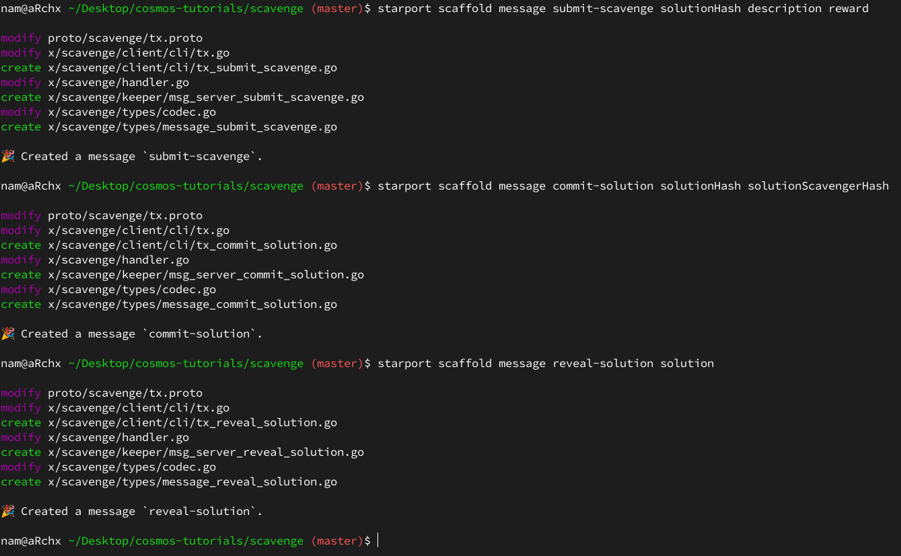

# Scavenge Hunt
---

## Background

Mục tiêu của phần này là giúp cho bạn suy nghĩ về những gì có thể say ra khi phát triển những ứng dụng mà có quyền truy cập vào phần khan hiếm kỹ thuật số (digital scarity) hay có thể gọi là phần gốc. Cách tốt nhất để nghĩ tới phần khan hiếm (scarcity) có thể tương tự như _tiền_. Nếu tiền mọc trên cây thì nó sẽ không khan hiêm và mất đi giá trị. Chúng ta đã có một lịch sử lâu đời của các phần mềm mà giải quyết các vấn đề liên quan đến tiền bạc, nhưng nó chưa bao giờ được coi là 'công dân hạng nhất' trong môi trường lập trình. Thay vào đó, _tiền_ luôn luôn được biểu thị dưới dạng một cón số hoặc một dạng thập phân, và nó phụ thuộc vào dịch vụ thương gia (merchant service) của bên thứ 3 hoặc một số quy trình trao đổi nào đó mà sự biểu hiện của _tiền_ được đổi sang tiền mặt.

Nếu _tiền_ là một phần gốc của môi trường phần mềm, nó sẽ cho phép các nền kinh tế tồn tại trong các game và ứng dụng, một bước tiến nữa trong việc xóa bỏ khoảng cách giữa các game, cuộc sống và chơi.

Chúng ta sẽ làm việc với Go framework Cosmos SDK. Framework hỗ trợ trong việc xây dựng các máy trạng thái được xác định. Một máy trạng thái đơn giản là một ứng dụng mà tồn tại trạng thái và có các chức năng rõ ràng để cập nhật các trạng thái đấy. Bạn có thể nghĩ đến một bóng đèn và một nút công tắc có thể coi là một máy trạng thái: trạng thái của 'ứng dụng' là đèn bật hoặc tắt, có một chức năng trong máy trạng thái này là: 'ấn công tắc', mỗi khi 'ấn công tắc' được kích hoạt, trạng thái của ứng dụng chuyển từ đèn bật sang đèn tắt hoặc ngược lại.

Một máy trạng thái xác định là một máy trạng thái trong đó tập hợp các hành động, được thực hiện đồng thời cùng nhau và lặp lại sẽ có cùng một kết quả. Vì vậy nếu chúng ta lấy tất cả các hành động 'bật' và 'tắt' cho cả tháng Giêng cho một số bộ phòng và lặp lại ở tháng Tám thì chúng ta sẽ có trạng thái cuối cùng của 'đèn sáng' hoặc 'đén tắt'. Sẽ không có gì về tháng Giêng hoặc tháng Tám mà có thể thay đổi kết quả đầu ra (theo thực tế thì một căn phong không thể được xác định nếu có các vấn đề về thiếu điện hoặc bảo trì trong thời gian diễn ra).

Điểu thú vị về máy trạng thái xác định là nó có thể truy vết lại các thay đổi bằng các mã băm của trạng thái, giống như một VCS như git. Nếu có một thỏa thuận giữa về cách băm của một trạng thái nhất định, không cần thiết phải lặp lại mọi hành động từ _nguồn_ (genesis) để đảm bảo rằng 2 phiên bản cùng đồng bộ với nhau. Các thuộc tính này rất hữu ích khi xử lý với phần mềm mà chạy bởi rất nhiều người khác nhau trong nhiều trạng thái khác nhau.

Một thuộc tính hay ho khác là của mật mã trạng thái băm (cryptographically hashing state) là nếu tạo ra một hệ thống phụ thuộc đáng tin cậy. Tôi có thể xây dựng một phần mềm mà sử dụng thư viện của bạn và tham chiếu một trạng thái nhất định trong ứng dụng của bạn. Như vậy nếu bạn thay đổi code của bạn mà có thể ảnh hưởng đến code của tôi thì tôi có thể chọn version cũ để tiếp tục sử dụng thay vì phải sử dụng version mới của bạn. Đây cũng là thuộc tính để biết chính xác trạng thái của một hệ thống (cũng như các mà trạng thái đó cập nhật) khiến nó có thể có những đảm bảo cần thiết cho phép sự khan hiếm kỹ thuật số trong một ứng dụng. Nếu tôi nói rằng chỉ có một thứ nào đó trong máy trạng thái và bạn biết rằng không có cách nào để máy trạng thái đó có thể tạo ra nhiều hơn cho bạn, bạn có thể biết rằng sẽ luôn chỉ có một.

Có một số loại máy có trạng thái xác định mà có những điều luật về việc cập nhật trạng thái. Trạng thái điểm chốt của các blockchain với hàm băm mật mã và sử dụng mật mã không đối xứng để có thể xử lý kiểm soát truy cập. Cóc nhiều cách mà Blockchains quyết định xem ai có thể thay đổi [điểm chốt] của một trạng thái. Các thửc thể đó có thể gọi là _người xác thực_ (Validator). Một số được lựa chọn bởi một trò chơi tốn năng lượng (electricity-intensive game) được gọi là bằng chứng công việc (proof-of-work) song song với với một thứ nữa được gọi là _quy tắc chuỗi dài nhất_ hoặc _Sự đòn thuận của Nakamoto_ trên các blockchain như Bitcon hoặc Ethereum.

Máy trạng thái chúng ta sẽ xây dựng sử dụng một bổ sung của một thuật toán đồng thụân (proof-of-stake) được gọi là Tendermint. Tendermint tiết kiệm năng lượng và có thể bao gồm rất nhiêu _trình xác thực_ cũng như được tin cậy hoặc _byzantine_. Khi xây dựng một hệ thống mà xử lý các tình trạng khan hiếm thực sự, tính toàn vẹn của hệ thống rất quan trọng. Một cách để đảm bảo tính toàn vẹn của hệ thống là chia sẻ các trách nghiệm duy trì nó đối với một lượng lớn những người tham gia độc lập có mục đích hay các _người xác thực_.

## The Game

Ứng dụng chúng ta phát triển hôm nay có thể dụng bởi nhiều cách nhưng mục đích xây dựng ứng dụng này sao cho nó như một _trò chơi tìm đồ vât_ (Scavenge Hunt game).

Trò chơi tìm đồ vật này nói về một chủ trò chuẩn bị các yêu cầu hoặc câu hỏi mà thách thức người chơi để tìm phương án giải pháp đi kèm với một số loại giải thưởng. Quy tắc đơn giản của game như sau:
- Bất cứ ai cũng có thể đăng _một câu hỏi_ với một _câu trả lời_ được mã hóa
- Câu hỏi này đi kèm với một khoản tiền thưởng
- Bất cứ ai có thể trả lời _câu hỏi_ này bằng cách đăng lên _một câu trả lời_. Nếu đáp án đúng, người chơi sẽ được nhận tiền thưởng tương ứng

Chú ý ở đây rằng khi xử lý với một mạng công cộng có độ trễ, nó có thể sảy ra một số sự việc không lường trước được như có thể diễn ra một cuộc tấn công [man-in-the-middle](https://en.wikipedia.org/wiki/Man-in-the-middle_attack). Thay vì giả vờ như 1 người chơi, kẻ tấn công sẽ lấy thông tin nhạy cảm từ 1 nhóm và sử dụng với mục đích xấu. Kích bản này được gọi là [Front-Running](https://en.wikipedia.org/wiki/Front_running) và nó sẽ diễn ra như sau:

- Người dùng đăng _đáp án_ cho _câu hỏi_ có phần thưởng đính kèm
- Một người khác thấy bạn đăng _đáp án_ và đăng _đáp án_ đó lên ngay trước người dùng
- Vì người dùng khác đó đăng _đáp án_ lên trước nếu nó đúng thì người dùng đó nhận phần thưởng thay vì người dùng thực sự đăng đáp án lên

Để tránh vieecj Front-Running, chúng ta sẽ bổ sung một chương trình cam kêt tiết lộ (commit-reveal scheme). Một commit-reveal scheme chuyển hóa 1 tương tác có thể bị lộ thành 2 tương tác an toàn.

Tương tác đầu tiên được gọi là bản cam kết (the commit). Đây là khi người dùng "cam kết" để đăng _đáp án_ trong một tương tác ngay tiếp theo. Cam kết này bao gồm một hàm băm kết hợp tên của người dùng và _đáp án_ của họ. Ứng dụng sẽ lưu giá trị mà được xác nhận bởi người dùng nhưng chưa được xác nhận rằng nó có đúng hay không.

Tương tác tiếp theo là tiết lộ (the reveal). Đây là khi bạn đăng _đáp án_ (dưới dạng văn bản) cùng tên của người dùng . Ứng dụng sẽ lấy _đáp án_ của người dùng và tên của người dùng để mã hóa lại. Nếu _đáp án_ của _người_ dùng trùng khớp với _đáp án_ được người dùng gửi trước đó trong giai đoạn cam kết, thì nó là bằng chứng cho việc _đáp án_ là của người dùng chứ không phải người dùng đã đánh cắp nó bằng cách front-running.

Một hệ thống như thế này có thể dùng với rất nhiều nền tảng trò chơi một cách không đáng tin cậy. Tưởng tượng rằng bạn đang chơi "The Legend of Zelda" và trò chơi được biên soạn với tất cả các câu hỏi cho các "cuộc săn tìm đồ vật" khác nhau mà đã được bao gồm. Khi bạn đánh bại 1 cấp độ, trò chơi có thẻ tiết lộ đáp án. Khi đó đằng sau trò chơi, đáp án này có thể kết hợp cùng tên của bạn để mã hóa lại, gửi đi và sẽ được tiết lộ. Tên của bạn sẽ được thưởng và bạn sẽ có nhiều điểm hơn trong trò chơi.

Có một cách khác để đạt được mức độ bảo mật này là có _danh sách kiểm soát truy cập_ (Access Control List) mà có tài khoản quản trị viên được công ty trò chơi sử dụng. Tài khoản này có thể xác nhận ràng bạn đã vượt qua cấp độ và cho bạn điểm. Nhưng vấn đề nảy sinh ra là nó sẽ tạo một điểm lỗi duy nhất cũng như thành mục tiêu được cố gắng tấn công duy nhất vào hệ thống. Nếu chỉ có 1 chìa khóa để điều khiển lâu đài thì cả hệ thống sẽ sụp đổ nếu chìa khóa đấy bị xâm phạm. Không chỉ vậy, nó sẽ sinh ra vấn đề về việc phối hợp, nếu quản trị viên luôn phải trực tuyến mọi lúc để người chơi có thể nhận điểm của họ. Nếu người dùng sử dụng hệ thống cam kết-tiết lộ (commit reveal system) thì bạn sẽ có một cấu trúc không đáng tin cậy nơi bạn không cần quyền để chơi. Hướng thiết kế này có lợi ích và hạn chế nhưng kết hợp với việc triển khai cẩn thận hơn, việc này có thể cho phép bạn mở rộng quy mô trò chơi mà không có một vấn đề nút cổ chai hoặc điểm thất bại nào.

## Scaffolding

Sử dụng Starport v0.17.0

Để dụng lên một blockchain Cosmos SDK thì có thể dùng lệnh **starport scaffold chain**

```bash
starport scaffold chain github.com/cosmonaut/scavenge --no-module
```
**--no-module** để bỏ qua phần dựng mô đun

Câu lệnh trên tạo ra một folder **scavenge** với blockchain Cosmos SDK mới, ứng dụng này chưa có phần xử lý logic gì cả ngoài một số mô-đun được thêm vào mặc định như **auth**, **bank**, **mint**, ...

Trong một blockchain Cosmos SDK, phần logic của ứng dụng được bổ sung ở các mô-đun tách biệt. Sử dụng các mô-đun để làm code dễ hiểu và có thể tái sử dụng

Trong thư mục _/scavenge_, tạo một mô-đun tên là **scavenge**. Dựa trên thiết kế mô-đun **scavenge** sẽ gửi tokens giữa các người tham gia (participants). Việc gửi tokens yêu cầu bổ sung mô-đun **bank**. Để thêm mô-đun **bank** như _một phần phụ thuộc_ (dependency) thì sử dụng flag **--dep**

```bash
starport scaffold module scavenge --dep bank
```

Một mô-đun đã được tạo ở trong _x/scavenge_ và được thêm vào trong _app/**app.go**_


## Messages

Các _Message_ là khởi đầu tốt để bắt đầu xây dựng mô-đun vì nó sẽ định nghĩa các hành động mà ứng dụng có thể làm. Hãy nghĩ đến tất cả các viễn cảnh mà người dùng có thể cập nhật trạng thái của ứng dụng. Chúng ta nên tổng hợp thành các tương tác cơ bản, tương tự như các thao tác CRUD

Mô-đun Scavenge sẽ có 3 _message_:
- Submit scavenge (Gửi yêu cầu tìm đồ vật)
- Commit solution (Cam kết đáp án)
- Reveal solution (Tiết lộ đáp án)

### Submit Scavenge Message
_Message_ gửi yêu cầu tìm đồ vật nên bao gồm tất cả các thông tin khi tạo một yêu câu tìm đò vật:
- Description (Mô tả): Đây là câu hỏi cần được giải đáp hoặc mô tả của đồ vật cần tìm
- Solution hash (Đáp án được mã hóa): Đáp án xáo trộn
- Reward (Phần thưởng): Đây là phần thưởng mà người nào gửi đáp đúng sớm nhất

Sử dụng lệnh **starport scaffold message** để tạo một _Cosmos SDK message_ cho mô-đun.

```bash
starport scaffold message {messangeName} {field1} {field2} ... {flag}
```

Nếu không có flag gì thêm _message_ sẽ tự thêm vào mô-đun trùng với tên của project

```bash
starport scaffold message submit-scavenge solutionHash description reward
```

Lệnh này tạo và sửa một số file cần chú ý:
- _proto/scavenge/**tx.proto**_: thêm message **MsgSubmitScavenge** và message **MsgSubmitScavengeResponse** và **SubmitScavenge** RPC được đăng ký trong _**Msg** service_


- _x/scavenge/types/**message_submit_scavenge.go**_: các phương thức được định nghĩa sao cho phù hợp với **Msg** interface
- _x/scavenge/**handler.go**_: message **MsgSubmitScavenge** được đăng ký trong mô-đun xử lý message
- _x/scavenge/keeper/**msg_server_submit_scavenge.go**_: phương thức keeper của **SubmitScavenge** được định nghĩa
- _x/scavenge/client/cli/**tx_submit_scavenge.go**_: Các câu lệnh CLI được thêm vào để gửi một giao dịch với một _message_
- _x/scavenge/client/cli/**tx.go**_: Các câu lệnh CLI được đăng ký
- _x/scavenge/types/**codec.go**_: codecs được đăng ký


Trong file _x/scavenge/types/**message_submit_scavenge.go**_, chúng ta có thể chú ý rằng _message_ được kế thừa từ **sdk.Msg** _interface_. Cấu trúc của _message_ bao gồm tất cả thông tin để tạo ra một yêu cầu tìm đồ vật như: _Description_, _SolutionHash_, _Reward_, _Creator_ (được tự động thêm vào)

**Msg** _interface_ có yêu cầu về một só phương thức phải được định nghĩa ví dụ như xác thực các nội dung của cấu trúc, và xác nhận _msg_ được ký và gửi bởi người tạo ra _msg_

### Commit solution Message

_Message_ cam kết đáp án bao gồm 2 phần:
- Solution hash (đáp án được mã hóa): _đáp án_ được trộn
- Solution scavenger hash (đáp án của yêu cầu được mã hóa): mã hóa của kết hợp giữa _đáp án_ và _người giải ra đáp án_

```bash
starport scaffold message commit-solution solutionHash solutionScavengerHash
```

### Reveal solution Message

_Message_ tiết lộ đáp án bao gồm:
- Solution (đáp án): đáp án được viét dưới dạng văn bản rõ ràng

```bash
starport scaffold message reveal-solution solution
```



Phần thông tin của người tạo được tự động thêm vào và _đáp án được mã hóa_ có thể xác định bắt nguồn từ _đáp án_

## Types

Sau khi định nghĩa các _message_ mà kích hoạt các giao dịch thay đổi trạng thái thì bây giờ sẽ bố sung thêm các _type_ và phương thức mà có thể hoạt động trong trạng thái đó.

_Keeper_ là một lớp trừu tượng mà cho ứng dụng blockchain có thể tương tác với các trạng thái. Các hàm tạo, sửa, xóa tất cả được định nghĩa như một phương thức của keeper. Trong ứng dụng 'Scavenge' này, **scavenge** và **commit** là 2 _type_ cần được định nghĩa với các phương thức tạo, sửa của nó.

Starport cung cấp một số lệnh để mà dựng code cho các chức năng CRUD cho một số cấu trúc dữ liệu quen thuộc, map (key-value) và một số đặc tính trọng trạng thái. Ở ví dụ này cả **scavenge** và **commit** sẽ được lưu trữ trong một cấu trúc dữ liệu gần giống map

### Scavenge

Sử dụng lệnh **starport scaffold map** để có thể dựng lên _type_ : **scavenge** và code để phần chức năng CRUD. Câu lệnh này mặc định sẽ tạo các _message_ CRUD, nhưng phần _message_ đã được tạo rồi nên chúng ta sẽ dùng thêm flag **--no-message**

```bash
starport scaffold map {typeName} {field1} {field2} {flag}
```

```bash
starport scaffold map scavenge solutionHash solution description reward scavenger --no-message
```

Câu lệnh sẽ chỉnh sửa 1 số file sau:

- _proto/scavenge/**scavenge.proto**_: _type_ Scavenge được định nghĩa dưới dạng _proto message_
- _proto/scavenge/**query.proto**_: các query mà để lấy dữ liệu từ ứng dụng sẽ được định nghĩa dưới dạng _proto message_ và được đăng ký trong **Query service**
- _proto/scavenge/**genesis.proto**_: _type_ để xuất trạng thái của blockchain (ví dụ như trong trường hợp cập nhật)

  

- _x/scavenge/keeper/**grpc_query_scavenge.go**_: phương thức của _keepeGiá trị cốt lõir_ để query dữ liệu
- _x/scavenge/keeper/**grpc_query_scavenge_test.go**_: test phần _keeper_ query dữ liệu
- _x/scavenge/keeper/**scavenge.go**_: các phương thức của _keeper_ để tạo, sửa, xóa **scavenge** từ _store_ (kho lưu trữ)
- _x/scavenge/keeper/**scavenge_test.go**_: test phần _keeper_ trên.

  

- _x/scavenge/client/cli/**query_scavenge.go**_: Các câu lệnh CLI để có thể query ứng dụng blockchain
- _x/scavenge/client/cli/**query.go**_: Đăng ký các câu lệnh CLI.
- _x/scavenge/client/cli/**query_scavenge_test.go**_: Test các câu lệnh CLI

  

- _x/scavenge/types/**keys.go**_: những chuỗi ký tự dùng như phần dánh dấu (prefix) đăng trước của những _key_ của **scavenge** để lưu vào _store_
- _x/scavenge/**genesis.go**_: phần logic để xuất và nhập trạng thái
- _x/scavenge/types/**genesis.go**_: logic để xác thực file _genesis_  
- _x/scavenge/**module.go**_: đăng ký cổng gRPC (gRPC gateway routes)

  


**SetScavenge** trong gói **keeper** dùng _store_ kiểu key-value sử dụng phần đánh dâu (prefix) cho _type_ **scavenge** (Scavenge-value-) để mã hóa _type_ **scavenge** và sử dụng phương thức **store.Set** để lưu **scavenge** vào store

**GetScavenge** sử dụng _store_ bằng qua phần đánh dâu (prefix) của **scavenge** và phương thức **store.Get** để có thể lấy dữ liệu với phần đánh chỉ mục xác định

### Commit

Tương tự phần _scavenge_

```bash
starport scaffold map commit solutionHash solutionScavengerHash --no-message
```


## Handler

Để một _message_ có thể chạm tới một _keeper_ thì nó phải đi qua _handler_. Đây là nơi logic được áp dụng để cho phép hoặc từ chôi _message_ thành công. Nếu bạn đã quen với kiến trúc MVC thì có thể nói rằng _keeper_ giống như _Model_ và _handler_ giống như _Controller_. Nếu bạn quen với kiến trúc của React/Redux hay Vue/Vuex, thì _keeper_ giống như _Reducer/Store_ và _handler_ giống như _Actions_

_Message handler_ trên toàn mô-đun được định nghĩa ở _x/scavenge/**handler.go**_. Có 3 loại _message type_ được  thêm vào trong _handler_:

- **MsgSubmitScavenge**
- **MsgCommitSolution**
- **MsgRevealSolution**

Với mỗi _message_, khi được xử lý sẽ gọi phương thức _keeper_ phù hợp mà có trách nghiệm cho việc cam kết để thay đổi _store_.


## Keeper

### Create Scavenge

Phương thức tạo _scavenge_ sẽ làm những việc sau:
- Kiểm tra một _scavenge_ với một _solution_ được mã hóa không tồn tại.
- Gửi tokens từ tài khoản của người tạo ra _scavenge_ tới một tài khoản mô-đun
- Lưu _scavenge_ vào _store_


```go
// x/scavenge/keeper/msg_server_submit_scavenge.go
package keeper

import (
  "context"

  "github.com/cosmonaut/scavenge/x/scavenge/types"
  sdk "github.com/cosmos/cosmos-sdk/types"
  "github.com/tendermint/tendermint/crypto"
  sdkerrors "github.com/cosmos/cosmos-sdk/types/errors"
)

func (k msgServer) SubmitScavenge(goCtx context.Context, msg *types.MsgSubmitScavenge) (*types.MsgSubmitScavengeResponse, error) {
  // Lấy context bao gồm các thông tin về môi trường như độ cao của block

  ctx := sdk.UnwrapSDKContext(goCtx)
  // Tạo một scavenge mới từ dữ liệu trong message MsgSubmitScavenge
  var scavenge = types.Scavenge{
    Index:        msg.SolutionHash,
    Creator:      msg.Creator,
    Description:  msg.Description,
    SolutionHash: msg.SolutionHash,
    Reward:       msg.Reward,
  }
  // Thử lấy một scavenge từ trong store với key là solution hash (đáp án đc mã hóa)
  _, isFound := k.GetScavenge(ctx, scavenge.SolutionHash)
  // Trả về lỗi nếu tìm thấy một scavengeS
  if isFound {
    return nil, sdkerrors.Wrap(sdkerrors.ErrInvalidRequest, "Scavenge with that solution hash already exists")
  }
  // Lấy địa chỉ của tài khoản mô-đun Scavenge
  moduleAcct := sdk.AccAddress(crypto.AddressHash([]byte(types.ModuleName)))
  // Chuyển hóa địa chỉ của người tạo ra từ 1 string thành sdk.AccAddress
  scavenger, err := sdk.AccAddressFromBech32(scavenge.Creator)
  if err != nil {
    panic(err)
  }
  // Chuyển hóa tokens từ string sang sdk.Coins
  reward, err := sdk.ParseCoinsNormalized(scavenge.Reward)
  if err != nil {
    panic(err)
  }
  // Gửi đốn tokens từ tài khoản người dùng sang tài khoản của mô-đun scavenge
  sdkError := k.bankKeeper.SendCoins(ctx, scavenger, moduleAcct, reward)
  if sdkError != nil {
    return nil, sdkError
  }
  // Lưu scavenge vào store
  k.SetScavenge(ctx, scavenge)
  return &types.MsgSubmitScavengeResponse{}, nil
}
```
Chú ý việc sử dụng **moduleAcct**. Tài khoản này không được điều kiển bởi một cặp khóa online, nó chỉ là 1 tham chiếu đến một tài khoản mà thuộc quyền sở hữu của mô-đun thực tế này. Nó dùng để lưu giữ phần thưởng được gắn vào một _scavenge_ cho tới khi _scavenge_ đó được giải, tại thời điểm _scavenge_ được giải thì phần thưởng đó sẽ được trả lại cho giải được đáp án.

**SubmitScavenge** sử dụng phương thức **SendCoins** từ mô-đun _bank_. Từ khi bắt đầu dựng một mô-đun sử dùng flag **--dep bank** để sác định các phần phụ thuộc giữa ứng dụng _scavenge_ và mô-đun _bank_. Việc này đã tạo file **expected_keeper.go** với interface _BankKeeper_. Và hàm **SendCoins** có thể được sử dụng trong các phương thức của _keeper_ trong mô-đun của ứng _scavenge_

```go
// x/scavenge/types/expected_keepers.go
package types

import (
  sdk "github.com/cosmos/cosmos-sdk/types"
)

type BankKeeper interface {
  SendCoins(ctx sdk.Context, fromAddr sdk.AccAddress, toAddr sdk.AccAddress, amt sdk.Coins) error
}
```

### Commit Solution

Phương thức của _Commit Solution_ (Đáp án cam kết) phải làm những việc sau:
- Kiểm tra xem _commit_ với phần mã hóa không tồn tại trong _store_
- Lưu _commit_ mới vào _store_

```go
// x/scavenge/keeper/msg_server_commit_solution.go
package keeper

import (
  "context"

  "github.com/cosmonaut/scavenge/x/scavenge/types"
  sdk "github.com/cosmos/cosmos-sdk/types"
  sdkerrors "github.com/cosmos/cosmos-sdk/types/errors"
)

func (k msgServer) CommitSolution(goCtx context.Context, msg *types.MsgCommitSolution) (*types.MsgCommitSolutionResponse, error) {
  ctx := sdk.UnwrapSDKContext(goCtx)
  Tạo commit mới bằng thông tin của message MsgCommitSolution
  var commit = types.Commit{
    Index:                 msg.SolutionScavengerHash,
    Creator:               msg.Creator,
    SolutionHash:          msg.SolutionHash,
    SolutionScavengerHash: msg.SolutionScavengerHash,
  }
  // Thử lấy một commit trong store sử dụng key = mã hóa giữa solution và scavenge
  _, isFound := k.GetCommit(ctx, commit.SolutionScavengerHash)
  // Trả về lỗi nếu tồn tại commit
  if isFound {
    return nil, sdkerrors.Wrap(sdkerrors.ErrInvalidRequest, "Commit with that hash already exists")
  }
  // Lưu commit lại vào trong store
  k.SetCommit(ctx, commit)
  return &types.MsgCommitSolutionResponse{}, nil
}
```

### Reveal Solution

Phương thức của _Reveal Solution_ (Đáp án tiết lộ) phải làm những việc sau:
- Kiểm tra xem _commit_ với phần mã hóa có tồn tại trong _store_
- Kiểm tra _scavenge_ với _solution_ đã được mã hóa tồn tại trong _store_
- Kiểm tra rằng _scavenge_ đó chưa được giải
- Gửi tokens từ tài khoản của mô-đun tới tài khoản mà tiết lộ đáp án chính xác
- Cập nhật _scavenge_


```go
// x/scavenge/keeper/msg_server_reveal_solution.go
package keeper

import (
  "context"
  "crypto/sha256"
  "encoding/hex"

  "github.com/cosmonaut/scavenge/x/scavenge/types"
  sdk "github.com/cosmos/cosmos-sdk/types"
  sdkerrors "github.com/cosmos/cosmos-sdk/types/errors"

  "github.com/tendermint/tendermint/crypto"
)

func (k msgServer) RevealSolution(goCtx context.Context, msg *types.MsgRevealSolution) (*types.MsgRevealSolutionResponse, error) {
  ctx := sdk.UnwrapSDKContext(goCtx)
  // Nối solution và địa chỉ của scavenge và chuyển nó thành bytes
  var solutionScavengerBytes = []byte(msg.Solution + msg.Creator)
  // Tìm kiếm phần đã mã hóa của solution và address
  var solutionScavengerHash = sha256.Sum256(solutionScavengerBytes)
  // Chuyển phần mã hóa đó thành string
  var solutionScavengerHashString = hex.EncodeToString(solutionScavengerHash[:])
  // Thử tìm kiếm phần commit bằng cách sử dụng mã hóa của solution và address
  _, isFound := k.GetCommit(ctx, solutionScavengerHashString)
  // Trả về lỗi nếu phần commit không có
  if !isFound {
    return nil, sdkerrors.Wrap(sdkerrors.ErrInvalidRequest, "Commit with that hash doesn't exists")
  }
  // Tìm phần mã hóa của solution
  var solutionHash = sha256.Sum256([]byte(msg.Solution))
  // Chuyển phần mã hóa đó thành string
  var solutionHashString = hex.EncodeToString(solutionHash[:])
  var scavenge types.Scavenge
  // Chuyển một scavenge từ stre bằng phần mã hóa _solution_
  scavenge, isFound = k.GetScavenge(ctx, solutionHashString)
  // Kiểm tra nếu phần solution không tồn tại
  if !isFound {
    return nil, sdkerrors.Wrap(sdkerrors.ErrInvalidRequest, "Scavenge with that solution hash doesn't exists")
  }
  // Kiểm tra thuộc tính của scavenger (người tìm được kết quả đầu tiên) bao gồm một address có xác thực
  _, err := sdk.AccAddressFromBech32(scavenge.Scavenger)
  // Trả về lỗi nếu scavenge đó đã được giải
  if err == nil {
    return nil, sdkerrors.Wrap(sdkerrors.ErrInvalidRequest, "Scavenge has already been solved")
  }
  // Lưu phần địa chỉ scavenger (người tìm được kết quả đầu tiên) vào trong scavenge
  scavenge.Scavenger = msg.Creator
  // Lưu phần đáp án đúng vào scavenge
  scavenge.Solution = msg.Solution
  // Lấy địa chỉ của mô-đun
  moduleAcct := sdk.AccAddress(crypto.AddressHash([]byte(types.ModuleName)))
  // Chuyển hóa địa chỉ của mô-đun thành sdk.AccAddress
  scavenger, err := sdk.AccAddressFromBech32(scavenge.Scavenger)
  if err != nil {
    panic(err)
  }
  // Chuyển hóa tokens từ string thành sdk.Coins
  reward, err := sdk.ParseCoinsNormalized(scavenge.Reward)
  if err != nil {
    panic(err)
  }
  // Gửi token từ tài khoản của mô-đun tới cho người tìm được kết quả
  sdkError := k.bankKeeper.SendCoins(ctx, moduleAcct, scavenger, reward)
  if sdkError != nil {
    return nil, sdkError
  }
  // Cập nhật scavenge mới vào store
  k.SetScavenge(ctx, scavenge)
  return &types.MsgRevealSolutionResponse{}, nil
}
```

## Use the CLI

CLI (Command Line Interface - Giao diện câu lệnh) sẽ giúp người dùng tương tác với ứng dụng khi ứng dụng hoạt động trên một máy tính. Mỗi một mô-đun có phần không gian tên của nó trong CLI mà cho phép người dùng khả năng tạo và ký _Message_ được thiết kế để được xử lý bới mô-đun đó. Cùng với đó là khả năng để query trạng thái của mô-đun đo. Khi kết hợp với phần còn lại của ứng dụng, CLI sẽ giúp người dùng các việc như tạo các key cho tài khoản mới hoặc kiểm tra trạng thái của một tương tác mà người dùng đã có với ứng dụng

CLI của mô-đun của chúng ta được chia làm 2 file là **tx.go** và **query.go** nằm ở trong thư mục _./x/scavenge/client/cli/_. Một file có trách nghiệm tạo ra các _transaction_ (giao dịch) mà bao gồm các _message_ mà cuối cùng sẽ cập nhật trạng thái của ứng dụng. File còn lại có trách nghiệm tạo ra các query mà cho người dụng khả năng để đọc thông tin từ trạng thái của ứng dụng. Cả 2 file sử dụng thư viện [Cobra](https://github.com/spf13/cobra)

### Working with the tx.go file

File **tx.go** bao gồm hàm **GetTxCmd** (là một phương thức tiêu chuẩn trong Cosmos SDk).
Nó sử dụng các tham chiếu trong file **module.go** nơi mà mô tả chính xác các thuộc tính mà một mô-đun có.
Điều này giúp dễ dàng hơn trong việc kết hợp các mô-đun khác nhau ở cấp độ của một ứng dụng thực tế.
Sau tất cả, chúng ta tập trung đến một mô-đun vào thời điểm này, nhưng sau này chúng ta sẽ tạo ra ứng dụng mà tận dụng mô-đun này cũng như các mô-đun khác mà đã có sẵn trong Cosmos SDK

### Commit Solution

```go
// x/scavenge/client/cli/tx_commit_solution.go
package cli

import (
 "crypto/sha256"
 "encoding/hex"
 "strconv"

 "github.com/spf13/cobra"

 "github.com/cosmonaut/scavenge/x/scavenge/types"
 "github.com/cosmos/cosmos-sdk/client"
 "github.com/cosmos/cosmos-sdk/client/flags"
 "github.com/cosmos/cosmos-sdk/client/tx"
)

var _ = strconv.Itoa(0)

func CmdCommitSolution() *cobra.Command {
 cmd := &cobra.Command{
   // Truyền solution như một tham số duy nhất
   Use:   "commit-solution [solution]",
   Short: "Broadcast message commit-solution",
   // Chuyển số lượng của các tham số thành 1
   Args: cobra.ExactArgs(1),
   RunE: func(cmd *cobra.Command, args []string) error {
     clientCtx, err := client.GetClientTxContext(cmd)
     if err != nil {
       return err
     }
     solution := args[0]
     // Tìm phần mã hóa của solution
     solutionHash := sha256.Sum256([]byte(solution))
     // Chuyển phần mã hóa solution -> string
     solutionHashString := hex.EncodeToString(solutionHash[:])
     // Chuyển phần địa chỉ của scavenger  -> string
     var scavenger = clientCtx.GetFromAddress().String()
     // Tìm phần mã hóa của đáp án và scavenger
     var solutionScavengerHash = sha256.Sum256([]byte(solution + scavenger))
     // Chuyển phần mã hóa -> string
     var solutionScavengerHashString = hex.EncodeToString(solutionScavengerHash[:])
     // Tạo message mới
     msg := types.NewMsgCommitSolution(clientCtx.GetFromAddress().String(), string(solutionHashString), string(solutionScavengerHashString))
     if err := msg.ValidateBasic(); err != nil {
       return err
     }
     // Gửi giao dịch bao gồm message tới ứng dụng blockchain
     return tx.GenerateOrBroadcastTxCLI(clientCtx, cmd.Flags(), msg)
   },
 }
 flags.AddTxFlagsToCmd(cmd)
 return cmd
}
```

Chú ý rằng file này sử dụng thư viện _sha256_ để mã hóa phần văn bản của các _solution_ thành các phần mã hóa băm vụm.
Các hành động này sảy ra trên phần client thê nên phần _solution_ chưa bao giờ được tiết lộ tới các thực thể chung nơi mà có thể bị ăn cắp tiền thưởng liên quan đến _scavenge_.
Bạn có thể để ý rằng phần mã hóa được chuyển sang hệ số 16 để có thể dễ đọc như các chuỗi (đây là cách mà chúng sẽ được lưu trong _keeper_)

### Submit Scavenge

```go
// x/scavenge/client/cli/tx_submit_scavenge.go
package cli

import (
  "crypto/sha256"
  "encoding/hex"
  "strconv"

  "github.com/spf13/cobra"

  "github.com/cosmonaut/scavenge/x/scavenge/types"
  "github.com/cosmos/cosmos-sdk/client"
  "github.com/cosmos/cosmos-sdk/client/flags"
  "github.com/cosmos/cosmos-sdk/client/tx"
)

var _ = strconv.Itoa(0)

func CmdSubmitScavenge() *cobra.Command {
  cmd := &cobra.Command{
    Use:   "submit-scavenge [solution] [description] [reward]",
    Short: "Broadcast message submit-scavenge",
    Args:  cobra.ExactArgs(3),
    RunE: func(cmd *cobra.Command, args []string) error {
      clientCtx, err := client.GetClientTxContext(cmd)
      if err != nil {
        return err
      }
      // Tìm phần mã hóa của đáp án
      solutionHash := sha256.Sum256([]byte(args[0]))
      // Chuyển phần mã hóa -> string
      solutionHashString := hex.EncodeToString(solutionHash[:])
      argsDescription := string(args[1])
      argsReward := string(args[2])
      // Gửi một message mới
      msg := types.NewMsgSubmitScavenge(clientCtx.GetFromAddress().String(), string(solutionHashString), string(argsDescription), string(argsReward))
      if err := msg.ValidateBasic(); err != nil {
        return err
      }
      // Gửi giao dịch bao gồm message tới ứng dụng blockchain
      return tx.GenerateOrBroadcastTxCLI(clientCtx, cmd.Flags(), msg)
    },
  }
  flags.AddTxFlagsToCmd(cmd)
  return cmd
}
```

## Play

### Starting the Blockchain
```bash
starport chain serve
```

**serve** sẽ xây phần mã code nhị phân của ứng dụng, tao một thư mục dữ liệu và khởi chạy một node ở chế độ phát triển. Tiếp tục giữ terminal chạy ở một cửa sổ và dùng một terminal khác để tương tác với ứng dụng

### Creating a Scavenge

Tuân thủ theo hướng dẫn và submit một _scavenge_.
Tham số đầu tiên là _solution_, nhưng chúng ta cũng nên biết câu hỏi thực sự của đáp án (description).

Ví dụ về một câu hỏi: "What's brown and sticky?" - "A stick"

Tiếp theo chúng ta phải xác định phần thưởng.
Ở đây sẽ dùng 100token làm phần thưởng

Bây giờ chúng ta sẽ dùng tát cả dữ liệu để tạo _message_. Sử dụng thêm flag **--from** để CLI có thể biết được rằng là ai đang gửi _message_ này.

```bash
scavenged tx scavenge submit-scavenge "A stick" "What's brown and sticky?" 100token --from alice
```

```json
{
  "body": {
    "messages": [
      {
        "@type": "/cosmonaut.scavenge.scavenge.MsgSubmitScavenge",
        "creator": "cosmos12sesfvvy020tnu7plxwe25awfj0tazjsmkfutl",
        "solutionHash": "2f9457a6e8fb202f9e10389a143a383106268c460743dd59d723c0f82d9ba906",
        "description": "What's brown and sticky?",
        "reward": "100token"
      }
    ],
    "memo": "",
    "timeout_height": "0",
    "extension_options": [],
    "non_critical_extension_options": []
  },
  "auth_info": {
    "signer_infos": [],
    "fee": { "amount": [], "gas_limit": "200000", "payer": "", "granter": "" }
  },
  "signatures": []
}
```

```json
{
  "height": "229",
  "txhash": "218ED6508BCDF28420C39A589FC9C1837261386AF71BB5B1E1E20A9729DE690E",
  "codespace": "",
  "code": 0,
  "data": "0A100A0E5375626D697453636176656E6765",
  "raw_log": "[{\"events\":[{\"type\":\"message\",\"attributes\":[{\"key\":\"action\",\"value\":\"SubmitScavenge\"},{\"key\":\"sender\",\"value\":\"cosmos12sesfvvy020tnu7plxwe25awfj0tazjsmkfutl\"}]},{\"type\":\"transfer\",\"attributes\":[{\"key\":\"recipient\",\"value\":\"cosmos13aupkh5020l9u6qquf7lvtcxhtr5jjama2kwyg\"},{\"key\":\"sender\",\"value\":\"cosmos12sesfvvy020tnu7plxwe25awfj0tazjsmkfutl\"},{\"key\":\"amount\",\"value\":\"100token\"}]}]}]",
  "logs": [
    {
      "msg_index": 0,
      "log": "",
      "events": [
        {
          "type": "message",
          "attributes": [
            { "key": "action", "value": "SubmitScavenge" },
            {
              "key": "sender",
              "value": "cosmos12sesfvvy020tnu7plxwe25awfj0tazjsmkfutl"
            }
          ]
        },
        {
          "type": "transfer",
          "attributes": [
            {
              "key": "recipient",
              "value": "cosmos13aupkh5020l9u6qquf7lvtcxhtr5jjama2kwyg"
            },
            {
              "key": "sender",
              "value": "cosmos12sesfvvy020tnu7plxwe25awfj0tazjsmkfutl"
            },
            { "key": "amount", "value": "100token" }
          ]
        }
      ]
    }
  ],
  "info": "",
  "gas_wanted": "200000",
  "gas_used": "65320",
  "tx": null,
  "timestamp": ""
}
```

Phần gửi về có txhash, tạm gọi là **TXHASH**, để có thể query xem _scavenge_ đã gửi lên là gì thì chúng ta sử dụng câu lệnh dưới

```json
{
  ...
  "txhash": "218ED6508BCDF28420C39A589FC9C1837261386AF71BB5B1E1E20A9729DE690E",
  ...
}
```

```bash
scavenged q tx {TXHASH} --output json
```

```json
{
   "height":"57",
   "txhash":"218ED6508BCDF28420C39A589FC9C1837261386AF71BB5B1E1E20A9729DE690E",
   "codespace":"",
   "code":0,
   "data":"0A100A0E5375626D697453636176656E6765",
   "raw_log":"[{\"events\":[{\"type\":\"message\",\"attributes\":[{\"key\":\"action\",\"value\":\"SubmitScavenge\"},{\"key\":\"sender\",\"value\":\"cosmos12sesfvvy020tnu7plxwe25awfj0tazjsmkfutl\"}]},{\"type\":\"transfer\",\"attributes\":[{\"key\":\"recipient\",\"value\":\"cosmos13aupkh5020l9u6qquf7lvtcxhtr5jjama2kwyg\"},{\"key\":\"sender\",\"value\":\"cosmos12sesfvvy020tnu7plxwe25awfj0tazjsmkfutl\"},{\"key\":\"amount\",\"value\":\"100token\"}]}]}]",
   "logs":[
      {
         "msg_index":0,
         "log":"",
         "events":[
            {
               "type":"message",
               "attributes":[
                  {
                     "key":"action",
                     "value":"SubmitScavenge"
                  },
                  {
                     "key":"sender",
                     "value":"cosmos12sesfvvy020tnu7plxwe25awfj0tazjsmkfutl"
                  }
               ]
            },
            {
               "type":"transfer",
               "attributes":[
                  {
                     "key":"recipient",
                     "value":"cosmos13aupkh5020l9u6qquf7lvtcxhtr5jjama2kwyg"
                  },
                  {
                     "key":"sender",
                     "value":"cosmos12sesfvvy020tnu7plxwe25awfj0tazjsmkfutl"
                  },
                  {
                     "key":"amount",
                     "value":"100token"
                  }
               ]
            }
         ]
      }
   ],
   "info":"",
   "gas_wanted":"200000",
   "gas_used":"65320",
   "tx":{
      "@type":"/cosmos.tx.v1beta1.Tx",
      "body":{
         "messages":[
            {
               "@type":"/cosmonaut.scavenge.scavenge.MsgSubmitScavenge",
               "creator":"cosmos12sesfvvy020tnu7plxwe25awfj0tazjsmkfutl",
               "solutionHash":"2f9457a6e8fb202f9e10389a143a383106268c460743dd59d723c0f82d9ba906",
               "description":"What's brown and sticky?",
               "reward":"100token"
            }
         ],
         "memo":"",
         "timeout_height":"0",
         "extension_options":[

         ],
         "non_critical_extension_options":[

         ]
      },
      "auth_info":{
         "signer_infos":[
            {
               "public_key":{
                  "@type":"/cosmos.crypto.secp256k1.PubKey",
                  "key":"AgvcjF8yaUYQR9DlLl2DRxMxxz5/KzuTQ3m2Z3md01SR"
               },
               "mode_info":{
                  "single":{
                     "mode":"SIGN_MODE_DIRECT"
                  }
               },
               "sequence":"1"
            }
         ],
         "fee":{
            "amount":[

            ],
            "gas_limit":"200000",
            "payer":"",
            "granter":""
         }
      },
      "signatures":[
         "7ATlBYzjOaPasNDbOzhTs5SMI+MkrSr0xKTo+tiyTv4YwWOlDPn+B59rmVka1DqBud24sTQ3sqb3m3B19/odPQ=="
      ]
   },
   "timestamp":"2021-10-03T00:21:34Z"
}
```

### Querying For a List of Scavenges

```bash
scavenged q scavenge list-scavenge --output json
```

```json
{
   "Scavenge":[
      {
         "creator":"cosmos12sesfvvy020tnu7plxwe25awfj0tazjsmkfutl",
         "index":"2f9457a6e8fb202f9e10389a143a383106268c460743dd59d723c0f82d9ba906",
         "solutionHash":"2f9457a6e8fb202f9e10389a143a383106268c460743dd59d723c0f82d9ba906",
         "solution":"",
         "description":"What's brown and sticky?",
         "reward":"100token",
         "scavenger":""
      }
   ],
   "pagination":{
      "next_key":null,
      "total":"0"
   }
}
```

### Committing a solution

Submit đáp án với tài khoản là bob

```bash
scavenged tx scavenge commit-solution "A stick" --from bob
```

```json
{
   "body":{
      "messages":[
         {
            "@type":"/cosmonaut.scavenge.scavenge.MsgCommitSolution",
            "creator":"cosmos189l8k7ryx4k0aulwjlrk92sytgswfwlua24e3s",
            "solutionHash":"2f9457a6e8fb202f9e10389a143a383106268c460743dd59d723c0f82d9ba906",
            "solutionScavengerHash":"41f9d661e16cb6e9897833b5958bfa911a3b20a38ffd3cd2fe5cb3896d6a8db4"
         }
      ],
      "memo":"",
      "timeout_height":"0",
      "extension_options":[

      ],
      "non_critical_extension_options":[

      ]
   },
   "auth_info":{
      "signer_infos":[

      ],
      "fee":{
         "amount":[

         ],
         "gas_limit":"200000",
         "payer":"",
         "granter":""
      }
   },
   "signatures":[

   ]
}

# confirm transaction before signing and broadcasting [y/N]: y

{
   "height":"530",
   "txhash":"A806BBC9DC5CAEF71452A303C747A638D72B0527DD1AF4E31F14895D1013C5A8",
   "codespace":"",
   "code":0,
   "data":"0A100A0E436F6D6D6974536F6C7574696F6E",
   "raw_log":"[{\"events\":[{\"type\":\"message\",\"attributes\":[{\"key\":\"action\",\"value\":\"CommitSolution\"}]}]}]",
   "logs":[
      {
         "msg_index":0,
         "log":"",
         "events":[
            {
               "type":"message",
               "attributes":[
                  {
                     "key":"action",
                     "value":"CommitSolution"
                  }
               ]
            }
         ]
      }
   ],
   "info":"",
   "gas_wanted":"200000",
   "gas_used":"56145",
   "tx":null,
   "timestamp":""
}
```

### Querying For a List of Commits

Lấy danh sách của các _commit solution_

```bash
scavenged q scavenge list-commit --output json
```

```json
{
   "Commit":[
      {
         "creator":"cosmos189l8k7ryx4k0aulwjlrk92sytgswfwlua24e3s",
         "index":"41f9d661e16cb6e9897833b5958bfa911a3b20a38ffd3cd2fe5cb3896d6a8db4",
         "solutionHash":"2f9457a6e8fb202f9e10389a143a383106268c460743dd59d723c0f82d9ba906",
         "solutionScavengerHash":"41f9d661e16cb6e9897833b5958bfa911a3b20a38ffd3cd2fe5cb3896d6a8db4"
      }
   ],
   "pagination":{
      "next_key":null,
      "total":"0"
   }
}
```

### Revealing a Solution

```bash
scavenged tx scavenge reveal-solution "A stick" --from bob
```

```json
{
   "body":{
      "messages":[
         {
            "@type":"/cosmonaut.scavenge.scavenge.MsgRevealSolution",
            "creator":"cosmos189l8k7ryx4k0aulwjlrk92sytgswfwlua24e3s",
            "solution":"A stick"
         }
      ],
      "memo":"",
      "timeout_height":"0",
      "extension_options":[

      ],
      "non_critical_extension_options":[

      ]
   },
   "auth_info":{
      "signer_infos":[

      ],
      "fee":{
         "amount":[

         ],
         "gas_limit":"200000",
         "payer":"",
         "granter":""
      }
   },
   "signatures":[

   ]
}

#confirm transaction before signing and broadcasting [y/N]: y

{
   "height":"627",
   "txhash":"F8C1D2DDB9797E28B63ECA7BE109FA89C6BF1DCDE1ED05B7AC08E94494DE42D6",
   "codespace":"",
   "code":0,
   "data":"0A100A0E52657665616C536F6C7574696F6E",
   "raw_log":"[{\"events\":[{\"type\":\"message\",\"attributes\":[{\"key\":\"action\",\"value\":\"RevealSolution\"},{\"key\":\"sender\",\"value\":\"cosmos13aupkh5020l9u6qquf7lvtcxhtr5jjama2kwyg\"}]},{\"type\":\"transfer\",\"attributes\":[{\"key\":\"recipient\",\"value\":\"cosmos189l8k7ryx4k0aulwjlrk92sytgswfwlua24e3s\"},{\"key\":\"sender\",\"value\":\"cosmos13aupkh5020l9u6qquf7lvtcxhtr5jjama2kwyg\"},{\"key\":\"amount\",\"value\":\"100token\"}]}]}]",
   "logs":[
      {
         "msg_index":0,
         "log":"",
         "events":[
            {
               "type":"message",
               "attributes":[
                  {
                     "key":"action",
                     "value":"RevealSolution"
                  },
                  {
                     "key":"sender",
                     "value":"cosmos13aupkh5020l9u6qquf7lvtcxhtr5jjama2kwyg"
                  }
               ]
            },
            {
               "type":"transfer",
               "attributes":[
                  {
                     "key":"recipient",
                     "value":"cosmos189l8k7ryx4k0aulwjlrk92sytgswfwlua24e3s"
                  },
                  {
                     "key":"sender",
                     "value":"cosmos13aupkh5020l9u6qquf7lvtcxhtr5jjama2kwyg"
                  },
                  {
                     "key":"amount",
                     "value":"100token"
                  }
               ]
            }
         ]
      }
   ],
   "info":"",
   "gas_wanted":"200000",
   "gas_used":"61131",
   "tx":null,
   "timestamp":""
}
```

### Querying For a List of Scavenges (solved)

```bash
scavenged q scavenge list-scavenge --output json
```

```json
{
   "Scavenge":[
      {
         "creator":"cosmos12sesfvvy020tnu7plxwe25awfj0tazjsmkfutl",
         "index":"2f9457a6e8fb202f9e10389a143a383106268c460743dd59d723c0f82d9ba906",
         "solutionHash":"2f9457a6e8fb202f9e10389a143a383106268c460743dd59d723c0f82d9ba906",
         "solution":"A stick",
         "description":"What's brown and sticky?",
         "reward":"100token",
         "scavenger":"cosmos189l8k7ryx4k0aulwjlrk92sytgswfwlua24e3s"
      }
   ],
   "pagination":{
      "next_key":null,
      "total":"0"
   }
}
```

### Committing a Solution Again to Get an Error

```bash
scavenged tx scavenge commit-solution "A stick" --from bob
```

```json
{
   "body":{
      "messages":[
         {
            "@type":"/cosmonaut.scavenge.scavenge.MsgCommitSolution",
            "creator":"cosmos189l8k7ryx4k0aulwjlrk92sytgswfwlua24e3s",
            "solutionHash":"2f9457a6e8fb202f9e10389a143a383106268c460743dd59d723c0f82d9ba906",
            "solutionScavengerHash":"41f9d661e16cb6e9897833b5958bfa911a3b20a38ffd3cd2fe5cb3896d6a8db4"
         }
      ],
      "memo":"",
      "timeout_height":"0",
      "extension_options":[

      ],
      "non_critical_extension_options":[

      ]
   },
   "auth_info":{
      "signer_infos":[

      ],
      "fee":{
         "amount":[

         ],
         "gas_limit":"200000",
         "payer":"",
         "granter":""
      }
   },
   "signatures":[

   ]
}

# confirm transaction before signing and broadcasting [y/N]: y

{
   "height":"710",
   "txhash":"602D2CE226DEFD19BE26FEE9B2F99D0638358D18461AE213A439F4A0C3667E9E",
   "codespace":"sdk",
   "code":18,
   "data":"",
   "raw_log":"failed to execute message; message index: 0: Commit with that hash already exists: invalid request",
   "logs":[

   ],
   "info":"",
   "gas_wanted":"200000",
   "gas_used":"41086",
   "tx":null,
   "timestamp":""
}
```
