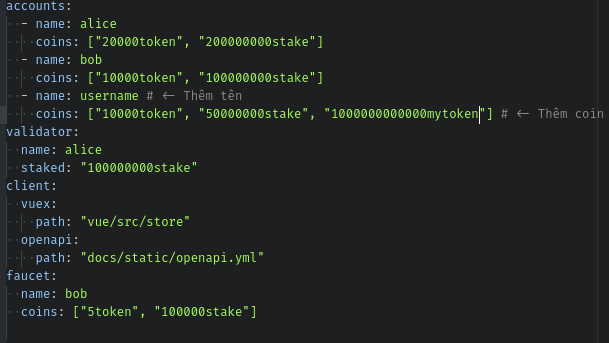
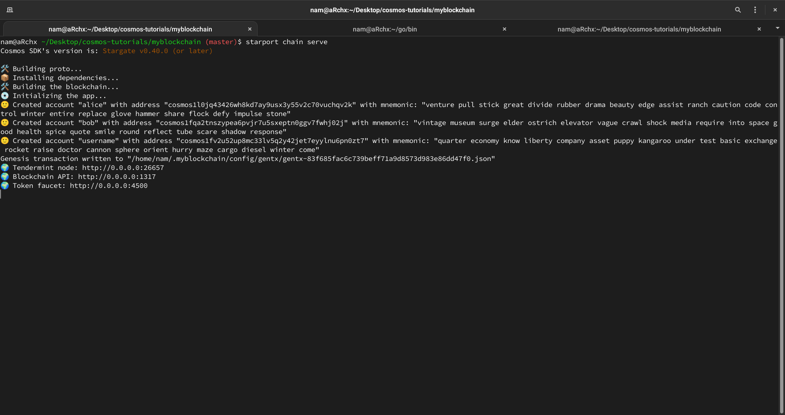
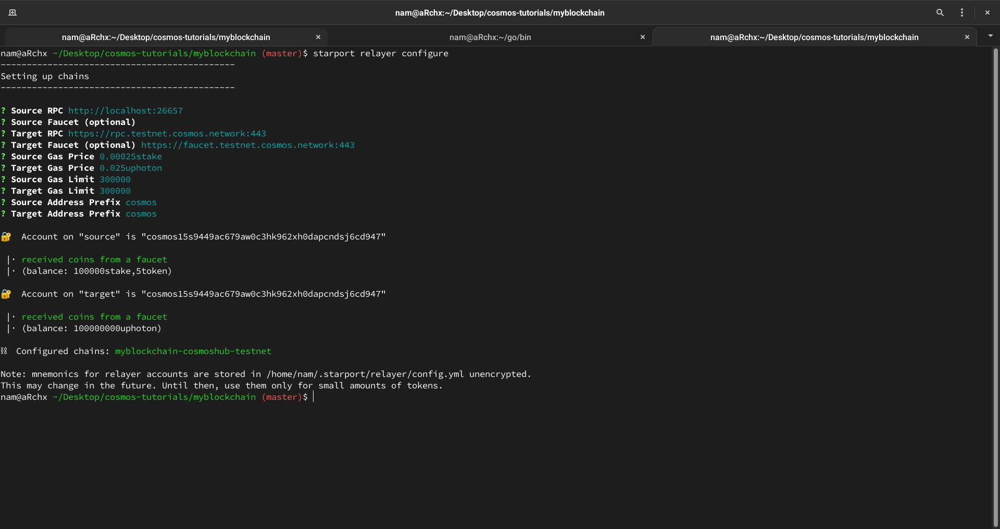
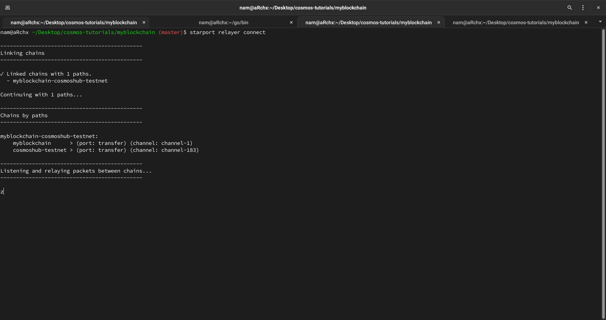

[id# Understand the Liquidity Module

---

## Liquidity Module

Mô-đun [thanh khoản](https://vietnambiz.vn/tinh-thanh-khoan-liquidity-la-gi-tinh-thanh-khoan-trong-chung-khoan-la-gi-20190826141104974.htm)

Mô đun thanh khoản được biết tới ở Trung tâm Cosmos là **Gravity DEX**, cho phép nhiều người dùng để tạo các vùng chứa (pool) thanh khoản và đổi _token_

# Use Liquidity Pools to Trade Tokens

Khi sử dụng blockchain dưa trên Cosmos-SDK, nêu muốn cho phép người dùng việc trao đổi _token_.
Người dùng có nhiều _token_ trên blockchain của người dùng hoặc có token được gửi từ các _blockchain ngoại lai_ bằng cấc sử dụng phương thức truyền thông nội bộ của các blockchain.

Mô-đun thanh cho phép người dùng sử dụng nhiều vùng chứa để trao đổi _token_ trên blockchain của họ.
Mỗi vùng chứa tượng trưng cho 1 cặp _token_ và cho phép người dùng trao đổi từ _token_ và _token_ khác.

Hướng dẫn này chỉ ra cách tạo blockchain, gửi các _token_ tới blockchain khác, tạo 1 vùng trao đổi, gửi/rút/đổi _token_ từ 1 vùng chứa

Có thể xem video ở [đấy](https://www.youtube.com/watch?v=GxaqpzMk0jk&t=978s)

Chú ý: Trong các mẫu code trong hướng dẫn này, hãy đổi [username] thành tên của bạn sao cho phù hợp.

Hướng dẫn này sẽ chỉ ra:
- Tạo 1 blockchain với Starport
- Tạo 1 _token_ của bạn trên blockchain đó
- Kết nối blockchain của bạn đến testnet
- Gửi _token_ của bạn qua IBC đến testnet
- Tạo 1 vùng chứa với _token_ của bạn
- Sử dụng vùng chứa đó với _token_ của bạn

### Requirements
1. Starport

  - Starport phiên bản v0.17.3 hoặc những bản cặp nhật sau
  - gaia v5.0.5


2. File nhị phân Gravity DEX

  ```bash
  # Clone gaia và sử dụng phiên bản 5.0.5
  git clone https://github.com/cosmos/gaia && cd gaia && git checkout v5.0.5

  ## ---
  # Build file nhị phân
  make install

  ## ---
  # Kiểm tra phiên bản gaiaa
  gaiad version # -> v5.0.5
  ```

### Create the Blockchain

Dựng 1 blockchain mới gọi là **myblockchain**, chuyển đổi [username] thành tên của bạn

```bash
starport scaffold chain github.com/<username>/<myblockchain>
cd <myblockchain>
```


### Add Your Token in the Configuration

Sửa file config.yml, đối với trường **accounts** hãy thêm tên và tiền của bạn

```yml
accounts:
  - name: <username> # <- Thêm tên
    coins: ["10000token", "50000000stake", "1000000000000<usertoken>"] # <- Thêm coin
```

Mẹo nhỏ:
Để thêm các coin, hãy sử dụng 1 danh sách chuỗi ký tự để khởi tạo coin với mệnh giá.
Bạn có thể làm theo các cú pháp của file _.yml_ mà đã được tạo sẵn cho 2 người dùng alice và bob




Số coin lưu giữ tối thiểu cho 1 vùng chứa trong mô-đun thanh khoản là 1.000.000.
Đảm bảo rằng bạn tạo đủ số _token_ cho vùng chứa thanh khoản.
Mục trên tạo đủ _token_ để có thể tạo đủ 10 vùng chứa thanh khoản (1000000000000)

### Start Your Blockchain

```bash
starport chain serve
```



> username address: cosmos1fv2u52up8mc33lv5q2y42jet7eyylnu6pn0zt7

### Configure the Relayer

1 trình chuyển tiếp là 1 ứng dụng để kết nối 2 blockchain.
Cài đăt trình chuyển tiếp này với các endpoint của bạn để tạo 1 kết nối giữa ứng dụng blockchain của bạn và testnet.
Sau khi kết nối được thiết lập, bạn có thể gửi các _token_ từ blockchain này đến blockchain khác

#### Remove Existing Relayer and Starport Configurations

Nếu bạn đã sử dụng trình chuyển tiếp này, làm theo cách này đẻ xóa trình chuyển tiếp cũ và phần cài đặt Starport
Xóa file cài đặt cũ:

```bash
rm -r $HOME/.starport/*
```

Nếu file cài đặt không tồn tại, lệnh trên sẽ không thực hiện và không có hành động nào được thực thi.

#### Create Your Connection

Cài đặt trihf chuyển tiếp để tạo kết nối giữa blockchain nội bộ và blockchain bạn muốn kết nối tới.
Trong ứng dụng này, blockchain mà bạn muốn kết nối tới là Gravity DEX tesnet.

```bash
starport relayer configure
```

- Đối với blockchain nội bộ nguồn, sử dụng giá trị mặc định.
- Đối với blockchain testnet đích, sử dụng giá trị sau:
- Target RPC: https://rpc.testnet.cosmos.network:443
- Target Token Faucet: https://rpc.testnet.cosmos.network:443
- Target Gas Price (0.025uatom): 0.025uphoton

Nếu mọi việc chạy thành công: bạn sẽ thấy kết quả như ở dưới đây:



Kết nối các blockchain:

```bash
starport relayer connect
```

Khi 2 blockchain được kết nối sẽ có thông báo sau đây

```bash
◣ Linking paths between chains...
```

Kết quả:



> channel-183

### Get Token From the Faucet

Từ terminal kết quả mà **starport chain server** tạo cho bạn, sử dụng địa chỉ tài khoản [username] để nhận _token_ từ điểm chốt.

```bash
curl -X POST -d '{"address": "<useraddress>"}' https://faucet.testnet.cosmos.network
```

```bash
curl -X POST -d '{"address": "cosmos1fv2u52up8mc33lv5q2y42jet7eyylnu6pn0zt7"}' https://faucet.testnet.cosmos.network
## Result
{"transfers":[{"coin":"100000000uphoton","status":"ok"}]}
```

Đảm bảo thêm địa chỉ của tài khoản của bạn vào phần **address**.

Thay đổi [useraddress] từ kết quả của lệnh **starport chain server**

Sau khi thấy thông báo thành công, bạn sẽ kiểm tra số dư của bạn thông qua:

> https://api.testnet.cosmos.network/cosmos/bank/v1beta1/balances/<useraddress>

Thay tên [useraddress] từ địa chỉ trả về như trên.

```bash
curl https://api.testnet.cosmos.network/cosmos/bank/v1beta1/balances/cosmos1fv2u52up8mc33lv5q2y42jet7eyylnu6pn0zt7

## Result

{
  "balances": [
    {
      "denom": "uphoton",
      "amount": "100000000"
    }
  ],
  "pagination": {
    "next_key": null,
    "total": "1"
  }
}

```

### Send Your Own Token to the Testnet

Bây giờ tài khỏan của bạn trên testnet đã được cấp vốn với cấc _token_ của testnest, bạn có thể gửi _token_ riêng của mình lên testnest

Trong terminal cục bộ của mình, sử dụng lệnh của mô-đun UBC để có thể chuyển _token_ của mình đến testnet

```bash
myblockchaind tx ibc-transfer transfer transfer <channel-0> <useraddress> "15000000<usertoken>" --from <username>
```

Đảm bảo thay thế:
- [useraddress] với địa chỉ của bạn
- [usertoken] với tên _token_ của bạn
- [username] là tên của bạn
- channel-0 là kênh mà đã được chỉ ra ở terminal khi mà bạn chạy lệnh **starport replayer connect**

```bash
myblockchaind tx ibc-transfer transfer transfer channel-183 cosmos1fv2u52up8mc33lv5q2y42jet7eyylnu6pn0zt7 "15000000mytoken" --from username
```

```json
{
  "body": {
    "messages": [
      {
        "@type": "/ibc.applications.transfer.v1.MsgTransfer",
        "source_port": "transfer",
        "source_channel": "channel-0",
        "token": {
          "denom": "mytoken",
          "amount": "15000000"
        },
        "sender": "cosmos1fv2u52up8mc33lv5q2y42jet7eyylnu6pn0zt7",
        "receiver": "cosmos1fv2u52up8mc33lv5q2y42jet7eyylnu6pn0zt7",
        "timeout_height": {
          "revision_number": "0",
          "revision_height": "780981"
        },
        "timeout_timestamp": "1633304847369726705"
      }
    ],
    "memo": "",
    "timeout_height": "0",
    "extension_options": [],
    "non_critical_extension_options": []
  },
  "auth_info": {
    "signer_infos": [],
    "fee": {
      "amount": [],
      "gas_limit": "200000",
      "payer": "",
      "granter": ""
    }
  },
  "signatures": []
}

# confirm transaction before signing and broadcasting [y/N]: y

{
  "height": "1086",
  "txhash": "E3E33E2D1F368181BC809AE7586EC3954F90F3F60194F4A4C176D9DEE72535ED",
  "codespace": "",
  "code": 0,
  "data": "0A0A0A087472616E73666572",
  "raw_log": "[{\"events\":[{\"type\":\"ibc_transfer\",\"attributes\":[{\"key\":\"sender\",\"value\":\"cosmos1fv2u52up8mc33lv5q2y42jet7eyylnu6pn0zt7\"},{\"key\":\"receiver\",\"value\":\"cosmos1fv2u52up8mc33lv5q2y42jet7eyylnu6pn0zt7\"}]},{\"type\":\"message\",\"attributes\":[{\"key\":\"action\",\"value\":\"transfer\"},{\"key\":\"sender\",\"value\":\"cosmos1fv2u52up8mc33lv5q2y42jet7eyylnu6pn0zt7\"},{\"key\":\"module\",\"value\":\"ibc_channel\"},{\"key\":\"module\",\"value\":\"transfer\"}]},{\"type\":\"send_packet\",\"attributes\":[{\"key\":\"packet_data\",\"value\":\"{\\\"amount\\\":\\\"15000000\\\",\\\"denom\\\":\\\"mytoken\\\",\\\"receiver\\\":\\\"cosmos1fv2u52up8mc33lv5q2y42jet7eyylnu6pn0zt7\\\",\\\"sender\\\":\\\"cosmos1fv2u52up8mc33lv5q2y42jet7eyylnu6pn0zt7\\\"}\"},{\"key\":\"packet_timeout_height\",\"value\":\"0-780981\"},{\"key\":\"packet_timeout_timestamp\",\"value\":\"1633304847369726705\"},{\"key\":\"packet_sequence\",\"value\":\"1\"},{\"key\":\"packet_src_port\",\"value\":\"transfer\"},{\"key\":\"packet_src_channel\",\"value\":\"channel-0\"},{\"key\":\"packet_dst_port\",\"value\":\"transfer\"},{\"key\":\"packet_dst_channel\",\"value\":\"channel-182\"},{\"key\":\"packet_channel_ordering\",\"value\":\"ORDER_UNORDERED\"},{\"key\":\"packet_connection\",\"value\":\"connection-0\"}]},{\"type\":\"transfer\",\"attributes\":[{\"key\":\"recipient\",\"value\":\"cosmos1a53udazy8ayufvy0s434pfwjcedzqv34kvz9tw\"},{\"key\":\"sender\",\"value\":\"cosmos1fv2u52up8mc33lv5q2y42jet7eyylnu6pn0zt7\"},{\"key\":\"amount\",\"value\":\"15000000mytoken\"}]}]}]",
  "logs": [
    {
      "msg_index": 0,
      "log": "",
      "events": [
        {
          "type": "ibc_transfer",
          "attributes": [
            {
              "key": "sender",
              "value": "cosmos1fv2u52up8mc33lv5q2y42jet7eyylnu6pn0zt7"
            },
            {
              "key": "receiver",
              "value": "cosmos1fv2u52up8mc33lv5q2y42jet7eyylnu6pn0zt7"
            }
          ]
        },
        {
          "type": "message",
          "attributes": [
            {
              "key": "action",
              "value": "transfer"
            },
            {
              "key": "sender",
              "value": "cosmos1fv2u52up8mc33lv5q2y42jet7eyylnu6pn0zt7"
            },
            {
              "key": "module",
              "value": "ibc_channel"
            },
            {
              "key": "module",
              "value": "transfer"
            }
          ]
        },
        {
          "type": "send_packet",
          "attributes": [
            {
              "key": "packet_data",
              "value": "{\"amount\":\"15000000\",\"denom\":\"mytoken\",\"receiver\":\"cosmos1fv2u52up8mc33lv5q2y42jet7eyylnu6pn0zt7\",\"sender\":\"cosmos1fv2u52up8mc33lv5q2y42jet7eyylnu6pn0zt7\"}"
            },
            {
              "key": "packet_timeout_height",
              "value": "0-780981"
            },
            {
              "key": "packet_timeout_timestamp",
              "value": "1633304847369726705"
            },
            {
              "key": "packet_sequence",
              "value": "1"
            },
            {
              "key": "packet_src_port",
              "value": "transfer"
            },
            {
              "key": "packet_src_channel",
              "value": "channel-0"
            },
            {
              "key": "packet_dst_port",
              "value": "transfer"
            },
            {
              "key": "packet_dst_channel",
              "value": "channel-182"
            },
            {
              "key": "packet_channel_ordering",
              "value": "ORDER_UNORDERED"
            },
            {
              "key": "packet_connection",
              "value": "connection-0"
            }
          ]
        },
        {
          "type": "transfer",
          "attributes": [
            {
              "key": "recipient",
              "value": "cosmos1a53udazy8ayufvy0s434pfwjcedzqv34kvz9tw"
            },
            {
              "key": "sender",
              "value": "cosmos1fv2u52up8mc33lv5q2y42jet7eyylnu6pn0zt7"
            },
            {
              "key": "amount",
              "value": "15000000mytoken"
            }
          ]
        }
      ]
    }
  ],
  "info": "",
  "gas_wanted": "200000",
  "gas_used": "79870",
  "tx": null,
  "timestamp": ""
}
```

Mẹo nhỏ: Thỉnh thoảng các giao dịch này không diễn ra trong lần thử đầu tiên.
Hãy đảm bảo rằng cửa sổ terminal chỉ ra quá trình của trình chuyển đổi và xác thực kết quả như ở dưới đây

```
Relay 1 packets from myblockchain => cosmoshub-testnet
Relay 1 packets from myblockchain => cosmoshub-testnet
Relay 1 acks from cosmoshub-testnet => myblockchain
Relay 1 acks from cosmoshub-testnet => myblockchain
```


Sau khi giao dịch hoàn thành kiểm tra số dư trên Gravity DEX testnet để kiểm tra rằng token của bạn đã được chuyển.

> https://api.testnet.cosmos.network/cosmos/bank/v1beta1/balances/[useraddress>

```bash
curl https://api.testnet.cosmos.network/cosmos/bank/v1beta1/balances/cosmos1fv2u52up8mc33lv5q2y42jet7eyylnu6pn0zt7

```

Kết quả:

```json
{
  "balances": [
    {
      "denom": "uphoton",
      "amount": "258850000"
    },
    {
      "denom": "ibc/2A399B0A1E83C2929B7C07E12B86F72EF4B4252ECB95A895BB51C2C00A106370",
      "amount": "13500000",
    },
  ],
  "pagination": {
    "next_key": null,
    "total": "1"
  }
}
```

Hãy quan sát kỹ phần **ibc/denomhash**.
Khi tạo 1 vùng chứa mới, bạn sử dụng mệnh giá này để tạo 1 cặp với 1 _token_ gốc đã tồn tại.
Trên testnet tạo 1 cặp với **uphoton** và **ibc/denomhash**

Mẹo: Để truy vấn số dư của **uphoton** và **ibc/denomhash** bằng câu lệnh:

```bash
gaiad query bank balances <useraddress> --node https://testnet.cosmos.network:443
```

```bash
gaiad query bank balances cosmos1fv2u52up8mc33lv5q2y42jet7eyylnu6pn0zt7 --node https://testnet.cosmos.network:443

## Result

balances:
- amount: "13500000"
  denom: ibc/2A399B0A1E83C2929B7C07E12B86F72EF4B4252ECB95A895BB51C2C00A106370
- amount: "258850000"
  denom: uphoton
pagination:
  next_key: null
  total: "0"

```


### Create a Pool with My Token

Với mô-đun thanh khoản và file nhị phân **gaiad** đã được cài đặt.
Sử dụng các link sau để khám phá ứng dụng của bán.

    RPC https://rpc.testnet.cosmos.network:443
    API https://api.testnet.cosmos.network:443
    gRPC https://grpc.testnet.cosmos.network:443
    Token faucet https://faucet.testnet.cosmos.network:443


#### Verify Your Token Supply

Bạn có thể kiểm tra tất cả token có thể sử dụng, và có thể thấy _token_ của bạn vì _token_ của bạn đã được liệt kê.

Kiểm tra các tài nguyên sau để biết tổng quan về hoạt động trên testnet và tìm _token_ của bạn.

    https://api.testnet.cosmos.network/cosmos/bank/v1beta1/supply
    https://api.testnet.cosmos.network/ibc/applications/transfer/v1beta1/denom_traces

### Add your Starport blockchain account to gaiad

Để truy cập tài khoản Starport của bạn ở gaiad, thêm tài khoản [username] vào _keychain_:

```bash
gaiad keys add <username> --recover
```

Bạn được nhắc nhập cụm mật khẩu của mình:

```
Enter your bip39 mnemonic
```

```bash
./gaiad keys add username --recover

## > Enter your bip39 mnemonic
## quarter economy know liberty company asset puppy kangaroo under test basic exchange rocket raise doctor cannon sphere orient hurry maze cargo diesel winter come

- name: username
  type: local
  address: cosmos1fv2u52up8mc33lv5q2y42jet7eyylnu6pn0zt7
  pubkey: cosmospub1addwnpepq2uxd67y96rl6tnc4ega6aexqhgq3uw92rpp6cwfdct7kada3yy5vg0n0gz
  mnemonic: ""
  threshold: 0
  pubkeys: []

```

Lưu ý rằng, bạn có thể thấy cụm mật khảu của mình khi chạy lệnh **starport chain server**
Sau khi bạn nhập cụm mật khẩu, bạn sẽ thấy kết quả sau:

### Create a Liquidity Pool

Để tạo 1 vùng chứa thanh khoản có thể dùng câu lệnh **gaiad tx liquidity create-pool**:

```bash
gaiad tx liquidity create-pool 1 1100000uphoton,1500000ibc/<longibchash> --from <username> --chain-id cosmoshub-testnet --gas-prices "0.025uphoton" --node https://rpc.testnet.cosmos.network:443 --gas 2000000
```

Chú ý:
- 1 là loại vùng chứa sẽ tạo
- 1100000uphoton,1500000ibc/[longibchash]: là cặp _token_ của vùng chứa
- Chuyển [longibchash] với phần mã hóa mệnh giá mà bạn nhận được khi truy vấn số dư
- Chuyển [username] với tên tài khoản được tạo

Có thể kiểm tra vùng chứa đã được tạo bằng api sau:
>  https://api.testnet.cosmos.network/cosmos/liquidity/v1beta1/pools

Kiểm tra rằng vùng chứa đã được tạo:
```bash
gaiad query liquidity pools
```

Bạn có thể truy vấn các vùng chứa với [id]

```bash
gaiad query liquidity pool <id>
```


```
- id: "1"
  pool_coin_denom: poolF4E2371BB7E34567B5A91A44808B8470BFAE0ABD606D707A8F1D59A3EB164816
  reserve_account_address: cosmos17n3rwxahudzk0ddfrfzgpzuywzl6uz4alp5z2l
  reserve_coin_denoms:
  - ibc/32023ECF96BB757261CB59A37F9013D012969795D12D24FCCE50CBE5F879C920
  - uphoton
  type_id: 1
  .
  .
  .
- id: "6"
  pool_coin_denom: poolFE384B6C9AE769A67754EAD275832A5A6DAA6E2C769A1E1D281E596DD47AA36D
  reserve_account_address: cosmos1lcuykmy6ua56va65atf8tqe2tfk65m3v58zq6n
  reserve_coin_denoms:
  - ibc/2A399B0A1E83C2929B7C07E12B86F72EF4B4252ECB95A895BB51C2C00A106370
  - uphoton
  type_id: 1
```

### Swap Token

Bây giờ bạn có thể đổi các _token_!
Bạn đã có _token_ **uphoton** trong tài khoản và muốn đổi chúng với các _token_ mới:


```bash
gaiad tx liquidity swap <id> 1 100000uphoton ibc/<longibchash> 0.1 0.003 --from <username> --chain-id cosmoshub-testnet --gas-prices "0.025uphoton" --node https://rpc.testnet.cosmos.network:443
```

- [id] là id của vùng chứa
- 1 là loại hoán đổi tức thì
- 100000uphoton là _token_ đầu trong cặp
- ibc/[longibchash] là _token_ thứ 2 trong cặp
- 0.1 là giá yêu cầu
- 0.0003 phí để thay đổi
- [username] là tên người dùng

Kiểm tra số dư với tài khoản mà đã thay đổi:

> https://api.testnet.cosmos.network/cosmos/bank/v1beta1/balances/[useraddress]

### Deposit Token

```bash
gaiad tx liquidity deposit <id> 100uphoton,100ibc/<longibchash> --from <username> --chain-id cosmoshub-testnet --gas-prices "0.025uphoton" --node https://rpc.testnet.cosmos.network:443
```

- [id] là id của vùng chứa
- ibc/[longibchash] là _token_ thứ 2 trong cặp
- [username] là tên người dùng

Lưu ý: Tiền gửi phải có cùng mệnh giá với coin dự trữ.

Kiểm tra lại số dư

> https://api.testnet.cosmos.network/cosmos/bank/v1beta1/balances/[useraddress]

### Withdraw Token

Bạn có thể rút lấy _token_ từ vùng chứa bạn vừa tạo

```bash
gaiad tx liquidity withdraw <id> pool-coin --from <username> --chain-id cosmoshub-testnet --gas-prices "0.025uphoton" --node https://rpc.testnet.cosmos.network:443
```
- [id] là id của vùng chứa
- pool-coin mệnh giá của vùng chưa thanh khoản, trong trường hơp này là cặp _token_
- pool-id là id bạn có thể lấy tại qua link này
  > https://api.testnet.cosmos.network/cosmos/bank/v1beta1/balances/[useraddress]
- <useraddress] là địa chỉ của tài khoản người dùng
- [username] tên của người dùng

Nhớ kiểm tra lại số dư:
> https://api.testnet.cosmos.network/cosmos/bank/v1beta1/balances/[useraddress]
